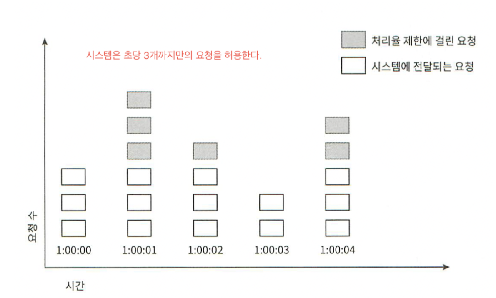

# System Design Interview

## 1장. 사용자 수에 따른 규모 확장성

### 데이터베이스
#### 어떤 데이터베이스를 선택할 것인가?
##### 관계형 데이터베이스
- 자료를 테이블과 컬럼, 열로 표현한다.
- SQL을 사용하면 여러 테이블에 있는 데이터를 그 관계에 따라 조인해서 합칠 수 있다.
- MySql, Oracle, PostgreSQL

##### 비관계형 데이터베이스(NoSQL)
- 일반적으로 조인 연산은 지원하지 않는다.
- 종류
  - Key-Value 저장소(Key-Value Store)
  - 그래프 저장소(Graph Store)
  - 컬럼 저장소(Column Store)
  - 문서 저장소(Document Store)
- CouchDB, Neo4j, Cassandra, HBase, Amazon DynamoDB

##### NoSQL이 더 적합한 경우
- 아주 낮은 응답 지연시간(latency) 가 요구되는 경우
- 다루는 데이터가 비정형이라 관계형 데이터가 아닌 경우
- 데이터(JSON, XML, YAML 등)를 직렬화(Serialize)하거나 역직렬화(deserialize)할 수 있기만 하면 되는 경우
- 아주 많은 양의 데이터를 저장할 필요가 있는 경우

### 수직적 규모 확장 vs 수평적 규모 확장
#### 수직적 규모 확장(Scale-Up)
- 서버에 고사양 자원(더 좋은 CPU, 더 많은 RAM 등)을 추가하는 행위를 말한다.
- 장점
  - 서버로 유입되는 트래픽의 양이 적을 때는 수직적 확장이 좋은 선택이다.
  - 적용하기 단순하다.
- 단점
  - 서버에 CPU나 Memory를 무한대로 증설할 방법이 없다.
  - 장애에 대한 자동복구(failover) 방안이나 다중화(redundancy) 방안을 제시하지 않는다. 서버에 장애가 발생하면 완전히 중단된다.
  - 대규모 애플ㄹ리케이션을 지원하는데는 부적합하다.

#### 수평적 규모 확장(Scale-out)
- 더 많은 서버를 추가하여 성능을 개선하는 행위를 말한다.

#### 로드밸런스
- 부하 분산 집합(load balancing set)에 속한 웹 서버들에게 트래픽 부하를 고르게 분산하는 역할을 한다.

#### 데이터베이스 다중화(Database Redundancy)
- 보통 Master-Slave 관계를 설정하여 데이터 원본은 Mater서버에, 사본은 Slave서버에 저장하는 방식이다.
- 주로 쓰기 연산(write operation)은 Master에서만 지원하고, 읽기 연산(read operation)은 Slave에서만 지원한다.
- 따라서 보통 읽기 연산이 더 많기 때문에 Slave 서버 갯수가 Master 서버 갯수보다 더 많다.
- 데이터베이스 다중화 장점
  - 더 나은 성능: 병렬로 처리할 수 있는 질의(Qeury)의 갯수가 증가하여 성능이 향상된다.
  - 안정성: 데이터베이스 서버 중 일부가 장애가 나도 데이터가 보존될 수 있다.
  - 가용성: 데이터를 여러 서버에 복제해 놓을 수 있어 특정 데이터베이스 서버에서 장애가 발생해도 다른 서버에 있는 데이터를 가져와 계속 서비스할 수 있다.

##### 데이터베이스 서버 중 하나가 다운될 때 벌어지는 현상
**Master 서버가 다운이 되었을 때**
- Slave 서버가 한대인 경우: 해당 Slave 서버가 일시적으로 Master 서버 역할을 하며 읽기, 쓰기 연산을 모두 수행한다. 동시에 새로운 Slave 서버가 기동하여 Slave 역할을 한다.
- Production 환경에서는 Slave 서버에 있는 데이터가 최신이 아닐 수 있기 때문에 없는 데이터는 복구 스크립트(recovery script) 돌려서 추가해야 한다.
- 별도로 다중 마스터(multi-masters)나 원형 다중화(circular-replication) 방식을 도입하면 이런 상황에 대처하는데 도움이 된다.

**Slave 서버가 다운이 되었을 때**
- Slave 서버가 한대인 경우: Master 서버가 한시적으로 읽기, 쓰기 연산 모두 수행한다. 또한 새로운 Slave 서버가 기동하면서 장애 서버를 대체한다.
- Slave 서버가 여러대인 경우: 읽기 연산은 나머지 Slave 서버로 분산하여 처리되고, 새로운 Slave 서버가 기동하여 장애 서버를 대체한다.

#### 데이터베이스 수평적 확장(Scale-out)
- 샤딩(sharding): 대규모 데이터베이스를 샤드(shard)라고 부르는 작은 단위로 분할하는 기술을 말한다.
- 샤딩 전략 구현 시 고려할 사항(샤딩 키를 어떻게 정하느냐)
  - 데이터 재 샤딩(resharding): 데이터가 균일하게 분포되지 않아서 특정 샤드키에 할당된 공간이 모두 소진되면 데이터를 재배치해야 한다.
    - 안정 해쉬(consistent hashing) 기법을 활용하여 문제 해결하기
  - 유명인사(celebrity) 문제: hotspot key라고도 하는데 특정 샤드에 질의가 집중되어 서버에 과부하가 걸리는 문제다.
    - 유명인사 데이터를 각 샤드마다 1개씩 속하도록 배치하거나 더 잘게 쪼개야 할 수도 있다.
  - 조인과 비정규화: 여러 샤드에 걸쳐 데이터가 있을 때 조인하기 힘들다.
    - 한가지 해결 방법은 데이터를 비정규화하여 하나의 테이블에 저장한다.

### 캐쉬
- 값비싼 연산 결과 또는 자주 참조되는 데이터를 메모리 안에 두고, 뒤이은 요청이 보다 빨리 처리될 수 있도록 하는 저장소이다.
- 데이터가 잠시 보관되는 곳으로 데이터베이스보다 훨씬 빠르다. 따라서, 데이터베이서의 부하를 줄일 수 있다.

#### 캐쉬 계층
- 읽기 주도형 캐시 전략(Read-through caching strategy): 요청 데이터가 캐쉬에 있으면 해당 데이터를 반환하고, 없을 경우, 데이터베이스 질의를 통해 데이터를 가져와 캐쉬에 저장한 후 클라이언트에 반환한다. 
- 캐쉬 전략
  - 읽기 주도형 캐시 전략(Read-through caching strategy)
  - 캐쉬할 데이터 종류, 크기, 액세스 패턴에 맞는 캐쉬 전략이 있음.

#### 캐쉬 선택 시 유의사항
- 캐쉬는 데이터 갱신은 자주 일어나지 않지만, 읽기가 빈번히 이뤄지는 경우 적용하면 좋다.
- 영구 저장이 필요한 데이터는 영속성 저장소(persistent data store)에 저장하는게 적합하다.
- 데이터 만료(expire)는 어떻게 할 것인가? 미리 정책을 세워두는 게 좋다.
- 일관성(consistency)는 어떻게 유지할 것인지?
- 장애는 어떻게 대처할 것인지? 한대만 두면 SPOF가 될 수 있기 때문에 여러 대를 분산해서 사용해야 한다.
- 캐시 메모리는 얼마나 크게 잡을 것인가?
  - 캐시 메모리가 너무 작으면 액세스 패턴에 따라 데이터가 자주 캐시에서 밀려나버려(eviction) 캐시의 성능이 떨어지게 된다.
- 데이터 방출(eviction) 정책은 무엇인가?
  - LRU(Least Recently Used): 마지막으로 사용된 시점이 가장 오래된 데이터를 내보내는 정책
  - LFU(Least Frequently Used): 사용된 빈도가 가장 낮은 데이터를 내보내는 정책
  - FIFO(First In First Out): 가장 먼저 캐시에 들어온 데이터를 가장 먼저 내보내는 정책

### 컨텐츠 전송 네트워크(CDN)
- CDN은 정적 콘텐츠를 전송하는데 쓰이는, 지리적으로 분산된 서버의 네트워크다. 클라이언트에서 가장 가까운 CDN 서버로부터 컨텐츠가 전달되도록 한다.
- 동적 컨텐츠 캐싱: 요청 경로(request path), 질의 문자열(query string), 쿠키, 요청 헤더 등의 정보에 기반하여 HTML 페이지를 캐시한다.
- 동작 원리
  - 파일이 CDN에 캐쉬되어 있지 않으면 원본 서버로 요청하여 CDN 서버에 반환한다. 응답 헤더에 TTL(Time-To-Live) 값을 세팅하여 반환한다.
  - CDN서버에서는 TTL까지 만료되기 전까지 해당 콘텐츠를 클라이언트에 서비스한다.

#### CDN 사용 시 고려할 사항
- 비용
- 적절한 만료 시한 설정
- CDN 장애에 대한 대처 방안
- 콘텐츠 무효화 방법: object versioning을 통해서 강제로 새로운 리소스로 요청되도록 한다.
  ```shell
   /image.png?version=2
  ```

### 무상태(Stateless) 웹계층
- 수평적(scale-out)으로 확장하려면 사용자의 세선 정보와 같은 상태 정보를 웹 계층에서 제거해야 한다.
- 상태 정보를 여러 서버에서 공유해야 할 때는 별도의 공유 저장소(shared storage)로 부터 데이터를 가져오게 한다.

### 데이터센터
- 지리적 라우팅(geoDNS-routing, geo-routing): 사용자로부터 가장 가까운 장애가 없는 데이터센터로부터 서비스가 되도록 한다.
- 해결해야 할 기술적 난제
  - 트래픽 우회: 사용자로부터 가장 가까운 장애가 없는 데이터센터에서 서비스되게 트래픽을 보낼 수 있어야 한다.
  - 데이터 동기화(synchronization): 데이터가 여러 데이터센터에 걸쳐 다중화(replication)가 되어 있을 때, 특정 데이터센터에 장애가 나도 다른 데이터센터에 해당 데이터가 존재하여 서비스할 수 있다.
  - 테스트와 배포: 웹사이트 또는 애플리케이션을 여러 위치에서 테스트해보는 것이 중요하다.

### 메세지 큐
- 메세지의 무손실(durability, 메세지 큐에 일단 보관된 메세지는 소비자가 꺼낼 때까지 안전히 보관된다는 특징)을 보장하는, 비동기 통신을 지원하는 컴포넌트이다.
- producer/consumer, publisher/subscriber
- 서비스 또는 서버간 결합도가 낮아진다.
- 규모 확장성이 보장된다.

### 로그, 메트릭, 자동화
- 로그: 에러 로그 모니터링 중요하다. 여러 서버에 분산된 로그를 단일 서비스로 모아주는 도구 활용하면 편리하다.
- 메트릭: 시스템 현재 상태를 손쉽게 확인할 수 있다.
- 자동화: CI/CD(빌드, 테스트, 배포 자동화)


## 3장. 시스템 설계 면접 공략법
### 효과적 면접을 위한 4단계 접근법
- 1단계. 문제 이해 및 설계 범위 확정
- 2단계. 개략적인 설계안 제시 및 동의 구하기
- 3단계. 상세 설계
- 4단계. 마무리(후속 질문)


## 4장. 처리율 제한(Rate Limiter) 장치 설계
### 1단계: 문제 이해 및 설계 범위 확정
- 어떤 종류의 철리율 제한 장치인지? Client 측 제한 장치인지 아니면 서버측 제한장치인지?
- 제한 기준이 무엇인지? 사용자ID인지 IP 주소인지 등
- 시스템 규모는? 스타트업 기준인지 사용자가 많은 큰 기업인지?
- 분산 환경에서 동작해야 하는지?
- 처리율 제한 장치가 독립된 서비스인지 애플리케이션 코드에 포함되도 되는지?
- 처리율 제한 장치에 의해 걸러진 경우에 사용자에게 알려야 하는지?

### 2단계: 개략적인 설계안 제시 및 동의 구하기

### 3단계. 상세 설계
**API 게이트웨이**
- 처리율 제한, SSL종단(termination), 사용자인증(authentication), IP허용목록(whitelist) 관리 등을 지원한다.

**처리율 제한 장치를 어디에 둘 것인가?**
- 서버측에 둘 것인가, API Gateway에 둘 것인가?
- 고려사항
  - 서버측 구현을 지원할 정도로 회사 내 리소스가 충분한가?
  - 요구사항에 맞는 처리율 제한 알고리즘을 찾아라
  - 이미 MSA로 설계했고, API Gateway를 포함했으면 여기에 두어라.
  - 처리율 제한 서비스를 직접 만드는 건 시간이 든다. 충분한 인력이 없으면 상용 API Gateway를 쓰는 것이 바람직하다.

### 처리율 제한 알고리즘
#### 토큰 버킷
- 고정 크기의 버킷에 사전에 설정된 토큰이 주기적으로 채어진다.
- 
- 2개의 인자를 받는다.
  - 버킷 크기: 버킷에 담을 수 있는 토큰의 최대 갯수
  - 토큰 공급률(refill rate): 초당 몇 개의 토큰이 버킷에 공급되는가
- 
- 장점
  - 구현이 쉽다.
  - 메모리 사용 측면에서도 효율적이다.
  - 짧은 시간에 집중되는 트래픽도 처리 가능하다. 버킷에 남은 토큰이 있기만 하면 처리될 수 있다.
- 단점
  - 버킷 크기와 토큰 공급률을 적절하게 튜닝하기 까다롭다.

#### 누출 버킷(Leaky Bucket)
- 토큰 버킷 알고리즘과 비슷하지만 요청 처리율이 고정되어 있다는 점이 다르다.
- 2개의 인자를 받는다.
  - 버킷 크기: 큐 사이즈와 같은 값이다.
  - 처리율(outflow rate): 지정된 시간당 몇 개의 항목을ㄹ 처리할지 지정하는 값이다. 보통 초 단윌로 표현한다.
- 장점
  - 큐의 크기가 제한되어 있어 메모리 사용ㄹ량 측면에서 효율적이다.
  - 고정된 처리율을 갖고 있기 때문에 안정적인 출력이 필요한 경우 적합하다.
- 단점
  - 단시간에 많은 트래픽이 몰리는 경우 큐에는 오래된 요청들이 쌓이게 되고, 최신 요청들은 버려지게 된다.
  - 버킷 크기와 처리율을 적절하게 튜닝하기 까다롭다.

#### 고정 윈도 카운터(Fixed Window Counter)
- 타임라인(timeline)을 고정된 윈도우(window0로 나누고, 각 윈도우마다 카운터(counter)를 붙인다.
- 동작 원리
  
  - 요청이 접수될 때마다 이 카운터 값은 1씩 증가한다.
  - 이 카운터의 값이 사전에 정의한 임계치(threshold)에 도달하면 새로운 요청은 새 윈도우가 열릴 때까지 버려진다.
- 문제점
- 
  - 윈도우 경계 부근에 순간적을로 많은 트래픽이 집중될 경우, 윈도우에 할당된 양보다 더 많은 요청이 처리될 수 있다.
- 장점
  - 메모리 효율이 좋다.
  - 이해하기 쉽다.
  - 윈도우가 닫히는 시점에 카운터를 초기화하는 방식은 특정한 트래픽 패턴을 처리하기 적합하다.
- 단점
  - 윈도우 경계 부근에서 일시적을로 많은 트래픽이 몰리는 경우, 기대했던 시스템의 처리 한도보다 많은 양의 요청을 처리하게 된다.

#### 이동 윈도 로그(Sliding Window Logging)
- 고정 윈도우 카운터의 문제를 해결한 알고리즘이다.
- 동작 원리
  
  - 요청의 timestamp를 추적한다. timstamp는 보통 Redis의 Sorted Set 같은 캐시에 보관한다.
  - 새 요청이 오면 만료된 타임스탬프는 제거한다.
  - 새 요청의 타임스탬프를 로그(log)에 기록한다.
  - 로그의 크기가 허용치보다 같거나 작으면 요청을 시스템에 전달한다. 그렇지 않은 경우에는 처리를 거부한다.
- 장점
  - 처리율 제한 매커니즘이 아주 정교하다. 허용되는 요청의 개수는 시스템의 처리율 한도를 넘지 않는다.
- 단점
  - 다량의 메모리를 사용하는데, 거부된 요청의 타임스탬프도 보관하기 때문이다.
#### 이동 윈도 카운터
- 고정 윈도우 카운터와 이동 윈도우 로깅 알고리즘을 결합한 것이다.
- 동작 원리
  
  - 현재 윈도우 계산 방법
    - 현재 1분간 요청 수 + 직전 1분간 요청수 X 이동 윈도우와 직전 1분이 겹치는 비율ㄹ
- 장점
  - 짧은 시간에 몰리는 트래픽에도 잘 대응한다.
- 단점
  - 직전 시간대에 도착한 욫청이 균등하게 분포되어 있다고 가정한 상태에서 추정ㅊ치를 계산해서 다소 느슨하다.
  - 하지만, Cloudflare가 실시한 실험에서 버려지는 요청이 0.003%에 불과했다.

### 개략적인 아키텍처
- *카운터를 어디에 보관할 것인가?*가 중요한 문제인데, 메모리상에서 동작하는 빠른 캐시가 바람직하다.
- Redis 사용한다. 시간에 기반한 만료 정책을 지원하기도 한다.

### 처리율 한도 초과 트래픽 처리
- API는 HTTP Response에 429(too many request) 응답을 내려준다.
- Response Header 정보
  - X-Ratelimit-Remaining: 윈도 내에 남은 처리 가능 요청의 수
  - X-Ratelimit-Limit: 매 윈도마다 클라이언트가 전송할 수 있는 요청의 수
  - X-Ratelimit-Retry-After: 한도 제한에 걸리지 않으려면 몇 초 뒤에 요청을 다시 보내야 하는지 알려줌.

### 상세 설계
- 

### 분산환경에서의 처리율 제한 장치의 구현
- 고려사항
  - 경쟁 조건(race condition)
  - 동기화(synchronization)
- 해결책
  - 경쟁 조건
    - 루아 스크립트(Lua script)
    - 정렬 집합(Sorted Set)을 사용하는 레디스 자료 구조 사용
  - 동기화
    - Redis와 같은 중앙 집중형 데이터 저장소 사용하기(Count, Timestamp 보관하기).

#### 성능 최적화
- 여러 데이터센터를 둔 경우, 가까운 Edge Server에서 서비스가 되어 지연시간(latency) 줄이기
- 제한 장치 간 데이터 동기화할 때, 최종 일관성 모델(eventual consistency model) 사용하기

#### 모니터링
- 채택된 처리율 제한 알고리즘이 효과적인지
- 정의한 처리율 제한 규칙이 효과적인지

### 4단계. 마무리(후속 질문)
- hard or soft 처리율 제한
- 다양한 계층에서의 처리율 제한
- 처리율 제한을 회피하는 방법. 클랄이언트를 어떻게 설계할 것인가?
  - 클라이언트 측 캐시를 사용하여 API 호출 횟수를 줄인다.
  - retry를 할 때는 충분한 back-off 시간을 둔다.

## URL 단축 설계
- 블룸 필터(Bloom filter)
  - 원소가 집합에 속하는지 여부를 검사하는데 사용되는 확률적 자료 구조이다.
  - 참고
    - https://meetup.toast.com/posts/192


## 웹 크롤러 설계

### 상세 설계
#### 미수집 URL 저장소
**예의(Polite)**
- 웹 크롤러는 수집 대상 서버로 짧은 시간 안에 너무 많은 요청을 보내는 것을 삼가야 한다.
- 원칙
  - 동일 웹 사이트에 대해서는 한 번에 한 페이지만 요청한다.
- 설계
  - 큐 라우터(queue router): 같은 호스트에 속한 URL은 언제나 같은 큐(b1, b2,... ,bn)로 가도록 보장한다.
  - 매핑 테이블(mapping table): 호스트 이륾과 큐 사이의 관계를 보관하는 테이블.
  - FIFO(b1 ~ bn 큐): 같은 호스트에 속한 URL은 언제나 같은 큐에 보관한다.
  - 큐 선택기(queue selector): 큐 선택기는 큐들을 순회하면서 큐에서 URL을 꺼내서 해당 큐에서 나온 URL을 다운로드하도록 지정된 작업 스레드에 전달하는 역할을 한다.
  - 작업 스레드(worker thread): 작업 스레드는 전달된 URL을 다운로드하는 작업을 수행한다. 전달된 URL은 순차적으로 처리될 것이며, 작업들 사이에는 일정한 지연시간(delay)을 둘 수 있다.

**우선순위**
- URL 우선순위 결정하기

**신선도**
- 재수집할 필요가 있다.
- 전략
  - 웹 페이지의 변경 이력을 활용한다.
  - 우선순위를 활용하여 중요한 페이지는 좀 더 자주 재수집한다.

**미수집 URL 저장소를 위한 지속성 저장장치**
- 대부분의 URL은 디스크에 두지만, IO 비용을 줄이기 위해 메모리 버퍼에 큐를 둔다. 버퍼에 있는 데이터는 주기적으롤 디스크에 기록한다.


# 5장. 안정 해시(Consistent Hash) 설계
- 수평적 규모 확장성(scale-out)을 달성하기 위해 요청 또는 데이터를 서버에 균등하게 나누는게 중요하다.
- 안정 해시는 이 목표를 달성하기 위해 보편적으로 사용되는 기술이다. 
- 해시 테이블 크기가 조정될 때 평균적으로 오직 k/n개의 키만 재배치하는 해시 기술이다.
  - k: 키 갯수
  - n: slot 갯수

## 해시 키 재배치(rehash) 문제
- 등장 배경
  - 고정 서버 갯수로 modular 연산을 한 결과값을 할당할 서버로 하는 알고리즘을 사용할 경우, 특정 서버에서 장애가 발생했을 경우, 해당 서버에 있는 값들은 모두 data miss 가 발생한다.
  - ```bash
    serverIndex = hash(key) % N(서버갯수)
    ```
  - 
  - 만일 2번 서버에서 문제가 발생하면 해당 서버로의 요청은 miss 가 발생한다.

### 해시 공간과 해시 링
- 동작 원리
  - SHA-1 해시 알고리즘을 사용한다고 가정한다.
  - 해시 공간은 0 ~ 2^150-1
    
  - 해시 링으로 만들면
    

#### 해시 서버

#### 해시 키

#### 서버 조회
- 어떤 키가 저장되는 서버는, 해당 키의 위치로부터 시계 방향으로 링을 탐색해 나가면서 만다는 첫 번째 서버다.

#### 서버 추가
- 서버를 추가하더라도 키 가운데 일부만 재배치하면 된다.

#### 서버 삭제
- 서버를 삭제해도 키 가운데 일부만 재배치하면 된다.

#### 문제점
- 서버가 추가되거나 삭제되는 상황을 감안하면 partition 크기를 균등하게 유지하는게 불가능하다. 어떤 서버는 굉장히 작은 해시 공간을 할당 받고, 어떤 서버는 굉장히 큰 해시 공간을 할당 받는 상황이 가능하다.
- 키의 균등 분포를 달성하기 어렵다.

#### 가상 노드(Virtual Node/Replica)
- 위 문제를 해결하기 위해 제안된 기법
- 하나의 서버는 링 위에 여러 개의 가상 노드를 가질 수 있다.
- 
- 장점
  - 가상 노드의 갯수가 클 수록 좀 더 균등하게 partition을 나눌 수 있다.
- 단점
  - 가상 노드의 갯수가 클 수록 가상 노드 데이터를 저장할 공간이 커진다.

#### 실제로 쓰이는 기술
- 아마존 다이나모 DB 파티셔닝 관련 컴포넌트
- 아파치 카산드라 클러스터에서의 데이터 파티셔닝
- 디스코드 채팅 어플리케이션
- 아카마이  CDN
- 매그래프 네트워크 부하 분산기


#### 참고
- [해쉬](https://ratsgo.github.io/data%20structure&algorithm/2017/10/25/hash/)


# 6장. Key-Value 저장소 설계

## CAP 이론
- 

#### 일관성 모델(Consistency model)
- 강한 일관성(Strong Consistency)
  - 모든 사본에 현재 쓰기 연산의 결과가 반영될 때까지 해당 데이터에 대한 읽기/쓰기를 금지하는 것이다.
  - 고가용성(high availabilty) 시스템에는 적합하지 않다. 
- 약한 일관성(Soft Consistency):
- 최종 일관성(Eventual Consistency): 약한 일관성의 한 형태로 갱신 결과가 결국에는 모든 사본에 반영(즉, 동기화)되는 모델이다.

#### 비 일관성 해소 기법: 데이터 버저닝
- 데이터를 다중화하면 가용성은 높아지지만 일관성이 깨지기 쉽다.
- 이를 해결하기 위하여 Versioning + Vector Clock 기술을 이용한다.
- 
**버저닝(Versioning)**
**벡터 시계(Vector Clock)**
- D[Si, Vi]
  - D: 데이터
  - Si: 서버 번호
  - Vi: 버전 카운터
- 
- 단점
  - 충돌 감지 및 해소 로직이 클라이언트에 들어가야 하므로, 클라이언트 구현이 복잡해진다.
  - [Si, Vi] 순서쌍 개수가 굉장히 빨리 늘어날 수 있다.
  - But, AWS 다이나모 DB 관련 문헌에 따르면 이런 문제가 벌어지는 것은 발견한 적이 없다고 한다.

#### 장애 감지(failure detection)
- 보통 2대 이상 서버에서 특정 동일 서버에 장애를 보고해야 실제로 장애가 발생했다고 간주한다.
- multicasting: 서버 갯수가 많으면 비효율적이다.
- **가십 프로토콜(gossip protocol)**
  - 동작 원리
    
  - 각 노드는 멤버쉽 목록을 유지한다. 각 멤버ID와 heartbeat counter 쌍 목록이다.
  - 각 노드는 주기적으로 자신의 heartbeat counter를 증가시킨다.
  - 각 노드는 무작위로 선정된 노드들에게 주기적으로 자기 heartbeat counter 목록을 보낸다.
  - heartbeat list를 받은 노드는 멤버십 목록을 최신값으로 갱신한다.
  - 어떤 멤버의 heartbeat count 값이 지정된 시간 동안 갱신되지 않으면 해당 멤버는 장애 상태인 것으로 간주한다.

#### 일시적 장애처리
**단서 후 임시위탁(hinted handoff)**
- 장애가 발생한 서버 대신 임시로 다른 서버가 읽기/쓰기를 처리한다. 이를 위해 hint를 남겨 놓는다. 장애가 발생한 서버가 복구되면 임시 서버가 갱신된 데이터를 장애났던 서버에 인계한다.

#### 영구 장애처리
**Anti-Entropy 프로토콜**
- 사본 간의 일관성이 망가진 상태를 탐지하고 전송 데이터의 양을 줄이기 위해 Merckle Tree를 사용한다.

#### 데이터센터장애
- 데이터센터 다중화하기

### 시스템 아키텍처 다이어그램

- 클라이언트는 key-value 저장소가 제공하는 get(key), put(key, value) API로 통신한다.
- 중재자(coordinator)는 클라이언트에게 key-value 저장소에 대한 proxy 역할을 하는 노드이다.
- 노드는 안정 해시(consistent hash)의 hash ring 위에 분포한다.
- 노드를 자동으로 추가 또는 삭제할 수 있도록 완전히 분산된다.
- 데이터는 여러 노드에 다중화된다.
- 모든 노드가 같은 책임을 지므로, SPOF는 존재하지 않는다.

#### 쓰기 경로
- 카산드리 SSTable(Sorted String Table)
- [SSTable](https://velog.io/@yunhongmin/SSTable-data-storage)

#### 읽기 경로
- 블룸 필터: 어느 SSTable에 찾는 키가 있는지 알아내는데 효율적이다.

## Key-Value 저장소가 가져야 하는 기능 및 그 기능 구현에 이용되는 기술
| 목표/문제  | 기술 |
|---|---|
| 대규모 데이터 저장  | 안정 해시를 사용해 서버들에 부하 분산  |
| 읽기 연산에 대한 높은 가용성 보장  | 데이터를 여러 데이터센터에 다중화  |
| 쓰기 연산에 대한 높은 가용성 보장  | 버저닝 및 벡터 시계를 사용한 충돌 해소  |
| 데이터 파티션  | 안정 해시  |
| 점진적 규모 확장성  | 안정 해시  |
| 다양성  | 안정 해시  |
| 조절 가능한 데이터 일관성  | 정족수 합의  |
| 일시적 장애 처리  | 느슨한 정족수 프로토콜 및 단서 후 임시 위탁(hinted handoff)  |
| 영구적 장애 처리  | 머클 트리(Muckle Tree)  |
| 데이터 센터 장애 대응  | 여러 데이터 센터에 걸친 데이터 다중화  |

# 7장. 분산 시스템을 위한 유일 ID 생성기 설계
## 1단계. 문제 이해 및 설계 범위 확정
- ID는 유일해야 한다.
- ID를 시간 순서로 정렬해야 한다.
- ID 최대 길이는 64bit이다.
- ID는 숫자와 알파벳으로만 이루어져 있다.
- 초당 10,000개를 만들 수 있어야 한다.

## 2단계. 개략적 설계안 제시 및 동의 구하기

### 다중 마스터 복제(multi-master replication)
- 데이터베이스의 auto_increment 기능을 활용하는 것이다.
- 
- ```shell
  next = current + k
  ```
  - k: 데이터베이스 서버의 갯수
- 단점
  - 여러 데이터센터에 걸쳐 규모를 늘리기 어렵다.
  - ID의 유일성은 보장되나 시간 흐름에 맞추어 커지도록 보장할 수 없다.
  - 서버를 추가하거나 삭제할 때 잘 동작하게 만들기 어렵다.

### UUID(Universally Unique Identifier)
- 컴퓨터 시스템에 저장되는 유일하게 식별하기 위한 128bit짜리 수이다.
- 위키피디아에 따르면 중복 ID 1개가 생길 확류을ㄹ 50%로 끌어올리려면 초당 10억 개의 UUID를 100년 동안 계속 만들어야 한다.
- UUID값은 09c93e62-50b4-468d-bf8a-c07e1040bfb2 같은 형태를 띤다.
- 
- 장점
  - UUID를 만들기 쉽다. 서버 사이의 조율이 필요없으므로 동기화 문제도 없다.
  - 각 서버가 알아서 ID를 만들어서 규모 확장이 쉽다.
- 단점
  - 128bit로 길다.
  - 시간순을로 정렬할 수 없다.
  - ID에 숫자가 아닌 값이 포함될 수 있다.

### 티켓 서버(Ticket Server)
- auto_increment 기능을 갖춘 데이터베이스 서버(티켓 서버)를 중앙 집중형으로 하나만 사용하는 것이다.
- 장점
  - 유일성이 보장되는 오직 숫자로만 구성된 ID를 쉽게 만들 수 있다.
  - 구현하기 쉽고, 중소 규모 애플리케이션에 적합하다.
- 단점
  - 티켓 서버가 SPOF가 된다. 이 이슈를 해결하기 위해 티켓 서버를 여러 대 준비하면 데이터 동기화 문제가 새로 발생한다.

### 트위터 스노플레이크(Twitter snowflake 접근법)
- 생성해야 하는 ID를 여러 section 으로 분할한다.
- 
  - 사인 비트(sign bit): 음수/양수 구별
  - 타임스탬프: 기원시각 이후 경과한 시간
  - 데이터센터ID: 2^5=32개 데이터센터 지원 가능
  - 서버ID: 2^5=32개 서버 사용 가능
  - 일련번호: 2^12. 1ms가 경과할 때마다 0으로 초기화된다.

## 3단계. 상세 설계
- 타임스탬프
  - 
- 일련번호
  - 같은 밀리세컨드당 여러 번 ID가 생성될 때만 숫자가 0보다 크게 된다.

## 4단계. 마무리
- 시계 동기화(clock synchronization)
  - ID 생성 서버들이 전부 같은 시계를 사용한다고 가정했으나, 여러 core에서 실행되거나 서버가 물리적으로 독립된 장비에서 실행되는 경우에 달라질 수 있다.
  - 해결책: NTP(Network Time Protocol) 을 사용한다.
- 스노우플레이크의 각 section 의 길이 최적화
  - 동시성이 낮고 수명이 긴 애플리케이션의 경우 timestamp의 길이를 늘리고, 일련번호 길이를 줄인다.
- 고가용성
  - ID 생성기는 중요한 컴포넌트로 아주 높은 고가용성을 제공해야 한다.


# 8장. URL 단축기 설계
## 1단계. 문제 이해 및 설계 범위 확정

### 개략적 추정
- 초당 쓰기 연산: 1억/24시간/3600초 =  1,160
- 초당 쓰기 연산: 읽기:쓰기 비율 -> 10:1 비율 = 11,600
- 10년간 운영: 1억 * 365일 * 10년 = 3650억개 레코드 보관 필요
- 축약전 URL 평균 길이: 100
- 10년 간 저장 용량: 3650억 * 100bite = 36.5TB

## 2단계. 개략적 설계안 제시 및 동의 구하기
### API 엔드포인트
- URL 단축용 엔드포인트: POST /api/v1/data/shorten { longUrl: xxx }, response: string
- URL 리다이렉션용 엔드포인트: GET /api/v1/shortUrl
### URL 리다이렉션
- 클라이언트와 서버 통신 절차
  
- Response
  
  - 301(Permanently Moved)
    - 브라우저는 이 응답을 캐시(Cache) 할 수 있다.
    - 서버 부하를 줄이는 것이 중요할 때 사용
  - 302(Temporarily Moved)
    - 언제나 단축 URL 서버에 먼저 보낸 후에 원래 URL로 리다이렉션되어야 한다.
    - 트래픽 분석이 중요할 때 사용. 클릭 발생율이나 발생 위치 추적하는데 좀 더 유리하다.

### URL 단축
- 
- 긴 원본URL을 hash함수에 적용하면 단축URL이 맵핑되어야 한다.
- 해시 함수 요구사항
  - 긴 URL이 다른 값이면 hash 값도 달라야 한다.
  - 짧은 URL에서 긴 원본 URL로 복원할 수 있어야 한다.

## 3단계. 상세 설계
### 데이터 모델
- ID, 단축URL, 원래URL 을 관계형 데이터베이스에 저장한다.

### 해쉬 함수
- 원래 URL을 단축URL로 변환하는데 사용된다.
#### 해시 값 길이
- [0-9],[a-zA-Z]로 구성된다. 10 + 26 + 26 = 62개다.
- 62^n >= 3,650억개에 해당하는 최소 n을 구해야 한다.
- n = 7이면 3.5조개의 URL을 만들 수 있다.
#### 해시 후 충돌 해소
- 긴 URL을 7자리 문자열로 만드는 해시 함수가 필요하다.
- 해시 함수
  - CRC32
  - MD5
  - SHA-1
- 7자리수가 넘어가기 때문에 해시 함수 결과값의 7자리만 취한다. 그 후 충돌을 해소하기 위해 *사전에 정의한 문자열*을 해시값에 덧붙인다.
  
  - 단점
    - 단축URL을 생성할 때 한번 이상 데이터베이스 질의를 해야 하므로 오버헤드가 크다.
    - 데이터베이스 대신 블룸 필터를 사용한다. 블룸 필터는 어떤 집합에 특정 원소가 있는지 검사할 수 있도록 하는, 확률론에 기초한 공간 효율이 좋은 기술이다.
#### base-62 변환
- 62진법을 쓰는 이유는 문자갯수가 62개이기 때문이다.

### URL 단축기 상세 설계
- 
4. 해당 원본URL에 대응하는 단축URL이 없으면 새로 만들기 위해 유일한 ID를 만든다. 이때 유일한 ID는 데이터베이스의 기본 키로 한다.
  - 유일 ID 생성기: 단축URL 을 만들 때 사용할 ID를 만들기 위해서다. 이는 전역적으로 유일해야 한다. 따라서, 7장에서 배운 분산 ID 생성기 살펴봐야 한다. 
5. 생성한 유일한 ID를 62진법 이용하여 변환하여 단축 URL을 만든다.
6. 유일한 ID, 단축URL(62진법 적용), 원URL을 데이터베이스에 저장하고, 클라이언트에 전달한다.


### URL 리다이렉션 상세 셜계


## 4단계. 마무리
- 처리율 제한 장치(rete limiter): 너무 많은 단축 URL 생성을 요청이 들어오는 걸 무력화해야 한다.
- 웹 서버는 무상태라서 확장하기 쉽다.
- 데이터베이스 규모 확장: 다중화하거나 sharding 한다.
- 데이터 분석 솔루션(analyticcs): 어떤 링클를 사용자가 클릭했는지, 주로 언제 클릭하는지 중요한 정보를 알아낼 수 있다.
- 가용성, 데이터 일관성, 안정성


# 9장. 웹 크롤러 설계
- 검색 엔진 인덱싱: 
- 웹 아카이빙: 
- 웹 마이닝: 
- 웹 모니터링:  


# 기타
## e-commerce 아키텍처
- https://medium.com/double-pointer/system-design-interview-amazon-flipkart-ebay-or-similar-e-commerce-applications-35a0bc764421
- https://www.youtube.com/watch?v=EpASu_1dUdE
- https://www.codekarle.com/images/Amazon.png
- https://www.codekarle.com/system-design/Amazon-system-design.html
