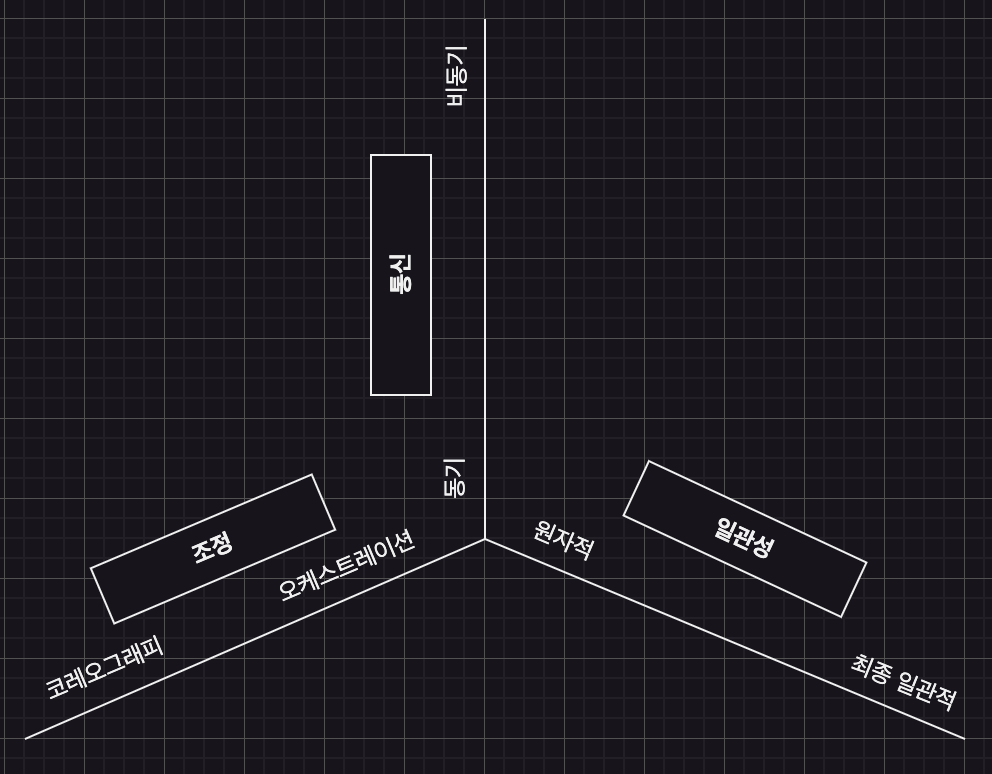
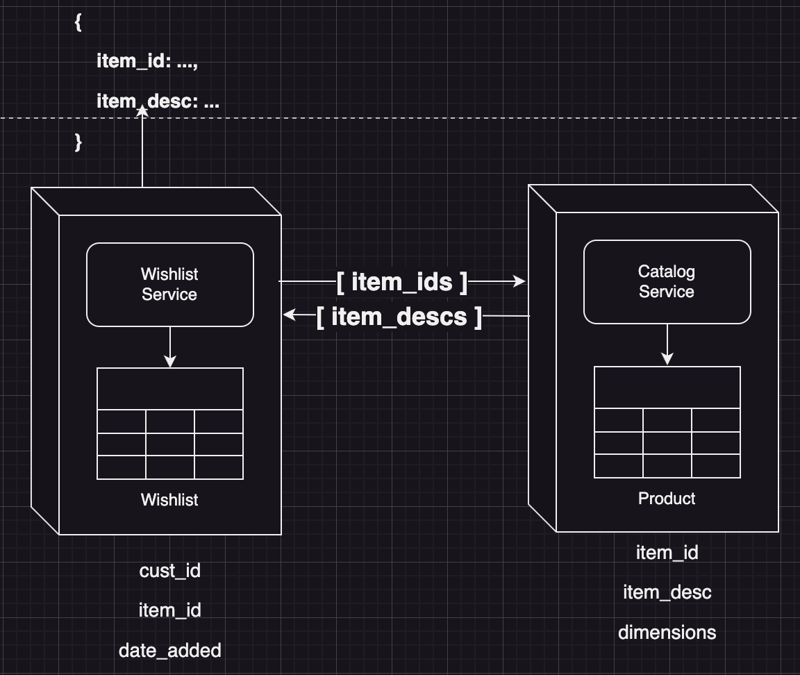

# 소프트웨어 아키텍처(The Hard Parts)
- 이 책은 시간이 흐름에 따라 소프트웨어 개발 생태계가 변하기 때문에 특정 기술이나 상세 구현에 집중하는 대신, 아키텍트가 어떻게 의사결정을 내리는지, 새로운 상황에 처했을 때, 트레이드오프를 어떻게 객관적으로 평가할 것인지 집중한다.

## 1장. '베스트 프랙틱스' 가 없다면?
**아키텍트**
- 아키텍트는 일반적인 문제보다는 새로운 상황에서 창의적인 의사 결정을 하느라 끊임없이 고군분투하는 사람들.
- 소프트웨어 아키텍처에서 나쁜 것중에서 제일 나은 트레이드오프 조합을 찾는 걸 권장한다.

### 1.4. 아키텍처 결정 레코드(Architecture Decision Records)
#### ADR(Architecture Decision Records)
- 아키텍처 결정이 기록된 (보통 한두 페이지 정도의) 짧은 텍스트 파일.
- 보통 아시키독(AsciiDoc)이나 마크다운(Markdown) 같은 텍스트 문서 포맷이나 위키페이지의 템플릿으로 작성함.
- 포맷
  - **콘텍스트(Context)**: ADR가 다루는 문제를 한두 문장으로 간략히 기술하고 문제를 해결할 수 있는 대안을 열거한다.
  - **결정(Decision)**: 확정된 아키텍처 결정과 그렇게 결정하게 된 사유를 자세히 밝힌다.
  - **결과(Consequence)**: 아키텍처 결정이 적용되면 어떤 결과가 발생하는지, 어떤 트레이드오프를 고려해야 하는지 기술한다.

### 1.5. 아키텍처 피트니스 함수
- 아키텍처 거버넌스: 아키텍트가 정의한 설계 원칙대로 개발자가 올바르게 구현하고 있는지 관리/감독하는 것

#### 1.5.1 피트니스 함수 사용하기
**아키텍처 피트니스 함수(Architecture Fitness Function)**
- 어떤 아키텍처 특성이나 그것들을 조합한 아키텍처 특성의 무결성을 객관적으로 평가하는 임의의 매커니즘
- 사용 예제
  - [JDpend](https://github.com/clarkware/jdepend) 메트릭(지표) 도구로 패키지 간 의존성을 확인할 수 있다.
  - [소나큐브(SonarQube)](https://www.sonarsource.com/products/sonarqube/)를 이용하여 많은 공통 피트니스 함수를 턴키 방식[1](#footnote_1)으로 제공한다.
  - [아크유닛(ArchUnit)](https://www.archunit.org/)을 이용하여 거시적인 아키텍처 구조를 검증할 수 있다.

<!-- 1장.-->
<a name="footnote_1">1</a>: 제품에 기본 제공된 함수를 바로 사용할 수 있는 형태

## 2장. 따로 떼어놓기
**커플링(Coupling)**
- 소프트웨어 시스템의 어느 한쪽을 변경하면 다른 쪽도 함께 변경해야 할 경우, 양쪽은 서로 결합된(coupled) 것이다.

### 2.1. 아키텍처 퀀텀
#### 아키텍처 퀀텀(Quantum)
- 각기 다른 요소들이 서로 연결을 맺고 통신하는 방법에 관한 소프트웨어 아키텍처의 토폴로지와 동작
- 개별 배포 가능한 단위

#### 정적 커플링
- 정적인 디펜던시가 아키텍처에서 계약을 통해 어떻게 결정되는지 나타냄
- 운영체제, 프레임워크, 전이적 디펜던시 관리(transitive dependency)[2-1](#footnote_2_1)를 통해 전달되는 라이브러리 등

#### 동적 커플링
- 퀀텀이 런타임에 어떻게 서로 통신하는지(예, 동기 통신, 비동기 통신)를 나타냄. 
- 피트니스 함수를 통해 모니터링해야 함.

#### 의미
- 독립적으로 배포 가능
- 높은 기능 응집도
- 높은 정적 커플링
- 동적 퀀텀 커플링
  - 통신(Communication): 동기 통신 vs 비동기 통신
  - 일관성(Consistency): 원자성 vs 최종 일관성, 데이터 트랜잭션
  - 조정(Coordination): 오케스트레이션 방식 vs 코레오그래피 방식
  - <figure><figcaption>그림. 3차원_동적_퀀텀_커플링_그래프</figcaption></figure>

<!-- 2장.-->
<a name="footnote_2_1">2-1</a>: A->B에 의존하고, B->C에 의존할 경우, 결과적으로 A->C에 의존하게 되는 현상

## 3. 아키텍처 모듈성
### 3.1 모듈화 동인
- 아키텍트는 뚜렷한 비지니스 동인(예. 시장 출시 속도, 시장 경쟁 우위 등) 없이 시스템을 더 잘게 나누면 안된다.

### 아키텍처 주요 5가지 특성
- 가용성(내고장성), 확장성, 배포성, 시험성, 유지 보수성 

#### 3.1.1. 유지 보수성

#### 3.1.2 시험성
- 아키텍처 민첩성을 위한 필수 성분
- 테스트의 완전성과 (보통 자동화 테스트를 통한) 용이함을 의미함.
- 예시. 서비스를 A, B, C로 나누었더라도 A -> B, B -> C, C -> 식으로 통신을 하게 되면 A가 변경되었을 때, B, C 모두 테스트해야 하기 때문에 테스트 용이성 및 완전성이 떨어지게 된다.

#### 3.1.3 배포성
- 배포의 용이함은 물론이고 배포 민도와 전체 리스크까지 포괄한 개념
- 만약, 마이크로서비스를 특정 순서를 지켜 완전한 하나의 세트로 배포해야 한다면 다시 모놀리스로 간 것과 마찬가지다.

#### 3.1.4 확장성
- 유저 부하가 점점 증가해도 시스템이 응답성을 유지하는 능력

#### 3.1.5. 가용성/내고장성
- 내고장성(fault tolerance): 아키텍처 모듈화 관점에서 시스템의 어떤 파트가 고장나도 나머지 파트는 응답성과 가용성을 유지하는 능력

## 6장. 운영 데이터 분리
### 6.1 데이터 분해인
#### 6.1.1 데이터 분해인
- 데이터 분해는 어떤 경우에 고려해야 하는가?
  - 변경 관리: 데이터베이스 테이블 변경 시 얼마나 많은 서비스가 영향을 받는가?
  - 커넥션 관리: 데이터베이스가 여러 분산 서비스와 커넥션을 맺을 수 있는가?
  - 확장성
  - 내고장성
  - 아키텍처 퀀텀
  - 데이터베이스 유형 최적화
- **변경 관리**
  - 경계 콘텍스트(Bounded Context)로 분해하면 변경 관리에 유익함.
  - 데이터 쓰기의 주체가 소유자이다.
  - 경계 컨텍스트 내에 있는 시스템의 데이터베이스가 변경되도 외부에 있는 시스템은 변경으로부터 격리된다.
- **커넥션 관리**
  - 여러 서비스가 데이터베이스 커넥션을 몇 개 맺고 있는지 따져 보며, 메트릭을 수집하는 피트니스 함수를 활용하여 파악한다.
- **확장성**
  - 데이터베이스를 포함하여 시스템 전 부문의 확장을 살펴봐야 한다.
- **내고장성**
  - 서비스나 데이터베이스가 고장이 나도 시스템의 다른 부분은 중단 없이 가동시킬 수 있어야 한다.
  - 단일 장애점(Single Point of Failure) 을 제거할 수 있다.
- **아키텍처 퀀텀**
  - 서비스 A,B 와 서비스 C,D,E 가 필요한 아키텍처 요건이 다른 상태인데 동일한 데이터베이스를 바라보면 단일 퀀텀이 된다. 따라서 이런 경우에는 서비스 A,B가 접속하는 데이터베이스와 서비스 C,D,E가 접속하는 데이터베이스를 분리하는 것이 나을 수 있다.
- **데이터베이스 타입 최적화**

### 6.3. 데이터베이스 타입 선택
- NewSQL 데이터베이스: NoSQL DB의 확장성과 RDB의 ACID 장점을 겸비한 새로운 개념의 데이터베이스. 
- 시계열 데이터베이스: 정해진 시간대에 수집된 일력의 데이터 포인트를 보관하는 일에 특화되었다. 추가전용

|           | 학습 용이성 | 데이터 모델링 용이성 | 확장성/처리량 | 가용성/내분할성 | 일관성 | 제품성숙도, SQL지원, 커뮤니티 | 읽기/쓰기 우선순위 | 종류 |
|---|---|---|---|---|---|---|----|---|
| 관계형 데이터베이스(RDBMS) | 4 | 3 | 2 | 1| 5| 4| 일기=쓰기| MySQL, Oracle, SQL Server, PostgreSQL|
| Key-Value 데이터베이스 | 3 | 1| 4| 4| 2| 3| 읽기 > 쓰기 | Amazon DynamoDB, Memcached, Redis |
| 문서형 데이터베이스| 3 | 3| 2| 3| 2| 3| 읽기 > 쓰기| MongoDB, CouchDB|
| 컬럼형 데이터베이스| 2 | 1 | 4| 4| 1 | 2| 읽기 < 쓰기 | Cassandra |
| 그래프 데이터베이스 | 1 | 2 | 3  | 3 | 3 | 2 | 읽기 > 쓰기| Neo4j |
| NewSQL 데이터베이스 | 3| 3| 3| 3| 2| 2| 읽기 = 쓰기 | 볼트DB, 누오DB, 클러스트릭스DB|
| 클라우드 데이터베이스 | 2| 2| 4| 3|3|2| 읽기 > 쓰기 | Snowflake, Amazon Redshift|
| 시계열 데이터베이스 | 1 | 2| 4| 2| 3| 2| 읽기 > 쓰기 |

## 10장. 분산 데이터 엑세스
- 서비스가 자신이 소유하지 않은 데이터를 읽는, 즉, 데이터를 필요로 하는 서비서의 경계 컨텍스트 외부에서 읽기 액세스를 획득하는 4가지 데이터 액세스 패턴
- 예시. 위시리스트 서비스는 카탈로그 서비스가 ownership 을 가지고 있는 Product 테이블의 item_desc 컬럼 데이터가 필요한데, 접근할 수 없다.
  - 

### 4가지 패턴
- 서비스 간 통신 패턴
- 컬럼 스키마 복제 패턴
- 복제 캐싱 패턴
- 데이터 도메인 패턴

### 서비스 간 통신 패턴(Interservice Communication Pattern)
- 

#### 트레이드오프
| 장점 | 단점|
|----|----|
| 단순하다| 네트워크, 보안, 데이터 latency 가 발생한다(성능이슈). |
| 데이터 용량 문제가 없다 | 확장성/처리량 이슈 |
|      | 내고장성이 없다(가용성 이슈) |
|      | 서비스 간 계약이 필요하다 |

##### 장점
- 단순하다.
- 데이터 용량 문제가 없다.
##### 단점
- 서비스 커플링
  - 위시리스트 서비스가 사실상 카탈로그 서비스의 가용성에 전적으로 의존하여 정적으로 결합될 수 밖에 없다.
  - 카탈로그 서비스가 실패하면 위시리스트 서비스도 사용할 수 없다.
- 확장을 할 때, 두 서비스가 모두 함께 확장해야 한다.
- 네트워크 latency, 보안 latency, 데이터 latency 발생하여 성능이 떨어진다. item_desc 목록 조회하려고 1초까지 걸릴 수 있다.
  - 네트워크 latency: 서비스간 패킷 전송 시간(30 ~ 300ms)
  - 보안 latency: 추가 인증이 필요할 때, 보안 레벨에 따라 (20 ~ 400ms)
  - 데이터 latency: 데이터베이스 조회 호출(10 ~ 50ms)

### 컬럼 스키마 복제 패턴(Column Schema Repliccation Pattern)
- 컬럼을 여러 테이블에 복제해서 다른 경계 컨텍스트에서도 데이터를 복제해 쓸 수 있게 만드는 패턴이다.
- 

#### 트레이드오프
| 장점              | 단점               |
|-----------------|------------------|
| 데이터 엑세스 성능이 좋다. | 데이터 동기화가 필요       |
| 확장성/처리량 이슈가 없다. | 데이터 Ownership 이슈 |
| 내고장성 이슈가 없다.    | 데이터 일관성 이슈   |
| 서비스 디펜던시가 없다. |                  |

##### 단점
- 데이터 동기화와 데이터 일관성
  - Product 정보가 변경되거나 생성될 떄마다 변경사실을 위시리스트 서비스(그리고 이 데이터를 복제해서 사용하는 다른 서비스들)에 알려야 한다. 보통 큐, 토픽, 이벤트 스트리밍을 응용한 비동기 통신으로 처리한다.
- 데이터 Ownership 이슈
  - 데이터 복제본을 다른 서비스에서 각자 갖고 있기 때문에 내 손을 떠난 데이터에 대해서 얼마든지 업데이트를 할 수 있다. 결국, 데이터 일관성 문제가 생길 수 있다.

##### 사용 예
- 데이터 집계, 리포팅, 데이터가 워낙 대량이라서 높은 응답성, 높은 내고장성이 절실함에도 다른 액세스 패턴으로 해결하기 곤란한 상황일 때 고려하기.

### 복제 캐싱 패턴(Replicated Caching Pattern)
- 각 서비스의 메모리에 데이터를 복제하여 언제나 정확히 동일한 데이터를 참조하도록 계속 동기화하는 캐싱 패턴이다.
- 

#### 트레이드오프
| 장점          | 단점           |
|--------------|--------------|
| 데이터 엑세스 성능이 좋다. | 초기 서비스 시작 디펜던스(startup dependency) |
| 확장성/처리량 이슈가 없다. | 대량의 데이터를 처리하기에 적합하지 않다. |
| 내고장성이 괜찮은 편이다. | 업데이트가 잦은 경우에도 잘 안 맞는다. |
| 데이터 일관성이 보장된다. | 클라우드, 컨테이너 환경에서 설정하기 까다로울 수 있다. |
| 데이터 ownership이 유지된다. |              |

##### 단점
- startup dependency
  - 캐시를 소유한 카탈로그 서비스가 가동 중일 때까지 초기 위시리스트 서비스는 연결될 때까지 대기 상태에 빠진다.
- data volume
  - 데이터가 너무 크면(예, 500MB 이상), 실요성은 급격히 떨어진다. 서비스마다 각자 복제 캐시를 갖고 있는데, 5개의 서비스 인스턴스가 각각 500MB 캐시가 필요하면, 총메모리 용량은 2.5GB나 된다.
- 데이터 변경 빈도가 지나치게 높으면, 서비스 간 데이터를 완전히 동기화하기 어렵다. 주로 정적인 데이터에 비교적 잘 맞는다.
- 서비스들은 TCP/IP 브로드캐스팅, lookup 등을 통해 서로가 서로를 인지한다. TCP/IP 브로드캐스팅과 lookup 범위가 너무 커지면 소켓 레벨에서 handshake를 하는 시간이 오래 걸릴 수 있다. 클라우드 환경에서는 IP 
  주소가 동적으로 변해서 구성 및 설정 관리가 만만하지 않을 수 있다.

#### 참고
- 분산 캐싱(Distributed Caching)과의 차이점
  - 분산 캐싱은 외부 캐시 서버에 데이터를 보관한다.
  - 서비스 간 통신 패턴에서 발생하는 내고장성 문제가 동일하게 발생한다.
  - 캐시 데이터가 중앙에서 공유되는 구조이기 때문에, 데이터 ownership 이 없는 서비스에서 변경할 수도 있다.(물론 엄격한 governence 로 어느 정도 해결할 수는 있다.)
  - 네트워크 latency(원격 호출을 통해 접근) 로 복제 캐싱보다 응답성이 떨어진다. 

### 데이터 도메인 패턴
- 여러 서비스가 공유하는 테이블을 하나의 스키마에 집어 넣고 관리하는 방법
- 

#### 트레이드오프
| 장점              | 단점               |
|-----------------|------------------|
| 데이터 엑세스 성능이 좋다. | 데이터 변경을 관리할 경계 콘텍스트가 더 넓어진다. |
| 확장성/처리량 이슈가 없다. | 데이터 Ownership 관리 |
| 내고장성 이슈가 없다.    | 데이터 엑세스 보안       |
| 데이터 일관성이 보장된다.  |  |
| 서비스 디펜던시가 없다. |       | 

##### 단점
- 데이터 변경을 관리할 경계 콘텍스트가 더 넓어진다.
  - 데이터 도메인의 테이블 중 하나라도 바뀌면 여러 서비스를 함께 변경해야 한다.
- 데이터 엑세스 보안
  - 위시리스트 서비스가 접근하면 안되는 테이블의 데이터가 존재할 수 있다(서비스 오너쉽과 경계 컨텍스트를 엄격하게 적용하여 완화할 수 있다.).
