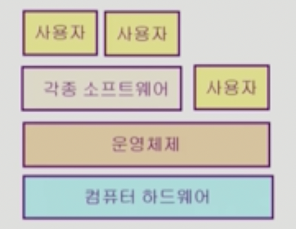

# 운영체제(Operating System, OS)
- 영상 : [KOCW 운영체제 (반효경)](http://www.kocw.net/home/search/kemView.do?kemId=1046323) (27H)
- 교재 : [그림으로 배우는 구조와 원리 운영체제(개정3판)](http://www.kyobobook.co.kr/product/detailViewKor.laf?ejkGb=KOR&mallGb=KOR&barcode=9791156642459)
- 블로그 : [https://brunch.co.kr/@toughrogrammer/15](https://brunch.co.kr/@toughrogrammer/15)

## 운영체제란?
- 컴퓨터 하드웨어 바로 위에 설치되어 사용자 및 다른 모든 소프트웨어와 하드웨어를 연결하는 소프트웨어 계층
  - 
- 좁은 의미의 운영체제(커널)
  - 운영체제의 핵심부분으로 메모리에 상주한다.
- 넓은 의미의 운영체제
  - 커널뿐 아니라 각종 주변 시스템 유틸리티를 포함한 개념이다. 

## 운영체제의 목표
- 컴퓨터 시스템을 `편리하게 사용할 수 있는 환경을 제공`하자.
  - 운영체제는 동시 사용자/프로그램들이 각각 독자적으로 컴퓨터에서 수행되는 것 같은 환상을 제공해주자.
  - 하드웨어를 직접 다루는 복잡한 부분을 운영체제가 대행한다.
- 컴퓨터 시스템의 `자원을 효율적으로 관리`하자.
  - 프로세서, 기억장치, 입/출력 장치 등의 효율적 관리하자.
    - 사용자간의 형평성있는 자원 분배를 하자.
    - 주어진 자원으로 최대한의 성능을 내자.
  - 사용자 및 운영체제 자신을 보호하자.
  - 프로세스, 파일, 메세지 등을 관리하자.

## 운영체제의 분류(동시 작업 가능 여부)
### 단일 작업(single tasking)
- 한 번에 하나의 작업만 처리한다.
- ex. MS-DOS 프롬프트 상에서는 한 명령의 수행을 끝내기 전에 다른 명령을 수행시킬 수 없음.

### 다중 작업(multi tasking)
- 동시에 2가지 이상의 작업을 처리한다.
- 현대의 운영체제는 거의 다 multi tasking을 지원한다.
- ex. UNIX, MS Window 등에서는 한 명령의 수행이 끝나기 전에 다른 명령이나 프로그램을 수행할 수 있다.
