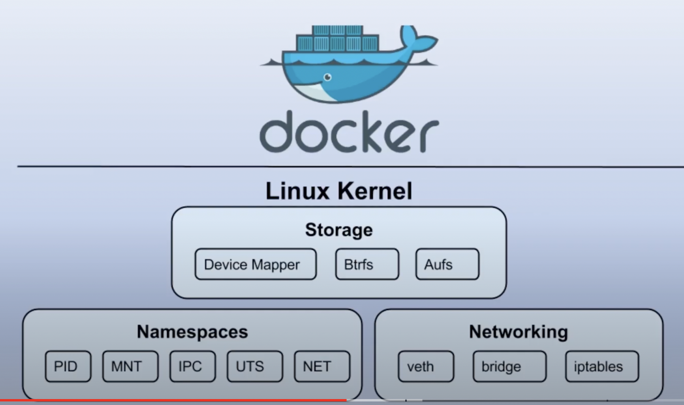

# 따라 배우는 도커
- https://www.youtube.com/watch?v=3HId-tpYaZs&list=PLApuRlvrZKogb78kKq1wRvrjg1VMwYrvi&index=2


# Docker
- Container Engine 중 하나

## Virtual Machine vs Container
- 

## 왜 굳이 Linux에서 Docker를 수행하는지?
- Linux Kernal 기능(chroot, namespace, cgroup)을 이용해서 Container를 만들게 된다.
- 

### Linux Kernal 기능
- chroot: 독립된 공간을 형성할 수 있다.
- namespace: isolate 기능을 지원해준다.
- cgroup: 필요한 만큼 HW를 지원해준다.

> Q. Window, MacOS에서는 어떻게 동작할까?
> 
> Window, MacOS에는 Linux Kernal이 없기 때문에 Hipervisor를 활성화시킨 후 Linux Kernal를 지원해줄 수 있게 한 후에 이 위에 Container 를 돌리는 것이다.

## Docker 를 사용하는 이유
- 모든 사람들이 동일한 Container 환경에서 애플리케이션을 구동시킬 수 있다.
- Scale-in/out 이 쉽고, 그래서 MSA, DevOps에 적합하다.

# Container vs Container 이미지
## Container
- Container는 하나의 애플리케이션 프로세스이다.
- Container 끼리는 Isolate되어 있다.

### Docker host 
- Docker Daemon(dockerd)이 동작하고 있는 Linux Kernal 이 있는 시스템을 Docker Host라고 한다.
- Container Engine 에 Docker를 설치해서 Docker Daemon을 실행한다.
- 즉, Docker가 Container가 실행될 수 있는 플랫폼을 만들어 놓았다.
- Docker Damon 이 있어서 Container가 동작할 수 있는 것이다.
- 각 Container는 동일한 Kernal을 이용한다.
- 

## Container Image
- 여러 개의 Layer로 구성되어 있다.
- 하나의 application이 잘 동작하게 하기 위해 여러 개의 Image를 구성하여 Container Image를 만든다.
- File 형태로 Registry에 저장되어 있다.
- 

## Container vs Container Image 차이점
- Container는 dockerd 위에서 동작 중인 Process 이다.
- Container Image는 Registry에 File 형태로 저장되어 있다. 이건 Read Only만 가능하다.
- 

### Container 동작 방식
- 공식 Docker Repository(Docker Hub) 에 여러 가지 Docker Container Image 들이 저장되어 있다.
- Local PC에서 `docker search [찾고자 하는 이미지]`로 해당 이미지가 Docker Hub에 있는지 찾는다.
- `docker pull [찾고자 하는 이미지:tag]` 를 하면 Docker Hub에서 Local PC의 저장소로 Container Image를 다운로드 받는다.
- `docker run -d --name web -p 80:80 nginx:latest` 로 Local PC의 저장소에 저장되어 있는 Container Image를 실행한다.

#### Docker Architecture
-  

### 정리
- Docker Host(Linux Kernal): dockerd가 동작하고 있는 Linux Kernal이 있는 시스템.
- Docker Daemon: `systemctl start docker` 로 실행한 도커 데몬
- Docker Client Command:
- Docker Hub: Docker Container Image가 보관되어 있는 저장소
- Container Image: Container Layer 별로 이미지가 저장되어 있다.
- Container: 동작중인 프로세스

### 실습
#### Docker 상태 살펴보기
- ```
  $ docker version
    Client: Docker Engine - Community
    Version:           20.10.17
    API version:       1.41
    Go version:        go1.18.3
    Git commit:        100c70180f
    Built:             Mon Jun  6 21:36:39 2022
    OS/Arch:           darwin/arm64
    Context:           default
    Experimental:      true
    
    Server: Docker Desktop 4.12.0 (85629)
    Engine:
    Version:          20.10.17
    API version:      1.41 (minimum version 1.12)
    Go version:       go1.17.11
    Git commit:       a89b842
    Built:            Mon Jun  6 23:01:01 2022
    OS/Arch:          linux/arm64
    Experimental:     false
    containerd:
    Version:          1.6.8
    GitCommit:        9cd3357b7fd7218e4aec3eae239db1f68a5a6ec6
    runc:
    Version:          1.1.4
    GitCommit:        v1.1.4-0-g5fd4c4d
    docker-init:
    Version:          0.19.0
  ```
  
#### Docker Status
- Linux 에서만 적용되는 명령어
- ```
  $ systemctl status docker
  ```
  

#### Docker Container Image 검색하기
```
$ docker search mysql
NAME                            DESCRIPTION                                     STARS     OFFICIAL   AUTOMATED
mysql                           MySQL is a widely used, open-source relation…   13337     [OK]
mariadb                         MariaDB Server is a high performing open sou…   5095      [OK]
phpmyadmin                      phpMyAdmin - A web interface for MySQL and M…   654       [OK]
percona                         Percona Server is a fork of the MySQL relati…   592       [OK]
bitnami/mysql                   Bitnami MySQL Docker Image                      78                   [OK]
databack/mysql-backup           Back up mysql databases to... anywhere!         70
linuxserver/mysql-workbench                                                     44
ubuntu/mysql                    MySQL open source fast, stable, multi-thread…   38
linuxserver/mysql               A Mysql container, brought to you by LinuxSe…   37
circleci/mysql                  MySQL is a widely used, open-source relation…   27
google/mysql                    MySQL server for Google Compute Engine          21                   [OK]
rapidfort/mysql                 RapidFort optimized, hardened image for MySQL   13
bitnami/mysqld-exporter                                                         4
ibmcom/mysql-s390x              Docker image for mysql-s390x                    2
newrelic/mysql-plugin           New Relic Plugin for monitoring MySQL databa…   1                    [OK]
vitess/mysqlctld                vitess/mysqlctld                                1                    [OK]
hashicorp/mysql-portworx-demo                                                   0
rapidfort/mysql8-ib             RapidFort optimized, hardened image for MySQ…   0
docksal/mysql                   MySQL service images for Docksal - https://d…   0
mirantis/mysql                                                                  0
cimg/mysql                                                                      0
drud/mysql                                                                      0
silintl/mysql-backup-restore    Simple docker image to perform mysql backups…   0                    [OK]
corpusops/mysql                 https://github.com/corpusops/docker-images/     0
drud/mysql-local-57             ddev mysql local container                      0
```

#### Docker Container Image가 저장되는 Default 위치
- /var/lib/docker/overlay2

#### 다운로드 받은 Docker Image 목록 보기
```
$ docker image ls
or
$ docker images

REPOSITORY   TAG       IMAGE ID       CREATED      SIZE
mysql        latest    262f364f4f01   5 days ago   546MB
```

#### 도커 Container Image 다운로드 받기
```
$ docker pull mysql:latest
[+] Running 12/12
 ⠿ mysql Pulled                                                                                                                                                                6.4s
   ⠿ 828689dcde4b Already exists                                                                                                                                               0.0s
   ⠿ 1f061378e43d Already exists                                                                                                                                               0.0s
   ⠿ 3b1a79ec4c76 Already exists                                                                                                                                               0.0s
   ⠿ 29639854082a Already exists                                                                                                                                               0.0s
   ⠿ 7be1d8abaf67 Already exists                                                                                                                                               0.0s
   ⠿ 862924992b62 Already exists                                                                                                                                               0.0s
   ⠿ 4d8afc4c260a Already exists                                                                                                                                               0.0s
   ⠿ 4fb5afa1cf8a Already exists                                                                                                                                               0.0s
   ⠿ 693834f1d9ba Already exists                                                                                                                                               0.0s
   ⠿ 3411c71dcce2 Already exists                                                                                                                                               0.0s
   ⠿ 877257953583 Already exists                                                                                                                                               0.0s
[+] Running 1/1
 ⠿ Container local-mysql  Started

```
- mysql은 총 11개의 image로 구성되어 있다. 즉, 11개의 layer가 있는 것이다.


#### Container Image를 Running 시키기
```
$ docker run -d -p 33306:3306 --name docker-mysql -e MYSQL_ROOT_PASSWORD=root1234 -d mysql:latest
4d2cfec92866abc2031bc6b2b3bda674817c0402ef6796996d5a72af4b7c104a
```

#### 실행 중인 Container 프로세스 확인하기
```
$ docker ps

CONTAINER ID   IMAGE          COMMAND                  CREATED          STATUS          PORTS                                NAMES
4d2cfec92866   mysql:latest   "docker-entrypoint.s…"   24 seconds ago   Up 24 seconds   33060/tcp, 0.0.0.0:33306->3306/tcp   docker-mysql
```

#### 도커 Container Process 중지시키기
```
$ docker stop docker-mysql
or
$ docker stop 4d2cfec92866
```

#### 도커 Container 지우기
```
$ docker rm docker-mysql
```

#### 도커 Container Image 지우기
```
$ docker rm image mysql
or
$ docker rmi mysql
or

docker image ls
REPOSITORY   TAG       IMAGE ID       CREATED      SIZE
mysql        latest    262f364f4f01   5 days ago   546MB

docker rmi 262f364f4f01
```

# Dockerfile
- Dockerfile은 Container를 만들 수 있도록 도와주는 명령어 집합이다.
- Dockerfile을 이용해서 Container 를 Build 한다.
- Dockerfile 은 쉽고, 간단하고, 명확한 구문을 가진 text file로 top-down 으로 한줄 한줄 해석한다.
- Container Image를 생성할 수 있는 `고유의 지시어(Instruction)`을 가진다.
- 대소문자를 구분하지 않는다. 그러나 가독성을 위해서 지시어는 대문자를 사용하는 걸 권장한다.

## Dockerfile 문법
- FROM: 컨테이너의 Base Image(운영환경)
- MAINTAINER: 이미지를 생성한 사람의 이름 및 정보
- LABEL: 컨테이너 이미지에 컨테이너의 정보를 저장
- RUN: 컨테이터 빌드를 위해 Base Image에서 실행할 commands
- COPY: 컨테이너 빌드 시 호스트의 파일을 컨테이너로 복사
- ADD: 컨테이너 빌드 시 호스트의 파일(tar, url 포함)을 컨테이너로 복사
- WORKDIR: 컨테이너 빌드시 명령이 실행될 작업 디렉토리 설정
- ENV: 환경변수 지정
- USER: 명령 및 컨테이너 실행 시 적용할 유저 설정
- VOLUME: 파일 또는 디렉토리를 컨테이너의 디렉토리로 마운트
- EXPOSE: 컨테이너 동작 시 외부에서 사용할 포트 지정
- CMD: 컨테이너 동작 시 자동으로 실행할 서비스나 스크립트 지정
- ENTRYPOINT: CMD와 함께 사용하면서 command 지정시 사용

## 내가 만든 컨테이너를 배포하려면?
1. `docker build -t testapp:latest .`
>  - t: tag
>  - `testapp`만 하고 lastest를 생략해도 자동으로 latest가 적용됨.
>  - . : 현재 작업 디렉토리 지정
- 이렇게 하면 local registry 에 컨테이너 이미지가 만들어져서 파일로 저장이 된다.

2. `docker login`
3. `docker push testapp:latest`
- Docker Hub에 내가 만든 docker image를 upload 시켜서 Registry에 저장한다.

## 실습
- 
- Dockerfile
  - ```
      FROM debian
      RUN  apt-get update \
      && apt-get install fortune
      COPY ./webpage.sh .
      RUN  chmod +x webpage.sh
      CMD ['sh webpage.sh']
    ```
- webpage.sh
  - ```
    #!/bin/bash
    mkdir /htdocs
    while:
    do
    /usr/games/fortune > /htdocs/index.html
    sleep 10
    done
    ```
- container image build하기
  - `docker build -f Dockerfile -t fortune:22.10 .`

# Docker Registry
- 컨테이터 이미지를 보관하는 저장소

## 종류
- Docker Hub: hub.docker.com(public 저장소)
- Private Registry: 사내 Private 컨테이너 저장소

## Docker Hub
- Official Image: Docker에서 공식적으로 보증하는 이미지들
- Verified Publisher: 벤더들이 보장하고 제공하는 이미지들

## Private Registry 구축
- Registry 컨테이너를 이용해 Private 컨테이너 이용할 수 있다.
- 참고: https://hub.docker.com/_/registry
- ```
  $ docker run -d -p 5001:5000 --restart always --name estel-registry registry:2
  ```
- Image Registry
  - private registry 접속할 때는 반드시 hostname:port 또는 ip:port를 통해서 접속해야 한다.
  - `localhost:5001/ubuntu:latest`
  - `docker.example.com:5000/ubuntu:latest`

## 명령어
### 컨테이너 이미지 검색하기
- ```
  $ docker search [이미지]
  ```

## 실습
### Docker Hub에서 인증하는 httpd를 down 받아서 나의 registry에 업로드하기
#### 1단계. httpd를 Docker Hub에서 다운로드 받기
```
$ docker pull httpd
```
- 다운로드 받은 image 확인하기
```
$ docker images httpd
REPOSITORY   TAG       IMAGE ID       CREATED       SIZE
httpd        latest    bdd9fb9f21a1   13 days ago   137MB
```
#### 2단계. 내 계정의 Registry에 업로드 하기
- 공식 사이트에서 받은 건 내 계정에 대한 컨테이너 이미지 정보가 없기 때문에 내 계정에 대한 이미지라는 걸 알려주기 위해서 tag 정보를 추가한다.
```
$ docker tag httpd:latest pikanpie/httpd:latest

$ docker images
REPOSITORY       TAG       IMAGE ID       CREATED       SIZE
pikanpie/httpd   latest    bdd9fb9f21a1   13 days ago   137MB
httpd            latest    bdd9fb9f21a1   13 days ago   137MB

$ docker push pikanpie/httpd:latest
aaf2289332a: Mounted from library/httpd
1a0a0b0ce31b: Mounted from library/httpd
396fbc9e1d79: Mounted from library/httpd
```

### 나의 PRIVATE REGISTRY에 업로드하기
#### 1단계. Registry Contianer 구성하기.
```
$ docker run -d -p 5001:5000 --restart always --name estel-registry registry:2
```
#### 2단계. registry ubuntu 다운로드 받기.
```
$ docker pull ubuntu
$ docker tag ubuntu localhost:5001/ubuntu
$ docker push localhost:5001/ubuntu
```

#### 3단계. 사설 Registry에 업로드하기 위해 Tag를 만들어서 push 하기
```
$ docker tag httpd:latest localhost:5001/httpd:latest

$ docker images localhost:5001/httpd
REPOSITORY             TAG       IMAGE ID       CREATED       SIZE
localhost:5001/httpd   latest    bdd9fb9f21a1   13 days ago   137MB

$ docker push localhost:5001/httpd:latest
The push refers to repository [localhost:5001/httpd]
baaf2289332a: Pushed
1a0a0b0ce31b: Pushed
396fbc9e1d79: Pushed
0e54c75454f4: Pushed
c75eaa0eefd3: Pushed
latest: digest: sha256:8b449db91d13460b848b60833cad68bd7f7076358f945bddf14ed4faf470fee4 size: 1366
```
- 리눅스 환경에서는 default path가 `/var/lib/docker/volumes/xxxxx/_data/docker/registry/v2/repositories` 에 컨테이너 이미지들이 저장된다.


# Docker Container Lifecycle

### Docker Container Image 검색하기

```jsx
docker search [option][image_name]
$ docker search mysql
```

### Docker Container Image 내 시스템으로 다운로드 받기

```jsx
docker pull [option] [image_name:tag_name]

$ docker pull mysql:latest // docker pull mysql 과 동일하다. tag가 없으면 latest는 자동임.
```

### 내 시스템에 다운로드 받은 Container image 목록 보기

```jsx
docker image ls
docker images
$ docker images

$ docker images --no-trunc // image_id를 full 로 살펴보기
REPOSITORY   TAG       IMAGE ID                                                                  CREATED       SIZE
mysql        8         sha256:262f364f4f01337f2027e10c7ca2994dc28883afb24386100c89351126d76fe4   6 days ago    546MB
mysql        latest    sha256:262f364f4f01337f2027e10c7ca2994dc28883afb24386100c89351126d76fe4   6 days ago    546MB
nginx        latest    sha256:1db0b6ded6ab40b48b544eafc8d76bc1b06cf25f3774b442de5282c429f4359f   13 days ago   135MB
```

### 내 시스템에 다운로드 받은 Container Image 상세 보기

```jsx
docker inspect [option] [image_name:tag]
$ docker inspect mysql:latest
```

### 내 시스템에 다운로드 받은 Container image 삭제하기

```jsx
docker rmi [option] [image_name]
$ docker rmi mysql:latest
```

### 내 시스템에 있는 Docker Container Image를 Running 시키기

```jsx
docker run [image_name:tag_name]

$ docker run mysql:latest
```

### Container Image를 바탕으로 Container를 만들기(Running 중은 아니다.)

- create는 default로 background로 만든다.
- `docker ps -a` 로 확인하면 created 만 된 상태이다.

```
$ docker create --name local-webserver nginx
533d73e660d57e300e88ade3f535edb3044662dee719656eef0ee1caf9053b81
```

### Container 시작하기(Running)

```
$ docker start local-webserver
```

### Container Image를 바탕으로 생성 + 시작을 동시에 하기

```
docker run [option] <image_name:tag_name>
$ docker run -d --name webserver nginx:1.14
```

### Running 중인 Docker Container 살펴보기

```
docker ps [option]
$ docker ps -a
CONTAINER ID   IMAGE          COMMAND                  CREATED          STATUS          PORTS                               NAMES
533d73e660d5   nginx          "/docker-entrypoint.…"   58 seconds ago   Created                                             local-webserver
4e36a311502c   mysql:latest   "docker-entrypoint.s…"   11 minutes ago   Up 11 minutes   0.0.0.0:3306->3306/tcp, 33060/tcp   local-mysql
```

### Running 중인 Container 상세 보기

```
docker inspect [option] <container_name>
$ docker inspect local-webserver

$ docker inspect --format '{{.NetworkSettings.IPAddress}}' local-webserver
172.17.0.2
```

### Running 중인 Docker Container 중지시키기

- `docker ps -a`로 확인하면 Exited가 되어 있다.

```
docker stop [option] <container_name>
$ docker stop local-webserver
```

### Container 삭제하기

```
docker rm [option] <container_name>
$ docker rm local-webserver -f
```

### Running 중인 Container 내에서 실행중인 프로세스 확인하기

```
docker top <continaer_name>
$ docker top local-webserver
UID                 PID                 PPID                C                   STIME               TTY                 TIME                CMD
root                2239                2214                0                   01:48               ?                   00:00:00            nginx: master process nginx -g daemon off;
uuidd               2293                2239                0                   01:48               ?                   00:00:00            nginx: worker process
uuidd               2294                2239                0                   01:48               ?                   00:00:00            nginx: worker process
uuidd               2295                2239                0                   01:48               ?                   00:00:00            nginx: worker process
uuidd               2296                2239                0                   01:48               ?                   00:00:00            nginx: worker process
uuidd               2297                2239                0                   01:48               ?                   00:00:00            nginx: worker process
```

### Running 중인 Container의 로그 확인하기

```
docker logs <container_name>
$ docker logs -t -f webserver
```

### Running 중인 Container에 New Command 추가 실행하기

```
docker exec <container_name> <command>
$ docker exec -it webserver /bin/bash
```

- -i(interactive)
- -t(terminal)

### Forground로 Running 중인 Container 에 연결하기

```
docker attach [option] <container_name>
$ docker attach 
```

### 실습


1.
```
$ docker search httpd
NAME                                 DESCRIPTION                                     STARS     OFFICIAL   AUTOMATED
httpd                                The Apache HTTP Server Project                  4211      [OK]       
centos/httpd-24-centos7              Platform for running Apache httpd 2.4 or bui…   44                   
centos/httpd                                                                         35                   [OK]
hypoport/httpd-cgi                   httpd-cgi                                       2                    [OK]
clearlinux/httpd                     httpd HyperText Transfer Protocol (HTTP) ser…   2                    
solsson/httpd-openidc                mod_auth_openidc on official httpd image, ve…   2                    [OK]
nnasaki/httpd-ssi                    SSI enabled Apache 2.4 on Alpine Linux          1                    
dockerpinata/httpd                                                                   1                    
lead4good/httpd-fpm                  httpd server which connects via fcgi proxy h…   1                    [OK]
dariko/httpd-rproxy-ldap             Apache httpd reverse proxy with LDAP authent…   1                    [OK]
centos/httpd-24-centos8                                                              1                    
inanimate/httpd-ssl                  A play container with httpd, ssl enabled, an…   1                    [OK]
manageiq/httpd                       Container with httpd, built on CentOS for Ma…   1                    [OK]
publici/httpd                        httpd:latest                                    1                    [OK]
manasip/httpd                                                                        0                    
patrickha/httpd-err                                                                  0                    
httpdss/archerysec                   ArcherySec repository                           0                    [OK]
manageiq/httpd_configmap_generator   Httpd Configmap Generator                       0                    [OK]
amd64/httpd                          The Apache HTTP Server Project                  0                    
e2eteam/httpd                                                                        0                    
httpdocker/kubia                                                                     0                    
paketobuildpacks/httpd                                                               0                    
19022021/httpd-connection_test       This httpd image will test the connectivity …   0                    
ppc64le/httpd                        The Apache HTTP Server Project                  0                    
sherazahmedvaival/httpd-php-fpm74                                                    0
```
2.
```
 docker run -dit --name my-apache-app -p 8080:80 -v "$PWD":/usr/local/apache2/htdocs/ httpd:2.4
Unable to find image 'httpd:2.4' locally
2.4: Pulling from library/httpd
Digest: sha256:4400fb49c9d7d218d3c8109ef721e0ec1f3897028a3004b098af587d565f4ae5
Status: Downloaded newer image for httpd:2.4
2131e038e0974bcdcbb3b66b955200351e17e7ab264d8772979a1d86a297bd2a
```

3. 
```
$ docker ps
CONTAINER ID   IMAGE       COMMAND              CREATED          STATUS          PORTS                  NAMES
2131e038e097   httpd:2.4   "httpd-foreground"   44 seconds ago   Up 43 seconds   0.0.0.0:8080->80/tcp   my-apache-app
```

4. 
```
$ docker inspect -f '{{.NetworkSettings.IPAddress}}' my-apache-app
172.17.0.2
```

6. 
```
$ docker logs my-apache-app -t -f
```

7. 
```
$ docker stop my-apache-app

$ docker rm my-apache-app
```

8. 
```
$ docker rmi httpd
```

# Container 리소스 관리하기
- 기본적으로 컨테이너는 호스트 하드웨어 리소스의 사용 제한을 받지 않는다.
- 때문에 Container가 여러 개를 운영할 때, 특정 Container가 호스트 하드웨어의 리소스를 너무 많이 점유하면 다른 Container 들은 리소스 사용이 적으면서 문제가 발생할 수 있다. 그래서 Container 마다 리소스 제한을 해야 한다.

## Container 리소스 제한하는 방법
### Docker Command를 통해 제한할 수 있는 리소스
- Memory
- CPU
- Disk

#### 명령어
```
$ docker run [option]
```

### Memory 리소스 제한
- 제한 단위는 b, k, m, g로 할당한다.
- | 옵션    | 의미   |
  |-------------|--------|
  | --memory, -m         | 컨테이너가 사용할 최대 메모리 용량을 지정                   |
  | --memory-swap        | 컨테이너가 사용할 스왑 메모리 영역에 대한 설정(메모리 + 스왑). <br/> 생략시 메모리의 2배가 설정됨. |
  | --memory-reservation | --memory 보다 적은 값으로 구성하는 소프트 제한값 설정.<br/> 최소 사용하는 값 |
  | --oom-kill-disable  | OOM Killer가 프로세스를 kill 하지 못하도록 보호         |
- 예시
  ```
  $ docker run -d -m 512m nginx
  $ docker run -d -m 1g --memory-swap 1.5g nginx
  $ docker run -d -m 1g --memory-reservation 512m nginx
  $ docker run -d -m 200m --oom-kill-disable nginx
  ```

### CPU 리소스 제한
- | 옵션            | 의미 |
  |-----|-----|
  | --cpus    | 컨테이너에 할당된 CPU Core 수를 지정.<br/> --cpus="1.5" 는 컨테이너가 최대 1.5개의 CPU 파워 사용 가능 |
  | --cpuset-cpus | 컨테이너가 사용할 수 있는 CPU나 코어를 할당. cpu index는 0부터 시작함. <br /> 예시. --cpuset-cpus=0-4 |
  | --cpu-shares  | 컨테이너가 사용하는 CPU 비중을 1024기반으로 설정. <br /> 예시. --cpu-share 2048: 기본값보다 2배 많은 CPU 자원을 할당 |
- 예시
  ```
  $ docker run -d --cpus=".5" ubuntu
  $ docker run -d --cpuset-cpus 0-3 ubuntu
  $ docker run -d --cpu-shares 2048 ubuntu
  ```

### Block I/O 리소스 제한하기
- 

## Container가 사용중인 리소스 확인하는 모니터링 툴
### docker monitoring commands
- `docker stat` : 실행중인 컨테이너의 런타임 통계 확인
  - `docker stats <options> [container_name]`
- `docker event` : Docker Host의 실시간 event 정보를 수집해서 출력
  - `docker events -f container=<NAME>`
  - `docker image -f container=<NAME>`
- [cAdvisor](https://github.com/google/cadvisor)

## 실습하기
- 

### 메모리 실습
- `Dockerfile`
  ```
  $ cat Dockerfile3
  FROM debian
  RUN  apt-get update \
       && apt-get install stress -y
  CMD ['/bin/sh', '-c', 'stress -c 2']
  ```
- Docker Container 만들기
  ```
  $ docker build -f Dockerfile3 -t stress .
  ```
- 5초 동안 부하 주기
  ```
  $ docker run -m 100m --memory-swap 100m stress:latest stress --vm 1 --vm-bytes 90m -t 5s
  stress: info: [1] dispatching hogs: 0 cpu, 0 io, 1 vm, 0 hdd
  stress: info: [1] successful run completed in 5s
  
  # 할당은 100m 했는데, stress 부하는 200m로 했기 때문에 실행되자마다 죽는다.
  $ docker run -m 100m --memory-swap 100m stress:latest stress --vm 1 --vm-bytes 200m -t 5s
  stress: info: [1] dispatching hogs: 0 cpu, 0 io, 1 vm, 0 hdd
  stress: FAIL: [1] (415) <-- worker 7 got signal 9
  stress: WARN: [1] (417) now reaping child worker processes
  stress: FAIL: [1] (421) kill error: No such process
  stress: FAIL: [1] (451) failed run completed in 0s
  
  # --memory-swap 생략하면 최대 메모리의 2배가 생성됨. 여기서는 100m 할당했는데, stress는 150m를 했기 때문에 2배 미만이라서 수행 잘 됨.
  $ docker run -m 100m  stress:latest stress --vm 1 --vm-bytes 150m -t 5s
  stress: info: [1] dispatching hogs: 0 cpu, 0 io, 1 vm, 0 hdd
  stress: info: [1] successful run completed in 5s
  ```

### CPU 실습
- ```
  $  docker run --cpuset-cpus 0-3 --name c1 -d stress:latest stress -cpu 2
  
  $ docker run -c 2048 --name cload1 -d stress:latest
  $ docker run --name cload2 -d stress:latest
  $ docker run -c 512 --name cload3 -d stress:latest
  $ docker stats cload1
  ```
  
### Disk 실습
- ```
  $ docker run -it --rm --device-write-iops /dev/xvda:10 ubuntu:latest /bin/bash
  root@rdf123r3r# dd if=/dev/zero of=file1 bs=1M count=10 oflag=direct  
  ```
  
### cAdvisor 실행

# Container 가 사용하는 스토리지
- Container Volume
- 데이터 보존 방법
- Container 끼리 데이터 공유

## Container Volume 이란
- Container Image는 readonly 이다.
- Container 에 추가되는 데이터들은 별도의 RW(Read + Write) 레이어에 저장된다.
- Docker는 `Union File System(Overlay)`이라는 기능을 통해서 ReadOnly 레이어에 Read+Write 레이어에서 변경된 사항을 마치 하나로 통합된 것처럼 관리를 해준다.
- Container에 추가되는 이미지는 별도의 레이어에 생성된다.
- 만일 실수로 Container를 삭제하면 RO(ReadOnly) + RW(Read+Write) 레이어에 있던 데이터들은 삭제된다. 해당 Container 에 보존해야 할 고객정보가 담겨있었을 경우 큰 문제가 발생할 수 있다. 때문에 
  Container에서 Volume을 저장하는 기술이 중요해지게 된다.
- 

## Container가 만들어주는 데이터를 영구적으로 보존 방법(Volume Mount)
- Container RW(Read + Write) Layer에 저장되는 데이터 위치를 Docker Host의 특정 디스크 위치(ex. /dbdata)와 연결지어(`Volume Mount`) 실제로 이 위치에 데이터가 저장되도록 설정한다.
- [](resources/images/8_DockerContainer_Storage_영구저장.png)
- 만약 실수로 Container를 삭제하더라도 Docker Host에 저장된 데이터는 삭제되지 않고 남아 있는다.
- 

### volume 옵션
- ```
  -v <host_path>:<container mount path> 
  -v <host_path>:<container mount path>:<read write mode>
  -v <container mount path> 
  ```
  - read write mode를 생략하면 default 는 RW(read+write)이다.
  - host_path 를 지정하지 않으면 임의의 디렉토리를 만들어서 이 디렉토리로 마운트해준다.
    - [](resources/images/8_mysql_storage_영구저장.png)
- 예시
  ```
  $ docker run -d -v /dbdata:/var/lib/mysql -e MYSQL... mysql:latest
  $ docker run -d -v /webdata:/var/www/html:ro httpd:latest
  $ docker run -d -v /var/lib/mysql -e MYSQL... mysql:latest
  ```

## Container 끼리 데이터 공유하기
- Container 끼리 데이터 공유가 가능하다.
- 

## 실습
1. mysql data 영구 보존하기
```
$ mkdir dockerdata

$ docker run -d --name docker-mysql -v  ~/workspace/dockerdata/mysql/data:/var/lib/mysql  -e MYSQL_ROOT_PASSWORD=root1234 -d mysql:latest
42dec2d60b2c0e6aec98536358d5d1d605a8c997da1fd1cdd4ed0fc632568b3e

$ docker ps                                                                                                                                 
CONTAINER ID   IMAGE          COMMAND                  CREATED          STATUS          PORTS                 NAMES
42dec2d60b2c   mysql:latest   "docker-entrypoint.s…"   19 seconds ago   Up 19 seconds   3306/tcp, 33060/tcp   docker-mysql

$ docker exec -it docker-mysql /bin/bash
bash-4.4# mysql -u root -proot1234
mysql> show databases;
+--------------------+
| Database           |
+--------------------+
| information_schema |
| mysql              |
| performance_schema |
| sys                |
+--------------------+
mysql> create database temp_db;
+--------------------+
| Database           |
+--------------------+
| information_schema |
| mysql              |
| performance_schema |
| sys                |
| temp_db            |
+--------------------+
mysql> exit
Bye
bash-4.4# exit
exit

$ cd ~/workspace/dockerdata/mysql/data
$ ls -lrt
...
drwxr-x---    2 avery  staff        64 Oct 24 12:21 temp_db
...

$ docker rm -f docker-mysql                                                                                                              
docker-mysql

$ cd ~/workspace/dockerdata/mysql/data
$ ls -lrt
...
drwxr-x---    2 avery  staff        64 Oct 24 12:21 temp_db
...
```
2. 웹데이터 readonly 서비스로 지원하기
```
$ cd ~/workspace/dockerdata
$ mkdir web
$ cd web
$ echo "<h1>Docker Practice</h1>" > index.html
$ docker run --name docker-nginx -v ~/workspace/dockerdata/web:/usr/share/nginx/html:ro -d -p 8080:80 nginx:latest
$ docker ps                                                                                                           
CONTAINER ID   IMAGE          COMMAND                  CREATED         STATUS         PORTS                  NAMES
84e3673cd226   nginx:latest   "/docker-entrypoint.…"   4 seconds ago   Up 3 seconds   0.0.0.0:8080->80/tcp   docker-nginx
```
- 브라우저 열어서 http://localhost:8080
  - [](resources/images/8_DockerContainer_Storage_VolumeMount_실습2.png)

```
$  docker stop 84e3673cd226             
84e3673cd226
```

3. 컨테이너간 데이터 공유하기

```
$ cat df.sh             
#!/bin/bash
mkdir -p /webdata
while true
do
    df -h / > /webdata/index.html
    sleep 10
done

$ cat Dockerfile
FROM ubuntu
ADD  df.sh /bin/df.sh
RUN  chmod +x /bin/df.sh
ENTRYPOINT ["/bin/df.sh"]

$ docker run -d --name df -v  ~/workspace/til/docker/mydockerbuild/dockerdata:/webdata docker-ubuntu:latest
 
$ docker run --name my-nginx -p 8080:80 -v ~/workspace/til/docker/mydockerbuild/dockerdata:/usr/share/nginx/html:ro -d nginx

```
- 
