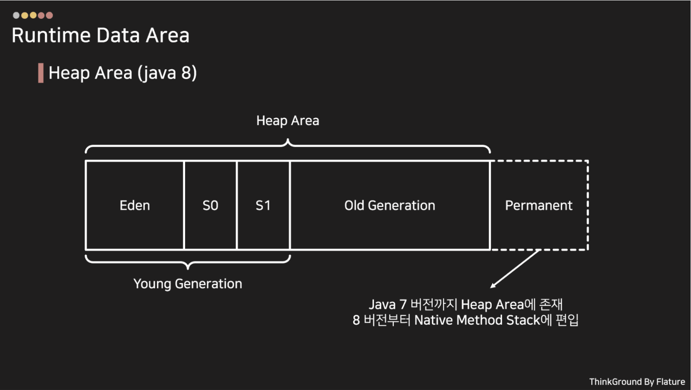
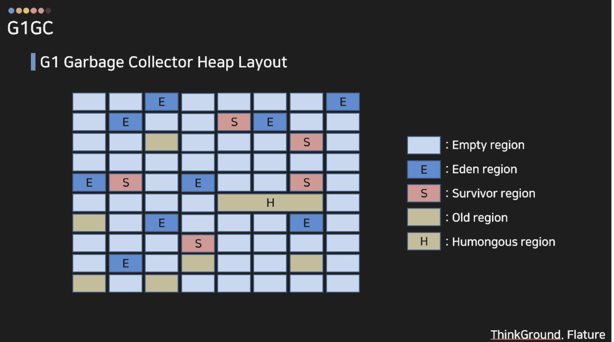
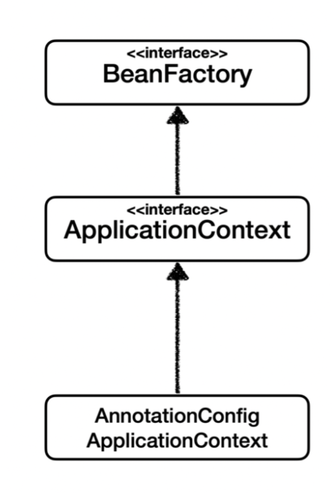
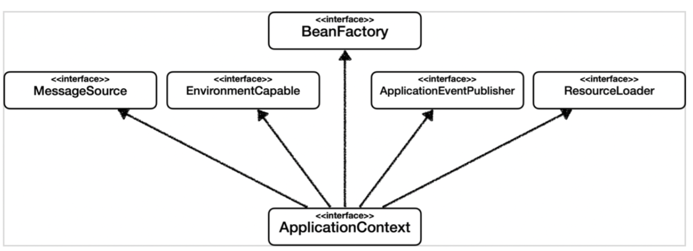
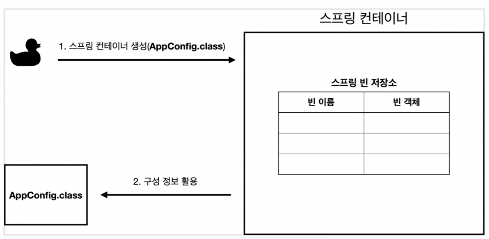
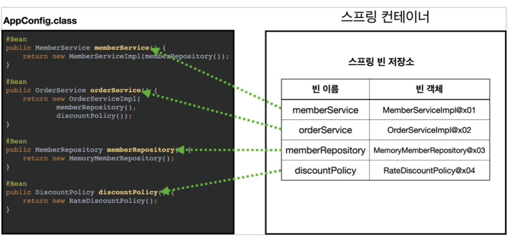
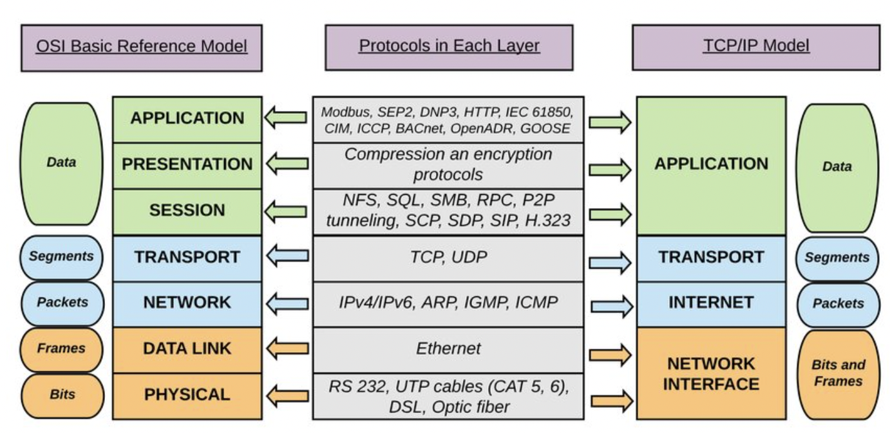
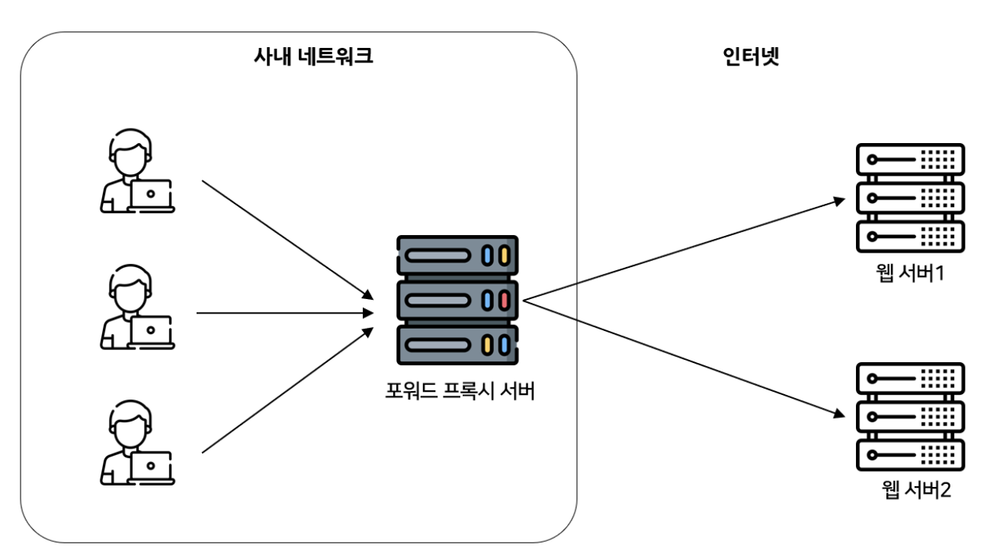
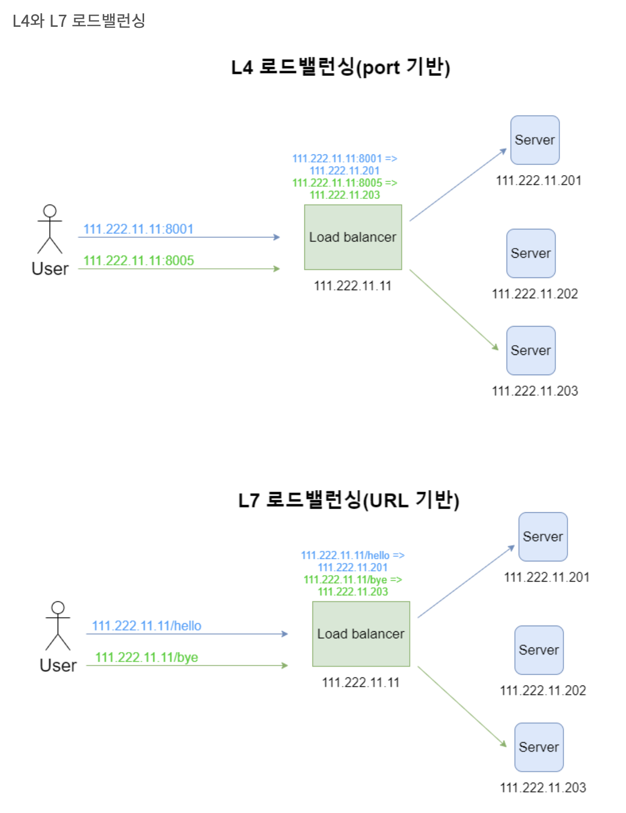

# 기본 알고리즘

> Q. Comparable과 Comparator 인터페이스의 차이는 무엇인가?
> - Comparable: 자연스러운 순서로 정렬할 때 사용한다.
> - Comparator: 원하는 대로 정렬 순서를 지정하고 싶을 때 사용한다.

example:
```java
private static class MyList implements Comparable<MyList> {

        private final String name;
        private final Integer age;

        public MyList(String name, Integer age) {
            this.name = name;
            this.age = age;
        }

        @Override
        public int compareTo(MyList o) {
            return this.age - o.age;
        }

        @Override
        public String toString() {
            return "NaturalOrder{" +
                    "name='" + name + '\'' +
                    ", age=" + age +
                    '}';
        }
    }
```
```java
        MyList[] myList = new MyList[6];
        myList[0] = new MyList("JHope", 28);
        myList[1] = new MyList("JK", 25);
        myList[2] = new MyList("RM", 28);
        myList[3] = new MyList("V", 27);
        myList[4] = new MyList("SUGA", 29);
        myList[5] = new MyList("JIMIN", 27);

        Arrays.sort(myList);

        for (MyList el : myList) {
            System.out.println(el);
        }
```
```shell
NaturalOrder{name='JK', age=25}
NaturalOrder{name='V', age=27}
NaturalOrder{name='JIMIN', age=27}
NaturalOrder{name='JHope', age=28}
NaturalOrder{name='RM', age=28}
NaturalOrder{name='SUGA', age=29}
```
```java
Arrays.sort(myList, ((o1, o2) -> {
   if (o1.name.compareTo(o2.name) <= 0) // 1. 이름 먼저 정렬
       return o1.name.compareTo(o2.name);
   return o1.age - o2.age; // 2. 나이 정렬
}));

System.out.println("=========== 내 맘대로 정렬 ==============");
for (MyList el : myList) {
   System.out.println(el);
}
```
```shell
=========== 내 맘대로 정렬 ==============
NaturalOrder{name='JHope', age=28}
NaturalOrder{name='JIMIN', age=27}
NaturalOrder{name='JK', age=25}
NaturalOrder{name='RM', age=28}
NaturalOrder{name='SUGA', age=29}
NaturalOrder{name='V', age=27}
```

> Q. 이진 검색(Binary Search)은 어떻게 구현하는가?
> - 정렬된 리스트가 있거나 이미 정렬이 수행된 상태일 때, 리스트에서 값을 찾을 때는 이진 검색(Binary Search)를 사용하는 것이 효율적이다.

# 자료구조
## 리스트(List)


### 1. 리스트
- 리스트는 특정 타입 값들이 순차적으로 정렬된 컬렉션(Collection) 이다. Java에서는 LinkedList나 ArrayList 클래스를 일반적으로 사용한다.
- 리스트는 자바의 내장 컬렉션인 배열하고는 다르다. 사실 리스트는 크기 지정에 한계가 없으므로 리스트를 사용하기 전에 크기를 지정할 필요가 없다.

### 2. 배열과 리스트의 관계
- 배열을 정의할 때는 크기를 지정해야 한다.
- 배열의 원소에는 *인덱스* 값을 이용해서 직접 접근할 수 있다. 이를 **랜덤 접근(random access)** 이라고 한다.

> Q. ArrayList와 LinkedList의 관계는?
>
>**ArrayList**
> - 클래스를 생성할 때는 배열의 초기 크기를 지정할 수 있다. 크기를 지정하지 않으면 기본 배열 크기는 10이다. 원소로 가득한 배열에 새로운 원소를 추가할 때마다 ArrayList 클래스는 자동으로 더 큰 배열을 재할당한다. 단, 시간이 소요되며 더 큰 메모리 용량을 소모한다.
> - 일반적으로 원소에 random access할 수 있어야 하거나 리스트 크기가 클 수록 ArrayList 클래스를 사용하면 좋다.
>
>**LinkedList**
> - 리스트의 첫 부분이나 중간에 원소를 삽입/삭제할 일이 많다면 LinkedList 클래스를 사용하는 것이 좋다.
> - LinkedList는 ArrayList 클래스에서 배열 재할당 과정에서 발생하는 손실을 막아준다. 그리고 리스트 크기가 작아지면 메모리 용량 역시 작아진다는 이점이 있다.
> - 혹시 스택처럼 특수한 자료구조를 만들었다면 LinkedList 클래스를 사용하는 것이 좋다. 리스트의 첫 부분에도 원소를 간단하게 넣고 뺄 수 있기 때문이다.

> Q. Queue와 Deque는 무엇인가?
>
> **Queue**
> - 선입선출(First in First out) 자료구조를 구현하는 자바 인터페이스이다.
>
> **DeQueue**
> - Queue 인터페이스의 확장이며 자료구조의 양끝에 원소를 추가하고 삭제할 수 있다.

## 트리(Tree)
- 이진 검색 트리(Binary Search Tree)에서는 주어진 노드의 값보다 '작은 원소'은 왼쪽에, '큰 원소'는 오른쪽에 위치한다.

## 맵(Map)
- 해쉬(Hash)라고도 하며, 배열이나 사전(Dictionary)과 관련 있는 'Key-Value' 쌍의 저장소다.
- Java Collection API의 일부지만, List 인터페이스와 달리 Collection 인터페이스를 구현하지 않는다.
- Map의 특징은 Key 값은 트리 상에서 한 번만 나타난다는 것이다. 동일한 키를 다시 삽입하면 원래 키에 있던 값을 덮어쒸운다.

**HashTable**
- 동기화할 수 있으며 병렬 처리에 효율적이다.
- 단일 스레드 작업이든 오버헤드 때문에 성능이 상당히 저하된다. 따라서 병렬 환경에서 Map 인터페이스를 사용해야 하면 ConcurrentHashMap을 사용하는 게 좋다.

**HashMap**
- HashTable을 자바로 구현한 것으로, 클래스 구현에는 Key-Value 쌍을 나타내는 Entry라는 내부 클래스가 있다.
- 동기화할 수 없다.

**TreeMap**
- Map 인터페이스를 구현하는데 이진 트리(Binary Tree) 자료구조를 이용한다.
- 키를 정렬 가능한 순서에 따라 저장하기 때문에 hashCode 메소드를 전혀 사용하지 않는다.
- TreeMap 클래스에 포함된 각 원소는 균형을 맞춘 트리 구조로 구성되어 있으므로 검색, 삭제, 삽입 같은 모든 동작은 항상 O(logN)의 처리 성능을 발휘한다.

> Q. TreeMap과 HashMap의 주된 차이점은?
> - TreeMap에서는 컬렉션이 *순서대로 저장*되므로 전체 컬렉션을 반복해서 순회할 때 키의 순서가 보전되는데 반해 HashMap 클래스에서는 순서가 보전되지 않는다는 것이다.

**LinkedHashMap**
- 기본적으로 HashMap 클래스와 같은 방식으로 작동한다.
- 그래서 원소를 찾는데 O(1)의 성능을 발휘한다.
- Key 인덱스를 빠르게 찾을 수 있을 뿐만 아니라 Map 안 원소들의 순서도 보존한다.

**ConcurrentHashMap**
- 많은 스레드에서 공유하고자 할 때 사용할 수 있다.
- Thread Safe 하고, 맵에 값을 쓰는 도중이라도 값을 읽어서 반환할 수 있도록 설계되어 있다. 값을 쓰는 동안에는 테이블의 지정된 줄만 lock되고, 나머지는 읽기 가능한 상태로 남겨둔다.

## 집합(Set)
- 중복을 허용하지 않는 순서 없는 객체들의 모음이다.

**HashSet**
- HashMap 클래스에 기반을 두고 구현되어 있으므로 값을 Map 키로 저장한다.

**TreeSet**
- 원소가 정렬되어 있다.

**LinkedHashSet**

단, ConcurruentHashSet은 없다. 다만, netSetFromMap이라는 정적 메서드가 있는데, ConcurrentHashMap 클래스와 유사한 역할을 한다.

# 디자인 패턴
- 소프트웨어 디자인 패턴은 프로그램을 만들면서 발생할 수 있는 다양한 상황에 효율적으로 적용할 수 있는 해결책이다.
- 보통 하나 이상의 객체를 함께 사용하며 코드 재사용, 확장성에 초점을 두거나 앞으로 개발할 때 필요한 견고한 기반을 제공한다는 점에서 개발하는데 도움이 된다.

#### 빌더패턴(Builder Pattern)
- 멤버필드가 많은 객체의 경우, 도메인에 적합한 객체를 생성하는 빌더라는 동반자 객체를 만들 수 있다.
- 따라서, 멤버필드가 많거나 생성과정이 복잡한 경우 사용하면 좋다.

#### 팩토리 메소드(Factory Method Pattern)
- 최종 생성된 객체의 종류가 달라질 때 사용하면 좋다.
- 참조
  - [java-abstract-factory-pattern](https://blog.seotory.com/post/java-abstract-factory-pattern)

#### 스트레티지 패턴(Strategy Pattern)
- 지정된 알고리즘의 세부 구현을 변경할 필요 없이 쉽게 교환할 수 있게 해주는 디자인 패턴이다. 실행 중이라도 구현된 알고리즘을 교환할 수 있으므로 의존성 주입(Dependency Injection)에 자주 사용된다.
- 장점은 실행하기 전까지 어떤 구현을 사용할지 결정을 미룰 수 있다는 점이다.
- Spring Framework에서 사용되는 예시
  - [ResourceLoader](https://sabarada.tistory.com/32)

#### 템플릿 메서드 패턴(Template Method Pattern)
- 알고리즘의 일부 또는 전부를 하위 클래스에서 구현하거나 위임하는데 사용한다. 즉, 공통으로 사용하는 안고리즘은 부모 클래스에 정의하고 특정 부분에서 사용하는 알고리즘은 하위 클래스에서 수행하도록 설계하는 것이다.
- Spring Framework에서 사용되는 예시
  - JdbcTemplate, JpaTemplate

#### 템플릿 콜백 패턴(Template Callback Pattern)
- Spring Framework에서 사용하는 예시
  - JdbcTemplate, RestTemplate , TransactionTemplate , RedisTemplate
- https://velog.io/@dbsrud11/SpringBoot-%ED%95%B5%EC%8B%AC-%EC%9B%90%EB%A6%AC-%ED%85%9C%ED%94%8C%EB%A6%BF-%EB%A9%94%EC%86%8C%EB%93%9C-%ED%8C%A8%ED%84%B4%EA%B3%BC-%EC%BD%9C%EB%B0%B1-%ED%8C%A8%ED%84%B4-3

#### 데커레이터 패턴(Decorator Pattern)
- 특정 객체의 기능을 설정하거나 변경할 수 있게 해준다.
- 자바의 기본 입/출력 클래스
  - InputStream, OutputStream, 그리고 하위 클래스들

#### 플라이웨이 패턴(Flyweight Pattern)
- 몇 개의 객체에 많은 값을 공유해야 할 때 유용하다.
- Sun에서 구현한 Java 표준 라이브러리 Integer.valueOf()
  - 이전에 캐시된 값이라면 새로운 사본 인스턴스를 만들지 않고, 이전에 생성해둔 인스턴스를 반환한다.
  - 기본 범위는 -128부터 127까지다.
```java
    @HotSpotIntrinsicCandidate
    public static Integer valueOf(int i) {
        if (i >= IntegerCache.low && i <= IntegerCache.high)
            return IntegerCache.cache[i + (-IntegerCache.low)];
        return new Integer(i);
    }
```

#### 싱글턴 패턴(Singleton Pattern)
- 오직 하나의 인스턴스만 생성한다는 것을 보장하는 패턴
- Spring Framework에서 사용되는 예시
  - Spring Framework에서 Singleton이 default scope이다.
  - IOC Contanier가 1개의 instance만 생성한다.
  
#### 프록시 패턴(Proxy Pattern)
- 프록시(Proxy)는 우리 말로 대변인 또는 대리자라고 한다. 대리자, 대변인은 누군가를 대신해서 그 역할을 수행해주는 것이다. 프로그램에서도 마찬가지로 어떤 클래스를 대신해서 그 역할을 하는 것이다.
- 인터페이스가 있을 때, Proxy와 실제 Real Target 모두 인터페이스를 구현한다. 대신 Proxy에서는 Real Target을 갖고 있어 내부적으로 호출하여 기능을 수행한다.
- 

#### Spring Framework에서 사용되는 예시
- [Learn About Design Patterns Used in Spring Framework](https://blog.eduonix.com/java-programming-2/learn-design-patterns-used-spring-framework/)
  - Factory Pattern
    - BeanFactory Container, ApplicationContext Container
  - Proxy Pattern
    - AOP
  - Singleton
    - Spring Framework에서 Singleton이 default scope이다.
    - IOC Contanier가 1개의 instance만 생성한다.
  - Template Method
    - JdbcTemplate, JpaTemplate
  - Model View Controller (MVC)
  - Strategy Pattern
    - [ResourceLoader](https://sabarada.tistory.com/32)


# 자주 묻는 면접 알고리즘 구현하기
- FizzBuzz 구현하기
- Fibonacci 수열 구현하기
- Factorial 수열 구현하기

- 알고리즘 연습 사이트
  - backjoon
  - leetcode
  - codility

# Java 기본

### [객체지향](https://ko.wikipedia.org/wiki/%EA%B0%9D%EC%B2%B4_%EC%A7%80%ED%96%A5_%ED%94%84%EB%A1%9C%EA%B7%B8%EB%9E%98%EB%B0%8D) 이란?
- 객체지향 프로그래밍(Object Oriented Programming:OOP)는 컴퓨터 프로그래밍의 패러다임 중 하나이다. 객체 지향 프로그래밍은 컴퓨터 프로그램을 명령어의 목록으로 보는 시각에서 벗어나 여러 개의 독립된 단위, 즉 *객체*들의 모임으로 파악하고자 하는 것이다. 객체들끼리 메세지를 주고 받으며 서로 협력하여 프로그램을 만든다.
- 특징
  - 추상화
    - 공통점을 추출하여 이를 하나의 개념으로 다른다.
    - 자료 추상화는 불필요한 정보는 숨기고 중요한 정보만을 표현함으로써 프로그램을 간단히 만드는 것이다.
  - 캡슐화
    - 불필요한 점보는 숨기고 중요한 정보만을 표현한다.
  - 상속
    - 상속은 새로운 클래스가 기존의 클래스의 자료와 연산을 이용할 수 있게 하는 기능이다. 상속을 통해서 기존의 클래스를 상속받은 하위 클래스를 이용해 프로그램의 요구에 맞추어 클래스를 수정할 수 있고 클래스 간의 종속 관계를 형성함으로써 객체를 조직화할 수 있다.
  - 다형성
    - 하나의 객체가 여러 가지 타입을 가질 수 있는 것을 의미한다.
    - 어떤 한 요소에 여러 개념을 넣어 놓는 것으로 일반적으로 오버라이딩(같은 이름의 메소드가 여러 클래스에서 다른 기능을 하는 것)이나 오버로딩(같은 이름의 메소드가 인자의 개수나 자료형에 따라서 다른 기능을 하는 것)을 의미한다. 다형 개념을 통해서 프로그램 안의 객체 간의 관계를 조직적으로 나타낼 수 있다.
  - 동적 바인딩
    - 동적 바인딩은 실행 시간 중에 일어나거나 실행 과정에서 변경될 수 있는 바인딩으로 컴파일 시간에 완료되어 변화하지 않는 정적 바인딩과 대비되는 개념이다. 동적 바인딩은 프로그램의 한 개체나 기호를 실행 과정에 여러 속성이나 연산에 바인딩함으로써 다형 개념을 실현한다.
    - 실행 시에 모든 클래스가 로딩되는 것이 아니라 *필요한 시점에 클래스를 로딩*하여 사용할 수 있다는 장점이 있다.
- [SOLID 원칙](https://ko.wikipedia.org/wiki/SOLID_(%EA%B0%9D%EC%B2%B4_%EC%A7%80%ED%96%A5_%EC%84%A4%EA%B3%84))
  - SRP(Single responsibility principle, 단일 책임 원칙): 어떤 클래스나 모듈을 변경해야 할 이유는 1개여야 한다.
  - OCP(Open/closed principle, 개방-폐쇄 원칙): 소프트웨어 요소는 확장에는 열려 있으나 변경에는 닫혀 있어야 한다.
    - 소프트웨어 개발 작업에 이용된 많은 모듈 중에 하나에 수정을 가할 때 그 모듈을 이용하는 다른 모듈을 줄줄이 고쳐야 한다면, 이와 같은 프로그램은 수정하기가 어렵다. 개방-폐쇄 원칙은 시스템의 구조를 올바르게 재조직(리팩토링)하여 나중에 이와 같은 유형의 변경이 더 이상의 수정을 유발하지 않도록 하는 것이다. 개방-폐쇄 원칙이 잘 적용되면, 기능을 추가하거나 변경해야 할 때 이미 제대로 동작하고 있던 원래 코드를 변경하지 않아도, 기존의 코드에 새로운 코드를 추가함으로써 기능의 추가나 변경이 가능하다.
  - LSP(Liskov substitution principle, 리스코프 치환법칙): "프로그램의 객체는 프로그램의 정확성을 깨뜨리지 않으면서 하위 타입의 인스턴스로 바꿀 수 있어야 한다." 계약에 의한 설계를 참고하라.
    - 부모, 자식 관계에 있는 클래스가 있을 때, 부모를 호출하던 걸 자식을 호출하는 걸로 바꾸더라도 프로그램 수정은 없어야 한다.
  - ISP(Interface segregation principle, 인터페이스 분리 원칙): 특정 클라이언트를 위한 인터페이스 여러 개가 범용 인터페이스 하나보다 낫다.
    - 큰 덩어리의 인터페이스들을 구체적이고 작은 단위들로 분리시킴으로써 클라이언트들이 꼭 필요한 메서드들만 이용할 수 있게 한다. 이와 같은 작은 단위들을 역할 인터페이스라고도 부른다. 인터페이스 분리 원칙을 통해 시스템의 내부 의존성을 약화시켜 리팩토링, 수정, 재배포를 쉽게 할 수 있다.
  - DIP(Dependency inversion principle, 의존관계 역전 원칙): 프로그래머는 "추상화에 의존해야지, 구체화에 의존하면 안된다." 의존성 주입은 이 원칙을 따르는 방법 중 하나다.
    - 상위 계층(정책 결정)이 하위 계층(세부 사항)에 의존하는 전통적인 의존관계를 반전(역전)시킴으로써 상위 계층이 하위 계층의 구현으로부터 독립되게 할 수 있다. 이 원칙은 다음과 같은 내용을 담고 있다.
      - 첫째, 상위 모듈은 하위 모듈에 의존해서는 안된다. 상위 모듈과 하위 모듈 모두 추상화에 의존해야 한다.
      - 둘째, 추상화는 세부 사항에 의존해서는 안된다. 세부사항이 추상화에 의존해야 한다.

> Q. Java에서 객체란 무엇인가?
> - entity와 entity에 관련된 연산을 제공하는 메소드들의 모음이다. 따라서, 객체에는 entity의 상태와 행위가 있다.

> Q. 다형성과 상속이란 무엇인가?
> - *다형성*은 행동의 특정 타입에 대한 정의를 만들 수 있게 하고, 행동을 구현하는 수많은 다른 클래스들을 갖게 한다.
> - *상속*은 부모 클래스에서 클래스의 행동과 정의를 가져다 사용할 수 있게 해준다. 새로운 클래스를 정의할 때, 부모 클래스에서 정의와 상태를 상속할 수 있고 새로운 행동을 추가하거나 새로운 타입에 대한 행동을 오버라이드할 수 있다.

> Q. 인터페이스와 추상클래스의 차이점에 대해 설명해주세요.
> - 추상 클래스는 그 추상 클래스를 상속 받아 기능을 이용하고 확장하는데 목적이 있다. 추상 클래스를 상속 받은 자식 클래스간에는 연관관계가 있다.
> - 인터페이스는 함수의 껍데기만 있는데, 함수의 구현을 강제하기 위해서이다. 물론 Java8부타 default method 기능이 추가되어 interface에서 기본 body 구현이 가능하다. 다중 상속이 가능하다. 그래서 구현체 간에 연관관계가 없다.

> Q. 자바의 예외 처리 구조를 이루는 주요 클래스를 설명하라.
> 
> - checked exception은 try/catch/finally로 예외를 적절히 처리해야 한다.

> Q. Java8의 특징을 설명하라.
> - 등장배경: 프로그래밍 언어 생태계에도 변화의 바람이 불기 시작했다.
>   - 하드웨어적 측면: 멀티코어 CPU가 대중화되었다.
>   - 프로그래밍 생태계 변화: 빅데이터를 효율적으로 처리하고자 하는 욕구가 커졌다. 즉, 병렬 프로세싱을 활용해야 하는데 지금까지의 자바로는 충분히 대응하지 못 하는 분야였다.

> Q. Java8에서 제공하는 새로운 기술을 설명하라.
> - Stream API
>   - Stream: 한 번에 한 개씩 만들어지는 연속적인 데이터 항목들의 모임이다.
>   - Stream API의 핵심
>    - 우리가 하려는 작업을 (데이터베이스 질의처럼) 고수준으로 추상화해서 일련의 스트림을로 만들어 처리할 수 있다는 것이다.
>    - 스트림 파이프라인을 이용해서 입력 부분을 여러 CPU 코어에 쉽게 할당 할 수 있다는 부가적인 이득도 얻을 수 있다. 이로 인해 공짜로 병렬성을 얻을 수 있다.
> - 메서드에 코드를 전달하는 기법
>   - 메서드를 다른 메서드의 인수로 넘겨주는 기능을 제공한다(동작 파라미터화).
> - 인터페이스의 디폴트 메서드
>   - 컬렉션에 stream(), parallelStream() 추가해야 하는데, 이미 Collection을 많이 사용하고 있음. 이 기능을 넣기 위해서 default method 가 필요했음.
> - GC에서의 변화
>   - Permanent 영역이 사라지고 Metaspace 영역이 새로 생겼다.
> Metaspace 영역은

> Q. Optional 은 언제 쓰나?
> - Optional은 자바 8에 추가된 인터페이스로써 `Null` 처리를 위애 추가되었다. 비어있을 수도 있고 무언가를 담고 있을 수 도 있음을 의미하는 컨테이너 인스턴스의 타입이다. 
> - Optional을 어디에 쓴다는 제약조건은 없지만 리턴 타입에 쓰는 것이 권장사항이다.
> - 참고
>  - https://www.daleseo.com/java8-optional-after/

> Q. for...loop vs stream 언제 사용해야 하나?
> - Stream 의 map()이나 flatMap() 같은 메서드들을 체이닝(chaining)을 통해 조합해서 사용해야할 때처럼 내부적, 함수적 반복이 확실히 유리할 때만 stream 스타일을 쓰는 것이 좋다.
> - 원시 데이터(primitive data type)를 반복문으로 처리할 때는 절대적으로 전통적인 for-loop 를 써야한다.
> - 참고
>   - https://homoefficio.github.io/2016/06/26/for-loop-%EB%A5%BC-Stream-forEach-%EB%A1%9C-%EB%B0%94%EA%BE%B8%EC%A7%80-%EB%A7%90%EC%95%84%EC%95%BC-%ED%95%A0-3%EA%B0%80%EC%A7%80-%EC%9D%B4%EC%9C%A0/

> Q. map() & flatMap() 차이는?
> - map :: Stream T -> (T -> R) -> Stream R
> - flatMap :: Stream T -> (T -> Stream R) -> Stream R
> - 참고
>   - [flatMap vs map](https://stackoverflow.com/questions/26684562/whats-the-difference-between-map-and-flatmap-methods-in-java-8)

> Q. 왜 Perm이 사라지고 Metaspace가 추가된 것일까?
> - JVM에 의해 관리되는 Heap이 아닌 OS 레벨에서 관리되는 Native 메모리 영역이다. 그러므로 Metaspace가 Native 메모리를 이용함으로서 개발자는 영역 확보의 상한을 크게 의식할 필요가 없어지게 되었다.
> - 참고
>   - [Java-8-JVM-Metaspace](https://goodgid.github.io/Java-8-JVM-Metaspace/)

> Q. JVM 파라미터 설정은 어떻게 하는지?
> ```shell
>    -Xms2G -Xmx5G  
>    -XX:+UseGCLogFileRotation 
>    -XX:NumberOfGCLogFiles=< number of log files >
>    -XX:GCLogFileSize=< file size >[ unit ]
>    -Xloggc:/path/to/gc.log
>    -XX:+HeapDumpOnOutOfMemoryError
>    -XX:HeapDumpPath=./java_pid<pid>.hprof
>    -XX:OnOutOfMemoryError="< cmd args >;< cmd args >"
>    -XX:+UseGCOverheadLimit
>  ```
> - 참조:
>   - (jvm-parameters)[jvm-parameters](https://www.baeldung.com/jvm-parameters)

> Q. Java 11 특징은?
> - String 클래스에 새로운 메소드 추가
>   - strip(): 문자열 앞, 뒤의 공백 제거.
>    - stripLeading(): 문자열 앞의 공백 제거.
>    - stripTrailing(): 문자열 뒤의 공백 제거.
>    - isBlank(): 문자열이 비어있거나, 공백만 포함되어 있을 경우 true를 반환한다.
>    - String.trim().isEmpty() 와 결과가 동일함.
>    - repeat(n): n개만큼 문자열을 반복하여 붙여서 반환함.
> - java.nio.file.Files 클래스에 새로운 메소드 추가
>   - Path writeString(Path, String, Charset, OpenOption): 파일에 문자열을 작성하고 Path로 반환한다. 파일 오픈 옵션에 따라 작동 방식을 달리하며, charset을 지정하지 않으면 UTF-8이 사용된다.
>   - String readString(Path, Charset): 파일 전체 내용을 읽어서 String으로 반환하고, 파일 내용을 모두 읽거나 예외가 발생하면 알아서 close를 한다. charset을 지정하지 않으면 UTF-8이 사용된다.
>   - boolean isSameFile(Path, Path): 두 Path가 같은 파일을 가리키며, true, 아니면 false를 반환한다.
>   - 컬렉션 인터페이스에 새로운 메소드 추가
>     - toArray() 메소드를 오버 로딩하는 메소드가 추가되었고, 원하는 타입의 배열을 선택하여 반환할 수 있게 되었다.
>     - ```java
>        List sampleList = Arrays.asList("Java", "Kotlin");
>        String[] sampleArray = sampleList.toArray(String[]::new);
>        assertThat(sampleArray).containsExactly("Java", "Kotlin");
>     ```
> - Predicate 인터페이스에 새로운 메소드 추가
>   - Predicate 인터페이스에 부정을 나타내는 not() 메소드가 추가되었다.
>   - ```java
>     List<String> sampleList = Arrays.asList("Java", "\n \n", "Kotlin", " ");
>     List withoutBlanks = sampleList.stream()
>                                    .filter(Predicate.not(String::isBlank))
>                                    .collect(Collectors.toList());
>     assertThat(withoutBlanks).containsExactly("Java", "Kotlin");
>   ```
> - 람다 파라미터를 위한 로컬 변수 var 사용
>   - java 10버전에서 편리한 var 구문이 생겨난 상황에서, 11버전에서는 람다 파라미터에서 좀 더 명시적으로 var 를 이용 할 수 있게 되었다.
>   - ```java
>      List<String> sampleList = Arrays.asList("Java", "Kotlin"); 
>      String resultString = sampleList.stream()
>                                      .map((@Nonnull var x) -> x.toUpperCase())
>                                      .collect(Collectors.joining(", "));
>      assertThat(resultString).isEqualTo("JAVA, KOTLIN");
>   ```
>   자바 파일 실행
>    - javac를 통해 컴파일 하지 않고도, 바로 java 파일을 실행할 수 있게 되었다.
>    - ```shell
>      // Java 11 이전
>      $ javac HelloWorld.java
>      $ java Helloworld
>      Hello Java 8!
>  
>      // Java 11 이후
>      $ java HelloWorld.java
>      Hello Java 11!
>      ```
> - Garbage Collector
>   **전통적인 GC**
>   - 
>   **G1GC**
>   - 
>   - 빠른 처리 속도를 달성하면서 일시 중지 시간(Stop The World)을 최소화하는 것이 G1GC의 목표이다.
>   - Java9 부터 Default GC 이다.
>   - G1GC: Eden, Survivor, Old 영역이 존재하지만, 해당 영역은 고정된 크기가 아니며 전체 Heap 메모리 영역을 Region 이라는 특정한 크기로 나눈 것이고 Region의 상태에 따라 그 Region의 역할(Eden, Survivor, Old)가 동적으로 변동한다.
>   - 참고
>     - G1GC(https://huisam.tistory.com/entry/jvmgc)
>     - https://thinkground.studio/%EC%9D%BC%EB%B0%98%EC%A0%81%EC%9D%B8-gc-%EB%82%B4%EC%9A%A9%EA%B3%BC-g1gc-garbage-first-garbage-collector-%EB%82%B4%EC%9A%A9/
>
> - 참조
>   - [Java8과 Java11 특징](https://steady-coding.tistory.com/598)
>   - [Java11 특징](https://okky.kr/article/784365)

> Q. Java11 로 전환해야 하는 이유는?
> - 향후 몇 년 안에 Java8은 더 이상 지원하지 않고, Java11이 LTS(Long Term Support: 장기 지원 버전)이다.
> - 프로파일링 및 진단을 더 수월하게 해준다.
> - G1GC를 기본으로 사용한다.
> - Docker 컨테이너 사용자가 Java 힙에 사용되는 시스템 메모리 양을 세부적으로 제어할 수 있도록 JVM 옵션도 추가되었다.
> - [Java11로 전환해야 하는 이유](https://docs.microsoft.com/ko-kr/java/openjdk/reasons-to-move-to-java-11)

> Q. JAVA17 의 Feature들은 어떤 게 있는지?
- 텍스트 블록 기능 추가: 기존 String을 여러 줄 작성할 때 사용 가능한 기능, 가독성 있는 코드 지원
- Record Data class 추가: immutable 객체를 생성하는 새로운 유형의 클래스로 기존 toString, equals, hashCode Method에 대한 구현을 자동 제공
- 봉인(Sealed) 클래스: 무분별한 상속을 막기 위한 목적으로 등장한 기능으로 지정한 클래스 외 상속을 허용하지 않으며, 지정한 클래스 외 상속 불가능
- Stream.toList() 기능 추가: 기존, Stream을 List로 변환 시 Collectors에서 기능을 찾아 사용했다면 Java17 부터는 Collectors호출 없이 toList()만으로 변환이 가능
- 참고
  - https://techblog.gccompany.co.kr/%EC%9A%B0%EB%A6%AC%ED%8C%80%EC%9D%B4-jdk-17%EC%9D%84-%EB%8F%84%EC%9E%85%ED%95%9C-%EC%9D%B4%EC%9C%A0-ced2b754cd7
  - https://madplay.github.io/post/what-is-new-java-17
  - https://www.baeldung.com/java-17-new-features

> Q. Java11 부터 Java17 까지의 중요한 특징에 대해 설명하기.
> 1. Java11
> - var 키워드 추가: 타입 추론 기능을 제공하여 코드 작성 시 편의성을 높임.
> - http 클라이언트 표준화: 기존 HttpURLConnection 대신 (Java9 에 도입되었던)HttpClient 클래스 도입으로, 더욱 간편하게 HTTP 통신 가능.
>   - HTTP/1.1 과 HTTP/2을 지원
>   - 예시
>   - ```java
>     HttpClient httpClient = HttpClient.newBuilder()
>                                     .version(HttpClient.Version.HTTP_2)
>                                     .connectTimeout(Duration.ofSeconds(20))
>                                     .build();
>     HttpRequest httpRequest = HttpRequest.newBuilder()
>                              .GET()
>                              .uri(URI.create("http://localhost:" + port))
>                              .build();
>     HttpResponse httpResponse = httpClient.send(httpRequest, HttpResponse.BodyHandlers.ofString());
>     assertThat(httpResponse.body()).isEqualTo("Hello from the server!");
> 2. Java12
> - Switch 표현식 개선: 복수의 값 지정 가능한 case 문 도입으로 코드 가독성 개선.
>   - 기존의 `switch` 문에서는 각 `case`마다 해당하는 코드 블록을 작성하고 마지막에 `break`를 명시해야 했다. 그러나 Java 12부터는 `->` 연산자를 이용하여 각 `case`에 대한 코드를 한 줄로 표현할 수 있다. 이를 통해 코드 블록과 `break` 문을 생략하고 보다 간결한 코드를 작성할 수 있다. 또한, `default` 블록에서도 `->` 연산자를 이용하여 한 줄로 처리할 수 있다.
>   - 예시
>   - ```java
>     // 기존 방식
>     String time;
>     switch (weekday) {
>         case MONDAY:
>         case FRIDAY:
>              time = "10:00-18:00";
>              break;
>         case TUESDAY:
>         case THURSDAY:
>              time = "10:00-14:00";
>              break;
>         default:
>              time = "휴일";
>     }
>   - ```java
>     // Java12 방식
>     String time = switch (weekday) {
>         case MONDAY, FRIDAY -> "10:00-18:00";
>         case TUESDAY, THURSDAY -> "10:00-14:00";
>         default -> "휴일";
>     };
> - GC 개선: G1GC 기본값 설정, 메모리 최적화 개선.
> - String 클래스 개선: 문자열 조합, 비교 등의 기능 개선.
> 3. Java13
> - Switch 표현식 개선: `->(화살표 연산자)`를 이용한 case 문 도입으로 코드 가독성 개선.
> - Text Blocks 추가: 문자열을 쉽게 다룰 수 있는 기능 도입.
> - GC 개선: 메모리 최적화 및 ZGC (Z Garbage Collector) 도입.
>   - ZGC(Z Garbage Collector): 큰 힙 메모리를 다루는 것을 목표로 설계된 GC 알고리즘.
>     - 큰 힙 영역에서도 일정 시간 내에 GC 작업을 완료할 수 있는 성능을 보이며, 
>     - GC 작업 도중에 애플리케이션의 실행을 일시 중단하지 않는다. 이를 통해 애플리케이션의 전반적인 성능을 유지할 수 있다.
> 4. Java14
> - Records 추가: 데이터 저장용 클래스를 간결하게 작성할 수 있는 기능 도입.
> - Switch 표현식 개선: yield 키워드 추가로 반환값을 설정할 수 있게 됨. 
> - JFR 이벤트 기능 개선: 프로파일링 및 모니터링 용이성 개선.
> 5. Java15
> - Text Blocks 개선: 들여쓰기 및 escape 문자열 처리 개선.
> - Records 개선: equals() 및 hashCode() 자동 생성 가능.
> - ZGC 개선: 최대 힙 크기 지정 가능.
> 6. Java16
> - Records 개선: 상속 및 캐스팅 지원. 
> - Vector API 추가: SIMD 명령어를 활용한 벡터화 연산 가능. 
> - GC 개선: ZGC의 성능 개선 및 Epsilon GC 도입으로 특정 용도에서는 GC 수행 없이 동작 가능.
> 7. Java17
> - Sealed Classes 추가: 클래스 상속 제한 기능 도입. 
> - Pattern Matching 개선: instanceof 연산자로 더욱 간편한 객체 타입 판별 가능. 
>   - ```java
>     // 기존 방식
>     if (obj instanceof String) {
>         String str = (String) obj;
>         System.out.println(str.length());
>     }
>   - ```java
>     // java17 방식
>     if (obj instanceof String str) {
>         System.out.println(str.length());
>     }
> - GC 개선: ZGC의 성능 개선 및 메모리 최적화.
> 8. Java18
> - Records 개선: 인터페이스 구현 및 불변 타입 생성 가능. 
> - Switch 표현식 개선: switch 식에서 패턴 매칭 사용 가능. 
> - Vector API 개선: SIMD 벡터화 연산을 통해 배열 및 데이터 처리 성능 개선.
> 9. Java19
> - Pattern Matching 개선: as 키워드 추가로 변수 타입 캐스팅 및 null 검사 기능 추가. 
> - Vector API 개선: 벡터화 연산 확장 및 기존 메서드의 벡터화 버전 추가. 
> - ZGC 개선: 기존 힙 크기 16TB에서 최대 64TB까지 지원 가능.
> 10. Java20
> - Records 개선: 내부 클래스, 메서드, 빈 생성자 등의 기능 추가. 
> - Switch 표현식 개선: switch 식에서 break 생략 가능. 
> - Foreign Function and Memory API 추가: C나 C++로 작성된 코드와 상호작용하기 위한 기능 도입.
> 11. Java21
> - Records 개선: 상속 및 패턴 매칭 등의 기능 추가. 
> - Garbage Collector 개선: 메모리 최적화 및 퍼포먼스 개선. 
> - HTTP Client 개선: HTTP/2 프로토콜 자동 선택 및 스트림 지원 기능 추가.
> 12. Java22
> - JVM 개선: 메모리 및 쓰레드 관리, 클래스 로딩 등의 성능 개선. 
> - Pattern Matching 개선: switch 문에서 case null 지원. 
> - Foreign Function and Memory API 개선: 네이티브 메모리 처리 및 데이터 변환 기능 추가.

> Q. JPA 와 쿼리 중심으로 개발할 때의 차이점은?
> 
> - ORM: 객체와 관계형 데이터베이스를 맵핑한다는 뜻.
> - ORM 프레임워크: 객체와 테이블을 매핑해서 패러다임의 불일치 문제를 개발자 대신 해결해준다.
> - JPA는 지루하고 반복적인 CRUD SQL을 알아서 처리해줌.
> - 객체 모델링과 관계형 데이터베이스 사이의 차이도 해결해줌.
> - 조회된 결과를 객체로 매핑하는 작업도 대부분 자동으로 처리해줌.
> - JPA는 실행시점에 자동으로 SQL을 만들어서 실행하는데, JPA를 사용하는 개발자 입장에서는 SQL을 직접 작성하는 것이 아니라 어떤 SQL이 실행될지 생각만 하면 됨.
> - 성능에 대한 대안이 있음
> - Native SQL을 이용해서 직접 SQL을 작성할 수 있고, 쿼리 힌트도 사용할 수 있는 방법 존재
> - 애플리케이션보다는 데이터베이스 조회 성능 이슈인데, 이건 JPA 문제라기보다는 SQL을 직접 사용해도 발생하는 문제들임.
> - JPA 사용해서 얻은 성과
>   - 애플리케이션을 SQL이 아닌 객체 중심으로 개발하여 생산성과 유지보수가 확연히 좋아짐.
>   - 테스트 작성하기 편리해짐.
>   - Database 손쉽게 변경할 수 있음.

> Q. 행위 주도 개발이란 무엇인가?
> - BDD(Behavior-Driven Development)은 가능한한 자연 언어에 가깝게 작성된 테스트 스크립트와 테스트 스크립트 위에서 실행되는 코드라는 두개의 요소로 이뤄져 있다.

> Q. TDD vs BDD? 
> - TDD는 테스트 자체에 집중하여 개발하는 반면, BDD는 비즈니스 요구사항에 집중하여 테스트 케이스를 개발한다는 것이다 

> Q. Proxy란 무엇인가?
> - Proxy란 사전적으로는 대리인이라는 뜻을 가지고 있다. Java 에서 프록시는 RealSubject는 자신의 기능에만 집중을 하고 그 이외 부가 기능을 제공하거나 접근을 제어하는 역할을 Proxy 객체에게 위임한다.
> - https://velog.io/@dev_leewoooo/Proxy-pattern%EC%9D%B4%EB%9E%80-with-Java

# 자바 가상머신 이해하기

**JVM**
- 자바 가상머신(Java Virtual Machine)은 Java 프로그램이 실행되는 플랫폼이다. 각각의 운영체제와 아키텍처용으로 만들어져 있고, 운영체제와 애플리케이션 사이에 위치하면서 애플리케이션이 플랫폼에 상관없이 독립적을로 실행될 수 있도록 만들어준다.
- 자바 프로그램은 javac를 이용해 bytecode로 컴파일된다. 이 byetcode는 JVM에서 명령어들을 아키텍처와 운영체제용으로 해석한다.


> Q. Thread 클래스와 Executor 인터페이스의 차이점은 무엇인가?
> - Java4에서 도입된 동시성 프레임워크는 동시에 동작하는 코드를 위한 클래스의 집합을 제공했으며 자바의 스레드 모델을 이용할 수 있게 도와줬다.
> - Java 에서 실행되는 스레드를 만드는 일은 시스템 자원을 많이 사용하는 연산이므로 운영체제는 애플리케이션에서 한번에 실행되는 스레드 개수를 제한하게 된다. 즉, Thread Pool을 이용함으로써 새로운 스레드를 사용하기보다는 필요할 때 스레드를 가져오게 하거나 이전 코드에서 실행이 완료되었을 때 스레드를 재사용할 수 있게 하는 것이 좋다.
> - 자바의 동시성 프레임워크는 일반적인 경우에 사용할 수 있는 스레드풀들을 제공하며 필요에 따라 확장해서 사용할 수 있다.
> - Executor는 캐시된 Thread Pool을 사용하여 처리할 수 있다.


# HTTP와 REST API 이용하기
> REST 란 무엇인가?
> - REST API(Representational State Transfer)는 URI와 HTTP 메소드를 이용해 Resource에 접근하는 것이다.
> - REST의 요소: 리소스(URI), 행위(HTTP Method), 표현(Representation) 3가지 요소로 구성된다.

# CS
> Q. 동기/비동기, 블로킹/논블로킹이란?
>
> **동기/비동기**
> - 호출한 함수가 호출 되는 함수의 작업 완료 여부를 신경 쓰느냐 안 쓰느냐가 관심사이다.
> - 작업을 수행하는 주체가 2개 이상이어야 한다. 이때 작업의 시간(시작, 종료 등)을 서로 맞춘다면 동기라고 부르고, 서로 작업의 시간이 관계가 없다면 비동기라고 부른다.
> - 동기 작업
>   - 작업을 수행하는 2개 이상의 주체가 서로 동시에 수행해서 동시에 끝나거나, 끝나는 동시에 시작할 때를 의미한다.
> - 시작과 종료를 동시에 하거나, 하나의 작업이 끝나는 동시에 다른 주체가 작업을 시작하면 이를 동기 작업이라고 볼 수 있다.
> - 
>
> **블로킹/논블로킹**
> - 작업의 대상이 2개 이상이어야 한다. 제어권이 누구에게 있느냐가 관심사이다.
> - 블로킹
>   - A가 작업을 수행하다가 B를 호출했을 때, 제어권을 B에게 넘겨주고, B의 작업이 끝날 때까지 대기하면서 기다린 후, B가 작업이 끝나면 다시 A에게 제어권을 넘겨준다.
> - Non-Blocking
>   - A가 작업을 수행하다가 B를 호출했을 때, 제어권을 그대로 본인이 갖고 있으며 작업을 수행해 나간다.
> - 참고
>  - [동기/비동기 블로킹/논블로킹](https://inpa.tistory.com/entry/%F0%9F%91%A9%E2%80%8D%F0%9F%92%BB-%EB%8F%99%EA%B8%B0%EB%B9%84%EB%8F%99%EA%B8%B0-%EB%B8%94%EB%A1%9C%ED%82%B9%EB%85%BC%EB%B8%94%EB%A1%9C%ED%82%B9-%EA%B0%9C%EB%85%90-%EC%A0%95%EB%A6%AC#%EB%B8%94%EB%A1%9C%ED%82%B9_&_%EB%85%BC%EB%B8%94%EB%A1%9C%ED%82%B9)

> Q. 프로세스와 쓰레드 차이점은?
> 
> 프로세스는 실행 중인 프로그램이다. 운영체제로부터 시스템 자원을 할당받는 작업의 단위이다. 기본적으로 1개 프로세스 당 1개의 쓰레드를 할당받는다.
> 
> 쓰레드는 프로세스 내에서 처리되고 있는 여러 작업 흐름의 단위이다. 프로세스가 할당받은 자원을 이용하는 실행의 단위이다. 쓰레드는 Stack 만 개별 할당받고 나머지는 프로세스 자원을 공유한다.
> 

> Q. HTTP Method
> 
> - GET: 
> - POST:
> - PUT:
> - PATCH:
> - OPTION: 해당 URL 또는 서버에서 허용하는 HTTP Method 정보를 반환한다.
> - HEAD: 
> - TRACE: Client가 보낸 Request 내용을 그대로 반환한다. 웹 브라우저가 보내는 HTTP 통신을 반사하는 역할을 한다. 그런데 HTTP 통신 상에는 클라이언트가 보내는 쿠키가 포함되므로 이 통신을 가로채면 HttpOnly로 선언된 쿠키값도 탈취를 할 수 있다.

# 스프링 프레임워크
### Spring Framework
- 등장 배경
  - 2004년에 출시된 스프링 프레임워크 v1.0은 무거운 배포 설명자로 악명 높은 J2EE(Java 2 Platforms, Enterprise Edition)를 대체하여 Java 개발을 더 쉽게 만들겠다는 목적으로 만들어졌다.
  - 의존성 주입(DI: Dependency Injection) 개념을 기반으로 매우 가벼운 개발 모델을 제공하며 J2EE의 배포 설명자와 비교해 훨씬 가벼운 XML 구성 파일을 사용한다.
- 개념
  - Java 엔터프라이즈 애플리케이션 개발의 복잡함을 해소하기 위해 만들어진 오픈 소스 프레임워크이다.
- 기본 임무
  - *Java 개발 간소화*에 초점을 맞춘다.
- Java 복잡도 간소화를 지원하는 Spring의 4가지 주요 전략
  1. POJO를 이용한 가볍고(lightweight) 비침투적(non-invasive)인 개발
  2. DI와 인터페이스 지향(interface orientation)을 통한 느슨한 결합도(loose coupling)
  3. 애스팩트와 공통 규약을 통한 선언적(declarative) 프로그래밍
     1. @Apspect 어노테이션만 붙이면 선언적으로 이 클래스가 Aspect(공통 관심사)라는 걸 Spring Container가 인지할 수 있게 한다.
  4. 애스팩트와 템플릿(template)을 통한 반복적인 코드 제거

**DI(Dependency Injection)**
- Spring Container라는 제 3자가 객체 사이의 관계를 조율하여 생성 시점에 종속객체를 부여해준다.
- 장점
  - 느슨한 결합도(loose coupling): 객체가 종속 객체를 생성하거나 호출하지 않고, 종속 객체를 인터페이스를 통해서만 알고 있으면 되기 때문에 구현체는 쉽게 바꿀 수 있다.
- 정적인 클래스 의존관계
- 실행 시점(Runtime)에 결정되는 동적인 객체(인스턴스) 의존관계
  - DI를 사용하면 정적인 클래스 의존관계는 변경하지 않고, 동적인 객체 인스턴스 의존관계를 변경할 수 있다.  

**Spring Container(DI Container/어셈블러/오브젝트 팩토리)**
- 스프링 컨테이너는 객체를 생성하고, 서로 엮어 주고(wiring), 이들의 전체 생명주기(lifecycle)를 관리한다.
- 구현체
  - 
  1. BeanFactory(org.springframework.beans.factory.BeanFactory)
     - DI에 대한 기본적인 지원을 제공하는 가장 단순한 컨테이너이다.
  2. ApplicationContext(org.springframework.context.ApplicationContext) Interface
     - 
     - BeanFactory 를 확장해 property 파일에 텍스트 메세지를 읽고, 해당 이벤트 리스너(listener)에 대한 애플리케이션 이벤트 발행 같은 애플리케이션 프레임워크 서비스를 제공하는 컨테이너이다.
     - 메세지 소스를 확용한 국제화 기능
     - 환경변수(local, dev, prod 등)
     - 애플리케이션 이벤트
     - 편리한 리소스 조회(파일, 클래스패스, 외부 리소스 조회 등)
     - `AnnotationConfigApplicationContext` 등 여러 구현체 존재
- Spring Container 생성 과정
  - 
  - 
  - 참고: https://velog.io/@woply/%EC%8A%A4%ED%94%84%EB%A7%81-%EC%BB%A8%ED%85%8C%EC%9D%B4%EB%84%88%EA%B0%80-%EC%83%9D%EC%84%B1%EB%90%98%EB%8A%94-%EA%B3%BC%EC%A0%95

**AOP**
- 소프트웨어 시스템 내부의 관심사들을 서로 분리하는 기술이다.
- logging이나 transaction 관리, 보안 등의 횡단 관심사(cross-cutting concern)을 한 곳에 모아 처리를 한다.
- 장점
  - 재사용성을 높임
- Spring AOP는 Runtime에 Weaving을 해줌.
- 종류
  - JDKDynamicProxy
    - Target에 1개 이상의 Interface를 구현하고 있는 경우
    - Reflection 사용해서 속도가 느릴 수 있음.
  - CGLibProxy(Code Generator Library Proxy)
    - 클래스의 Bytecode를 조작하여 Proxy 객체를 생성해줌.
    - final class, method는 클래스 재정의 불가능하여 사용할 수 없음.
- 참고: https://gmoon92.github.io/spring/aop/2019/04/20/jdk-dynamic-proxy-and-cglib.html

> Q. 라이브러리와 프레임워크의 차이는?
> - IoC 기준으로 나눌 수 있음.
> - 프레임워크: 내가 작성한 코드를 제어하고 대신 실행함. Application의 제어 흐름을 쥐고 있어서 이 프레임워크의 틀 안에서 개발자가 필요한 기능을 사용하고 추가해야 한다.
> - 프레임워크는 차, 비행기, 배와 같이 탈 것에 비유할 수 있다. 탈 것에 타면 목적지에 가기 위해 시동을 켜고, 핸들을 돌리고, 깜박이를 키는 등의 행동을 해야 하는데, 이는 개발자가 상황에 맞게 사용해야 한다.
> - 이때, 차는 도로에서, 비행기는 하늘에서, 배는 바다에서 운행할 수 있게 즉, 목적에 맞게 이미 설계되어 있어 개발자가 목적에 맞는 프레임워크를 골라 사용해야 한다.
> - 그리고 이 프레임워크에서도 내부 규칙이 있기 때문에 이에 맞게 적절하게 사용해야 한다. 예를 들면 앞으로 가기 위해서는 연료가 있어야 하고, 엔진 키고, 엑셀 밟고 하는 등.
> - 라이브러리: 내가 작성한 코드를 내가 제어함. 특정 기능을 하는 도구라고 보면 된다. 즉, 톱, 망치, 칼과 같은 특정 기능을 하는 연장과 같은 것이다.
> - 참조
    >   - https://kldp.org/comment/560991#comment-560991
  
> Q. 중요! 스프링 Container 가 Bean 들의 생명주기를 어떻게 관리해주는지? & Circular Dependency 랑 엮어서 생각해보기(중요!!)
> 
> 
- 생성과정
> 
>     | 단계  | 역할  |
>     |---|---|
>     | BeanDefinition  | Java, XML Config, @annotation component Scan 하여 BeanDefinition 생성  |
>     | Instantiate  | default constructor 를 호출함.  |
>     | Populate properties  | properties를 세팅하기 위해서 setters 호출함. |
>     | BeanNameAware:setBeanName(String s)  | 자신의 Bean Name을 알고자 할 때 사용  |
>     | BeanFactoryAware:setBeanFactory(BeanFactory bf)  | 현재 실행중인 BeanFactory를 불러오기 위해 사용|
>     | ApplicationContextAware:setApplicationContext  | 현재 실행중인 ApplicationContext를 불러오기 위해 사용 |
>     | BeanPostProcessor:postProcessBeforeInitialization(Object bean, String beanName)  | Spring container 가 Bean 을 instantiating, configuring, initializing 한 후에 custom logic 을 넣고 싶을 때, BeanPostProcessor 를 구현하기   |
>     | InitializingBean:afterPropertiesSet()  |   |
>     | Custom init-method  |   |
>     | BeanPostProcessor:postProcessAfterInitialization(Object bean, String beanName)  |   |
>
> - 빈 생성에 필요한 Property 정보 수집(XML, JavaConfig, 컴포넌트 스캔해서 annotation 정보 수집): ResourceLoader 가 수행
> - 빈 생성되었으면 의존성 관계 주입(Constructor DI, Field DI, Setter DI)
> - 빈 의존관계까지 엮어졌으면 빈 생성 후 초기화 작업(@PostConstruct -> InitializingBean:afterPropertiesSet, @Bean의 initMethod(XML 기반이면  <bean> 요소의 init-method): BeanPostProcessor 에서 일부 수행됨.
> - Spring context 모든 bean들을 load할 때, 완전히 동작할 수 있는 순서로 bean을 생성하려고 한다.
> - `객체의 생성과 초기화는 분리하는 것이 좋다. 초기화는 객체의 동작이다. 객체 생성은 메모리 할당까지로 한정하는 것이 좋다. 필수 데이터 세팅까지만하고, 실제 동작하는 것은 초기화 메서드를 따로 실행하는 것이 좋다.`
> - 생성 과정
>   - Java/XML Config 및 Component Scan을 통해서 Annotation 기반 정보에 대해 BeanDefinition을 만든다.
>   - Bean Instantiate 하기
>   - Properties Populate 하여 의존성 주입하기
>   - BeanNameAware(각종 Aware에 대해 callback 호출하기): 개발자가 의존관계 주입이 모두 완료된 시점을 확인할 수 없기 때문에 스프링이 빈에게 의존관계 주입이 끝났다고 콜백 메서드를 통해 알려준다.
>   - BeanFactoryAware
>   - ApplicationContextAware
>   - BeanPostProcessor - preInitialization
>   - InitializingBean - afterProperties
>   - Custom initMethod
>   - BeanPostProcessor - postInitialization
>   - Bean Ready To Use
> - 소멸 과정
    >  - BeanPostProcessor - @PostConstruct
>  - DisposalBean - destroy()
>  - Custom - destroyMethod
> 
> Q. BeanPostProcessor vs @PostConstruct, InitializingBean, Custom-init 
>  - 기본적으로 BeanPostProcessor는 여러 빈에 대한 custom initialization logic을 수행하는 데 사용할 수 있지만, 다른 빈은 그 빈 자체에 정의해야 한다.
> 
> - Circular Dependency가 없는 Bean A -> Bean B -> Bean C 로 참조하는 경우를 예를 들어 설명을 해보자. Spring Context는 bean C를 생성하고, bean B를 만들 때, bean C를 주입해주고, bean A를 만들 때, bean B를 주입해준다. 그러나 만일 `bean A -> bean B -> bean C -> bean A` 처럼 Circular 관계가 있다면, Spring Context는 어느 bean을 먼저 생성해야 하는지 결정을 할 수가 없다. 이 경우, `BeanCurrentlyInCreationException` 에러가 발생하게 된다. 이는 **constructor injection**을 사용할 때 발생한다. 만약 다른 종류의 injection을 사용하면 이 문제는 겪지 않는다. 왜냐하면 종속성 주입은 Context Loading이 아닌 필요할 때 주입이 되기 때문이다.
> - 해결 방법
>   - 디자인 설계 다시하기: Circular Dependency(순환참조)가 발생했다면 디자인 설계를 잘못 했을 가능성이 크다. 책임을 잘 분리하지 못 했을 가능성이 크다. 그러나 복잡한 레거시 코드 환경이거나 개선할 충분한 리소스가 없거나 시간이 부족한 등의 상황이 안될 때 다른 선택지를 사용할 수 있다.
>   - @Lazy를 사용하기: Spring Context한테 그 중 1가지는 Lasy initialize하라고 설정하는 것이다. 일단 Proxy를 주입하고 실제로 처음으로 사용될 때 완전히 만들어진다.
>   - Setter/Field Injection 사용하기: Spring Context가 일단 Bean을 생성하고 wiring은 해주지 않는다. 실제 Bean이 사용될 때 주입을 시켜준다.
>   - @PostConstructor 사용하기: 하나는 @Autowired를 사용하여 필요한 Bean을 정의하고, 그 필요한 빈에 자기 자신을 @PostConstructor를 이용하여 주입시킨다.
>   - ApplicationContextAware, InitializingBean: Circular Dependency가 발생하는 Bean 중에 ApplicationContextAware를 구현한 Bean이 있다면, 이 Bean은 ApplicationContext에 접근할 수 있고, 다른 Bean들을 추출할 수 있다. InitializingBean 을 구현해서 Bean이 Properties가 세팅된 후에 어떤 작업을 해야 한다고 가리켜야 한다. 개발자가 dependecy를 setting해줘야 한다.
> - Bean을 programmatically 하게 lifecycle을 hooking 할 수 있게 제공하는 이유
>   - Runtime에 Bean Properties를 획득해야 하는 경우가 있을 수 있음. 예를 들면 BeanName을 얻어야 하는 경우, BeanNameAware 활용
>   - Spring Bean을 Dynamically 변경해야 할 경우
>   - Spring Context 범위 밖에 있는 클래스를 접근해서 Bean을 만들어줘야 할 때 
>   - 참고
>    - https://dzone.com/articles/spring-bean-lifecycle-using-spring-aware-interface
>    - https://programming.vip/docs/spring-s-solution-to-circular-dependency-and-consideration-of-three-level-cache.html
>    - https://docs.spring.io/spring-framework/docs/current/javadoc-api/org/springframework/beans/factory/BeanFactory.html
>    - https://developpaper.com/does-spring-need-l3-cache-to-solve-circular-dependency/
>    - https://docs.spring.io/spring-framework/docs/current/reference/html/core.html
>    - https://www.baeldung.com/circular-dependencies-in-spring
>    - https://kgvovc.tistory.com/50
>    - https://reflectoring.io/spring-bean-lifecycle/
>    - https://jaimemin.tistory.com/2028
- 질문모임: https://howtodoinjava.com/interview-questions/top-spring-interview-questions-with-answers/

### Spring MVC Flow
> - 
> - 

> Q. 스코프란 무엇인가?
> 
> - Singleton scope: ApplicationContext 상의 getBean 메서드를 여러 번 호출할 수 있으며 항상 같은 인스턴스를 반환한다. 기본적으로 스프링 Bean은 애플리케이션 컨텍스트가 초기화될 때 생성되는데, 이를 eager instantiation 이라고 한다. 이 싱글 인스턴스는 싱글 빈즈 캐시에 저장이 되고, 요청이 있을 때 여기서 꺼내서 반환한다. 추가로 지정된 정의에 관한 스프링 빈의 인스턴스는 하나만 생성된다. 이를 싱글턴 스코프(Singleton Scope)라고 한다.
> - Bean scope: ApplicationContext 에서 getBean 메서드를 호출할 때마다 새로운 인스턴스를 반환한다.
> - Request scope: 특정 HTTP 요청이 살아있는 동안 빈이 살아있는 경우
> - Session scope: HTTP 세션이 존재하는 동안 존재하는 경우
> - 참고
>   - [Scope](https://charming-jung.tistory.com/54)

> Q. 오토와이어링이란 무엇인가?
> - autowiring 은 애플리케이션 컨텍스트가 클래스 사이의 의존성을 알아내는 과정이다.
> - 의존성을 갖는 빈을 생성하려면 가끔은 의존성에 대한 연결 고리를 직접 명시하지 않아도 된다. 애플리케이션 컨텍스트 내에서 해당 Bean이 1개만 존재할 경우 알아서 자동으로 연결해주기 때문이다.

> Q. meta annotation
> 
> - meta annotation: annotation 안에 있는 또다른 annotation
> ex) @Service 안에는 @Target(ElementType.TYPE), @Retention(RetentionPolicy.RUNTIME), @Documented, @Component 와 같은 meta-annotation 들이 존재한다.

> Q. Spring Boot와 Spring Framework의 차이 및 장점, 아쉬운 점은?
> - Spring Boot는 최소한의 설정으로 프로덕션 규모의 애플리케이션을 쉽게 개발할 수 있게 설계된 오픈 소스 프레임워크입니다.
> - Spring Boot 소개 페이지에서는 `just run` 이라고 소개할 정도로 손쉬운 개발을 주요 목표로 하고 있다.
> - Tomcat, Jetty, Undertow 같은 서블릿 컨테이너를 내장하고 있어서 별도의 웹서버가 없어도 독립 실행이 가능하고, 또한 복잡한 의종성과 설정을 자동화한 spring-boot-stater를 추가하면 쉽게 사용할 수 있다.
>   - `@SpringBootConfiguration` 은 추가적인 설정 정보를 갖고 오거나 정리된 Bean을 Spring Context에 추가한다.
>   - `@EnableAutoConfiguration` 을 통해서 자동 설정을 한다.
>     - `spring-boot-actuator-autoconfigure-x.jar` 에서 `META-INF/spring.factories`에 `후보자` Configuration 들이 정리되어 있다.
>     - @Conditional 상테에 따라서 필요한 정보들을 Load할지 안 할지 결정한다.
>     - @ConditionalOnClass 인 경우에만 Load하고, @ConditionalOnMissingClass는 클래스가 없을 때만 동작한다.
>     - @AopAutoConfiguration 에서 AOP 작동하기...
>   - `@ComponentScan`은 Component로 등록된 모든 Class를 찾는다. 
> - Spring Framework 는 XML, Java Configuration 설정하는데 개발자가 많은 시간을 쓰게 된다.

> Q. Spring Initializer...
> - Spring Boot 기반의 애플리케이션을 쉽게 만들 수 있게 도와주는 웹 애플리케이션이다.
> - Spring Initializr 를 이용하여 애플리케이션을 만들면 초기 프로젝트 구성시 들어가는 시간과 노력을 줄여 줄 수 있다.

> Q. Spring Batch 에 대한 설명..
> - Job은 여러 개의 Step으로 나눌 수 있다.
> - Step은 여러 개의 Tasklet 또는 ItemReader, (Processor), ItemWriter 로 나뉠 수 있다.
> - Tasklet과 ItemReader, Processor, ItemWriter 3개의 묶음이 동일 레벨이라고 보면 된다.
> - 

# Reactive / WebFlux
- WebFlux는 Spring5에 새롭게 추가된 Reactive-stack의 웹 프레임워크다.
- WebFlux는 클라이언트와 서버에서 리액티브 애플리케이션 개발을 위한 논블로킹 리액티브 스트림을 지원한다.

**등장 배경**
- WebFlux 논블로킹으로 동작하는 웹 스택의 필요성 때문에 등장하게 되었다. 기존 SpringMVC의 Servlet API는 v3.1 부터 논블로킹 I/O를 위한 API를 제공했었다. 하지만, 이외의 동기적으로 처리하는 모듈(Filter, Servlet)과 블로킹 방식의 API(getParameter, getPart)들이 있기에 완벽한 논블로킹 환경의 개발을 할 수 없었다. 또한, 비동기 논블로킹 환경의 서버로 Netty가 부상하고 있었으며 이 Netty와의 연동을 위해 Spring은 새로운 API가 필요했다.
- 1970년대에 이미 reactive programming 기술을 있었으나 각광을 받지 못 했다.Facebook 2005년 550만 -> 2014년 13.5억 유저 확보하게 됨. 24시간 가동 끊임없이 서비스 제공을 해야 하다보니까 요구에 빨리 빨리 반응을 하는 리액티브 프로그래밍 관심이 생기게 됨.
- 기존의 모놀리틱 하나의 큰 서비스로 사용자 요구 반영하는데 아무래도 시간이 더 오래 걸리니까 더 작은 서비스로 쪼개서 시간 사례가 있으면 좋으니까.
# [데브옵스(DevOps)](https://ko.wikipedia.org/wiki/%EB%8D%B0%EB%B8%8C%EC%98%B5%EC%8A%A4)
- 데브옵스(DevOps)는 Development와 Operation의 합성어로서, 소프트웨어 개발자와 정보 기술 전문가간의 소통, 협업 및 통합을 강조하는 개발 환경이나 문화를 말한다. 데브옵스는 소프트웨어 개발조직과 운영조직간의 상호의존적 대응이며 조직이 소프트웨어 제품과 서비스를 빠른 시간에 개발 및 배포하는 것을 목적으로 한다.
- 데브옵스는 애플리케이션과 서비스를 빠른 속도로 제공할 수 있도록 조직의 역량을 향상시키는 문화 철학, 방식 및 도구의 조합이다. 기존의 소프트웨어 개발 및 인프라 관리 프로세스를 사용하는 조직보다 제품을 더 빠르게 혁신하고 개선할 수 있습니다. 이러한 빠른 속도를 통해 조직은 고객을 더 잘 지원하고 시장에서 좀 더 효과적으로 경쟁할 수 있습니다.
- 데브옵스 툴체인
  - 계획
  - 코드
  - 빌드
  - 테스트
  - 패키지
  - 릴리즈
  - 구성
  - 모니터링
- 참고
  - [AWS what-is-devops](https://aws.amazon.com/ko/devops/what-is-devops/)

# 컨테이너(Container)
- 컨테이너는 어떤 환경에서나 실행하기 위해 필요한 모든 요소(라이브러리, 운영체제 등)를 포함하는 소프트웨어 패키지이다.
- 컨테이너는 애플리케이션의 코드, 구성 및 종속성을 하나의 객체로 패키징하는 표준화된 방식을 제공한다. 컨테이너는 서버에 설치된 운영 체제를 공유하며 리소스가 격리된 프로세스 형태로 실행되므로 환경에 상관 없이 빠르고 안정적이며 일관된 배포를 보장한다.

**컨테이너 등장 배경**
- 오늘날 애플리케이션이 사용되는 모습을 보면 남녀노소를 불문하고 많은 사람들이 스마트폰을 사용해서 게임, 음악, 쇼핑, SNS 등의 애플리케이션을 이용한다. 일상에서 수시로 사용되고, 경쟁 애플리케이션이 범람하는 가운데 중요성이 점차 높아지는 것이 바로 <b>지속적 통합(CI)</b>와 <b>배포(CD)</b>이다. 사용자에게 새로운 기능과 서비스를 빠르고 안정적으로 제공해야 하는 것이다. 컨테이너 기술은 이러한 요구 사항에 효과적인 대안을 제시한다.
- 개발자들은 일반적으로 오픈 소스를 사용해서 짧은 시간에 고품질의 애플리케이션을 개발한다. 그런데 오픈 소스의 경우에는 버전이 계속 바뀌기 때문에 같은 팀의 개발자들 간에도 서로 다른 버전을 사용하는 상황이 벌어지기 일쑤다. 즉,개발자 간에 개발 환경의 차이가 발생하여 개발 생산성과 안정성이 떨어지는 것이다.
- 이러한 상황에서 컨테이너 기술이 빛을 발한다. 컨테이너 기술은 애플리케이션 실행에 필요한 라이브러리나 운영체제 패키지 등을 모두 담아서 불변의 실행 환경(Immutable Infrastructure)을 만든다. 이렇게 하면 개발자들 간에 그리고 테스트와 운영 환경 간의 차이를 없앨 수 있어 개발 생산성을 높이고, 애플리케이션 정식 서비스를 안정적으로 배포할 수 있게 한다.

**컨테이너 이점**
- 책임 분리
  - 컨테이너화를 통해 책임을 깔끔하게 분리할 수 있습니다. 즉, 개발자는 애플리케이션의 로직과 종속 항목에 집중하고, IT 운영팀은 특정 소프트웨어 버전 및 구성과 같은 애플리케이션의 세부 요소 대신 배포 및 관리에 집중할 수 있습니다.
- 워크로드 이동성
  - 컨테이너는 Linux, Windows, Mac 등의 운영체제를 가리지 않고, 가상 머신, 물리적 서버, 개발자 컴퓨터, 데이터 센터, 온프레미스 환경, 퍼블릭 클라우드 등 사실상 어느 환경에서나 구동되므로 개발 및 배포가 크게 쉬워집니다.
- 애플리케이션 격리
  - 컨테이너는 운영체제 수준에서 CPU, 메모리, 스토리지, 네트워크 리소스를 가상화하므로 개발자에게 다른 애플리케이션으로부터 논리적으로 격리된 OS 환경을 제공합니다.

**컨테이너와 가상화(VM)의 차이**
- VM(가상화)는 자체 OS(Geust OS)를 포함하고 있다. 
  - Host OS 위에 Hypervisor 가 구동 되고 그 위에 자체 Guest OS를 띄우고 그 위에 App을 실행한다.
  - Hypervisor: VMWare, VirtualBox
- 컨테이너는 Host OS를 공유하기 때문에 좀 더 가볍고 빠르다.
- 

- 참조
  - [what is container?](https://cloud.google.com/learn/what-are-containers?hl=ko)
  - [컨테이너와 가상화 차이](https://daaa0555.tistory.com/464)

# Docker
- Docker 는 애플리케이션을 신속하게 구축, 테스트 및 배포할 수 있는 소프트웨어 플랫폼입니다. Docker는 소프트웨어를 컨테이너라는 표준화된 유닛으로 패키징하며, 이 컨테이너에는 라이브러리, 시스템 도구, 코드, 런타임 등 소프트웨어를 실행하는 데 필요한 모든 것이 포함되어 있습니다.

### Docker 기능
- Build : 이미지 만들기
  - 애플리케이션과 실행에 필요한 라이브러리, 미들웨어, OS, 네트워크 설정 등 필요한 모든 파일을 모아서 도커 이미지로 만든다.
- Ship : 이미지 공유
  - 도커 이미지를 업로드해서 공유하는 저장소를 도커 레지스트리(Docker Registry)라고 한다. 대표적으로는 도커의 공식 레지스트리인 Docker Hub 가 있다. 도커 허브에서는 업체에서 제공하는 공식 이미지를 받을 수 있다.
- Run : 컨테이너 동작
  - 도커는 도커 이미지를 가지고 컨테이너를 생성해서 동작시킵니다. 하나의 이미지를 가지고 여러 개의 컨테이너를 만들어낼 수도 있습니다. 도커는 컨테이너를 생성하고 관리하기 위한 여러 명령을 제공합니다.

### Docker 도구

**Docker Compose**
- Compose는 멀티 컨테이너 도커 애플리케이션을 정의하고 실행하는 도구이다. YAML 파일을 사용하여 애플리케이션의 서비스를 구성하며 하나의 명령을 가지고 모든 컨테이너의 생성 및 시작 프로세스를 수행한다.

**Docker Swarm**
- Docker Swarm 은 도커 컨테이너의 네이티브 클러스터링 기능을 제공하며 도커 엔진을 하나의 가상 도커 엔진으로 탈바꿈시킨다.
- 도커 1.12 이상부터 Swarm 모드가 도커 엔진에 통합되어 있다.

- 참조
  - [AWS deep-dive-containers](https://aws.amazon.com/ko/getting-started/deep-dive-containers/)
  - [docker-container-basics](https://futurecreator.github.io/2018/11/16/docker-container-basics/)
  - [Docker 따라 배우기 정리](https://github.com/AveryCastle/til/blob/master/docker/README.md)


# 쿠버네티스(Kubernetes)
- Kubernetes는 컨테이너화된 애플리케이션을 효율적으로 배포하고 운영하기 위해 설계된 오픈 소스 플랫폼이다.

**쿠버네티스 등장 배경**
- 컨테이너화된 애플리케이션 엔드 유저는 스마트폰을 사용하는 일반 사용자가 될 수도 있으므로, 수십만명에서 수백만명의 규모까지 대응 가능한 *확장성*과 *가용성*이 요구된다.
- 이러한 요구를 만족시킬 수 있는 업계 표준 플랫폼으로 기대를 받는 것이 바로 쿠버네티스(Kubernetes)이다.

**쿠버네티스 기능**
- 배포 계획에 맞춰 애플리케이션을 신속하게 배포할 수 있다.
- 가동 중인 애플리케이션을 스케일 업/다운할 수 있다.
- 새로운 버전의 애플리케이션을 무정지로 업그레이드할 수 있다.
- 하드웨어 가동률을 높여 자원 낭비를 줄인다.

# 데이터베이스
> Q. ACID 설명하기
> 
> - 원자성(Atomicity)은 트랜잭션과 관련된 작업들이 부분적으로 실행되다가 중단되지 않는 것을 보장하는 능력이다. 예를 들어, 자금 이체는 성공할 수도 실패할 수도 있지만 보내는 쪽에서 돈을 빼 오는 작업만 성공하고 받는 쪽에 돈을 넣는 작업을 실패해서는 안된다. 원자성은 이와 같이 중간 단계까지 실행되고 실패하는 일이 없도록 하는 것이다.
> - 일관성(Consistency)은 트랜잭션이 실행을 성공적으로 완료하면 언제나 규칙이 일관성 있게 유지되어야 한다. 만약 규칙이 모든 계좌는 잔고가 있어야 한다면 이를 위반하는, 예를 들어 잔고를 마이너스로 만드는 트랜잭션은 중단된다.
> - 격리성(Isolation)은 트랜잭션을 수행 시 다른 트랜잭션의 연산 작업이 끼어들지 못하도록 보장하는 것을 의미한다. 이것은 트랜잭션 밖에 있는 어떤 연산도 중간 단계의 데이터를 볼 수 없음을 의미한다. 은행 관리자는 이체 작업을 하는 도중에 쿼리를 실행하더라도 특정 계좌간 이체하는 양 쪽을 볼 수 없다. 공식적으로 고립성은 트랜잭션 실행내역은 연속적이어야 함을 의미한다. 성능관련 이유로 인해 이 특성은 가장 유연성 있는 제약 조건이다. 자세한 내용은 관련 문서를 참조해야 한다.
> - 지속성(Durability)은 성공적으로 수행된 트랜잭션은 영원히 반영되어야 함을 의미한다. 시스템 문제, DB 일관성 체크 등을 하더라도 유지되어야 함을 의미한다. 전형적으로 모든 트랜잭션은 로그로 남고 시스템 장애 발생 전 상태로 되돌릴 수 있다. 트랜잭션은 로그에 모든 것이 저장된 후에만 commit 상태로 간주될 수 있다.

> Q. 트랜잭션 격리 수준(Transaction Isolation Levels)
> 
> 트랜잭션 격리수준은 고립도와 성능의 트레이드 오프를 조절한다.
> - READ UNCOMMITTED: 다른 트랜잭션에서 커밋되지 않은 내용도 참조할 수 있다. 이로 인해 발생할 수 있는 문제로는 Dirty Read, Non-repeatable Read, Phantom Read 등이 있다. 최소한의 성능 오버헤드가 발생하므로 성능이 중요한 시스템에서 사용될 수 있다.
> - READ COMMITTED: 다른 트랜잭션에서 커밋된 내용만 참조할 수 있다. 이 수준에서는 Dirty Read 문제를 방지할 수 있지만, Non-repeatable Read와 Phantom Read 문제는 여전히 발생할 수 있다. 이 격리 수준은 일반적으로 많은 데이터베이스 시스템의 기본 설정으로 사용된다.
> - REPEATABLE READ: 트랜잭션 내에서 같은 데이터를 여러 번 읽어도 일관성 있는 결과를 얻을 수 있다. 이 수준에서는 Dirty Read와 Non-repeatable Read 문제를 방지할 수 있지만, Phantom Read 문제는 여전히 발생할 수 있다. REPEATABLE READ는 고립된 트랜잭션을 보장하려는 경우에 사용된다.
> - SERIALIZABLE: 트랜잭션에 진입하면 락을 걸어 다른 트랜잭션이 접근하지 못하게 한다.(성능 매우 떨어짐)
Dirty Read, Non-repeatable Read, Phantom Read 문제를 모두 방지할 수 있다. 하지만 이로 인해 성능에 상당한 오버헤드가 발생할 수 있으며, 동시성이 떨어질 수 있다. 이 격리 수준은 데이터의 일관성이 매우 중요한 경우에 사용된다.

> Q. ISOLIATION(격리성)이 낮을 때 발생할 수 있는 문제
> - Dirty Read: Dirty Read는 한 트랜잭션에서 아직 커밋되지 않은 변경 사항을 다른 트랜잭션에서 읽는 경우를 말한다.
>   - 트랜잭션 A가 사용자의 계좌에서 100달러를 인출하려고 합니다.
>   - 트랜잭션 A는 계좌 잔액을 100달러 빼고, 아직 커밋하지 않습니다.
>   - 트랜잭션 B가 해당 사용자의 계좌 잔액을 조회합니다.
>   - 트랜잭션 B는 트랜잭션 A의 변경 사항을 읽고 잘못된 잔액 정보를 확인합니다.
> - Non-repeatable Read: Non-repeatable Read는 한 트랜잭션 내에서 같은 데이터를 여러 번 읽을 때 일관되지 않은 결과를 반환하는 경우를 말합니다. `해당 데이터를 변경했을 때 발생`할 수 있는 경우입니다.
>   - 트랜잭션 A가 상품의 가격을 조회합니다.
>   - 트랜잭션 B가 해당 상품의 가격을 변경하고 커밋합니다.
>   - 트랜잭션 A가 다시 상품의 가격을 조회합니다.
트랜잭션 A는 두 번의 조회 결과가 다른 값을 반환하여 일관성이 없습니다.
> - Phantom Read: Phantom Read는 한 트랜잭션 내에서 동일한 쿼리를 여러 번 실행할 때 일관되지 않은 행의 수를 반환하는 경우를 말합니다. `새로운 데이터를 추가하거나 삭제하는 경우 발생`할 수 있습니다.
>   - 트랜잭션 A가 18세 이상의 사용자를 조회합니다. 결과로 10명의 사용자를 반환합니다.
>   - 트랜잭션 B가 새로운 사용자를 추가하고, 해당 사용자의 나이는 18세 이상입니다. 트랜잭션 B는 커밋합니다.
>   - 트랜잭션 A가 다시 18세 이상의 사용자를 조회합니다.
>   - 트랜잭션 A는 이번 조회에서는 11명의 사용자를 반환하고, 이전과 일관되지 않은 결과를 확인합니다.

> Q. MySQL 과 Spring Data JPA 를 사용할 경우, 기본 트랜잭션 격리 수준은?
> - MySQL: MySQL의 기본 트랜잭션 격리 수준은 REPEATABLE READ 다. 이 수준에서는 Dirty Read와 Non-repeatable Read 문제를 방지할 수 있지만, Phantom Read 문제는 여전히 발생할 수 있다.
> Spring Data JPA: Spring Data JPA의 기본 트랜잭션 격리 수준은 데이터베이스에 따라 다르다. JPA는 데이터베이스의 기본 트랜잭션 격리 수준을 사용하므로, MySQL을 사용하는 경우 기본 트랜잭션 격리 수준은 MySQL의 기본 격리 수준인 REPEATABLE READ를 따르게 된다.
> - @Transactional 애너테이션을 사용하여 특정 메서드나 클래스에 대한 격리 수준을 지정할 수 있다.
  ```java
        @Transactional(isolation = Isolation.READ_COMMITTED)
        public void someMethod() {
          // ...
    }
  ```
    

# 네트워크 전반
> Q. 웹 브라우저에서 URL 호출해서 응답받는 흐름을 설명하시오.
> 
> | 종류  | 역할  |    |
> |----|----|---|
> | Application  |  DATA  | HTTP(S), FTP, SSH, DNS, Telnet, LDAP |
> | TCP/UDP  | SEGMENT(PORT+DATA)  |    |
> | IP  | PACKET(IP+PORT+DATA)  | 도메인에 맵핑되는 IP를 DNS에 물어봐서 획득한다. |
> | Ethernet  | FRAME(MACAddress+IP+PORT+DATA)  |    |
> 1. Application Layer: 브라우저에 www.youtube.com 을 입력하면 브라우저가 URL에 적힌 값을 파싱해서 HTTP Request Message를 만듭니다. Data를 만들고 아래 레이어로 보냅니다.
> 2. TCP/UDP Layer: socket을 통해서 데이터를 받은 후에 DATA 앞에 PORT를 붙여서 SEGMENT를 붙이고 아래 레이어로 보낸다.
> 3. IP Layer: DNS에 도메인에 맵핑되는 IP를 획득한다. LocalDNS Cache에 맵핑되는 IP가 있으면 해당 IP를 돌려주고, 없으면 DNS Lookup 과정(RootDNS를 시작으로 서브 도메인 DNS를 거쳐 원하는 IP를 찾는 과정)을 거쳐 IP 주소를 얻는다. 이렇게 획득한 SourceIP, DestinationIP를 Header에 붙여서 패킷을 만든 후 아래 레이어로 보낸다.
> 4. Ethernet Layer: Source MAC Address + Destination MAC Address를 헤더에 붙어서 Frame을 만든 후 LAN을 따라 전기적 신호를 보낸다.
> 5. Frame 은 스위치 등을 경유하여 인터넷 접속용 라우터에서 ISP로 전달되고 인터넷으로 이동한다.
> 6. 목적지 LAN에 도착하면 방화벽이 패킷을 검사하고 캐시 서버에 보내어 웹 서버에 갈 필요가 있는지 검사한다.
> 7. 웹서버에 도착한 패킷은 프로토콜 스택이 패킷을 추출하여 메세지를 복원하고 웹 서버 애플리케이션에 전달한다.
> 8. 애플리케이션 서버는 요청에 대한 응답을 만든 후 데이터를 작성하여 같은 방식으로 클라이언트에 데이터를 전송한다.


> Q. IPC 란?
> 
> IPC(Inter Process Call)은 프로세스 간에 데이터를 주고 받는 것을 말합니다. 서버와 클라이언트간에 데이터를 주고 받기 위한 방법은 2가지가 있습니다.
> IPC 통신 방법
> - Socket 방식
>   - 소켓은 통신하고자 하는 상대의 목적지를 특정할 수 있는 IP와 프로세스간 통신을 위한 Pipeline을 Port로 연결하여 통신합니다. TCP, UPD가 속한다.
>   - Transport Layer 에 위치
> - 원격 프로시저 콜
>   - RPC(Remote Procedure Call)은 원격 프로시저 함수 호출을 마치 로컬에 위치한 함수를 호출할 수 있게 해줍니다. MSA의 경우 각각의 서비스가 Polyglot 으로 구현되는데, 서로 다른 언어로 구현된 서비스들끼리 IDL을 이용하여 서로 통신할 수 있게 해줍니다.
>   - Application Layer 에 위치
> IDL(Interface Definition Language)
> 참고
> - [IPC-Inter-Process-Communication](https://deveun.tistory.com/entry/OS-%ED%94%84%EB%A1%9C%EC%84%B8%EC%8A%A4%EC%9D%98-%ED%86%B5%EC%8B%A0-IPC-Inter-Process-Communication)
> - [RPC](https://velog.io/@jakeseo_me/RPC%EB%9E%80)
> - [REST API vs Async API vs gRPC vs AMQP](https://medium.com/l3montree-techblog/performance-comparison-rest-vs-grpc-vs-asynchronous-communication-3ad27d144a13)
> - 


> gRPC
> - 배경
>   - 구글에서 microservice 갯수가 엄청 많아지면서 통신할 일이 많아졌고, Stubby라고 만든 거를 open해서 release 해야 겠다 생각하고, 부족한 기능 추가하면서 나온게 gRPC인 듯.
> - 참고
>   - https://grpc.io/blog/principles/
>   - https://livlikwav.github.io/study/grpc-and-its-history/ 

# 인프라/클라우드
> Q. 포워드 프록시(Forward Proxy) 란?
> 
> - 일반적으로 프록시는 포워드 프록시를 일컫는다. 클라이언트 앞에 위치해서 클라이언트에서 서버로 리소스를 요청할 때, 직접 요청하지 않고, 프록시 서버를 거쳐서 요청하도록 한다.
> - 이 경우 서버에서 받는 IP는 클라이언트의 IP가 아닌 프록시 서버의 IP이기 때문에 클라이언트가 누군지 알 수 없게 된다.
> - 특징
>   - 캐싱: 클라이언트에서 동일한 리소스에 대한 요청을 반복적으로 수행할 경우 포워드 프록시 서버가 내부적으로 정적 데이터를 캐쉬하고 있어 동일한 요청일 경우, 웹서버까지 가지 않고 포워드 프록시가 이를 처리한다.
>   - 클라이언트 보안: 서버에서 받은 IP는 클라이언트 IP가 아니기 때문에 요청자가 누구인지 가릴 수 있다.
>   - 네트워크 제한: 보안이 중요한 사내망에서 정해진 사이트에만 접속하도록 웹 사용 제한을 할 수 있다.
  
> Q. 리버스 프록시(Reverse Proxy) 란?
> 
> - 리버스 프록시는 포워드 프록시의 반대 개념이다. 애플리케이션 서버 앞에 위치하여 클라이언트가 서버를 요청할 때 리버스 프록시를 호출하고, 리버스 프록시가 서버로부터 응답을 받아 다시 클라이언트에게 전송하는 역할을 한다.
> - 클라이언트가 애플리케이션 서버를 직접 호출하지 않기 때문에 애플리케이션 서버를 감출 수 있다.
> - 특징
>   - 로드 밸런싱: 유명한 웹 사이트는 하루에도 수백만명이 방문한다. 그러한 대량의 트래픽을 하나의 싱글 서버로 감당하기 어렵다. 때문에 여러 대의 서버를 두어 서비스를 처리한다. 이때, 이 애플리케이션 서버 앞에 리버스 프록시를 두어 특정 서버로만 요청이 가서 과부하가 일어나지 않게 로드 밸런싱을 해준다.
>   - 보안: 본래의 서버 IP를 노출할 필요없이, 리버스 프록시 서버 IP 로 노출하기 때문이다. 따라서, DDoS 공격과 같은 공격을 막는데 유용하다. 대신 CDN과 같은 리버스 프록시 서버가 공격의 타겟이 될수는 있다.
>   - 캐시 데이터 저장: 리버스 프록시에 데이터를 캐싱하여 더 빠른 응답을 제공해 줄 수 있다.  
>   - SSL 암호화: 본래 서버가 클라이언트와 통신할 때 SSL로 암호화하고 복호화하는데 비용이 많이 든다. 그러나 리버스 프록시를 사용하면 들어오는 요청은 모두 복호화하고 나가는 응답을 암호화해주므로 클라이언트와 안전한 통신을 할 수 있으며 서버의 부담을 줄여준다. 
> - 참조
>   - [리버스 프록시란?](https://losskatsu.github.io/it-infra/reverse-proxy/#3-%EB%A6%AC%EB%B2%84%EC%8A%A4-%ED%94%84%EB%A1%9D%EC%8B%9Creverse-proxy-%EC%84%9C%EB%B2%84%EB%9E%80)

> Q. 부하 분산 또는 로드 밸런싱에 대해 설명하시오.
> - 인기 있는 서비스의 경우 하루에도 수천만명의 고객이 이용하게 된다. 이런 경우 1대의 서버로만 대량 트래픽을 감당하기 어렵기 때문에 여러 대의 서버로 서비스를 한다.
> - 이때, 특정 서버로만 요청이 몰리지 않고 고루 분산될 수 있게 로드 밸런싱을 하여 부하 분산을 처리해준다.
> - 네트워크 또는 서버에 가해지는 로드를 분산 해주는 기술
> - 중앙처리장치(CPU) 혹은 저장장치와 같은 컴퓨터 자원들에게 작업을 나누는 것을 의미
>
> **로드 밸런서 종류**
> - 로드 밸런서는 OSI 7계층을 기준으로 어떻게 부하 분산을 하는지에 따라 종류가 나뉜다.
>
>    | 종류  | 역할  |   |
>    |---|---|---|
>    | L2  | Data link 계층을 사용, Mac주소 기반 부하 분산  |   |
>    | L3  | Network 계층을 사용, IP주소 기반 부하 분산  |  IP |
>    | L4  | Transport 계층을 사용, Port 기반 부하 분산  | TCP, UDP  |
>    | L7  | Application 계층을 사용, 요청(URL) 기반 부하 분산  | HTTP, HTTPS 등  |
> 
> 
> 
> 
> - 참고
>   - [[Network/네트워크] 로드밸런싱 (Load Balancing) - 정의, 종류, 알고리즘](https://velog.io/@yanghl98/OS%EC%9A%B4%EC%98%81%EC%B2%B4%EC%A0%9C-%EB%A1%9C%EB%93%9C%EB%B0%B8%EB%9F%B0%EC%8B%B1-Load-Balancing-%EC%A0%95%EC%9D%98-%EC%A2%85%EB%A5%98-%EC%95%8C%EA%B3%A0%EB%A6%AC%EC%A6%98)
>   - https://deveric.tistory.com/91

> Q. Fault-tolerant(무정지) 시스템으로 가기 위해 필요한 방법에 대한 생각을 말해주세요.
> - 무중단 배포는 서비스 장애와 배포의 부담을 최소화하기 위해 운영 중인 서비스를 중단하지 않고 신규 소프트웨어를 배포하는 기술입니다. 무중단 배포의 핵심은 로드밸런서(Load Balancer)를 통해 연결된 두 개 이상의 (서로 다른 IP, 포트를 가진) 인스턴스에 트래픽을 제어해 배포하는 것입니다.
>
> **장애 허용 시스템/결함 감내 시스템(Fault tolerant system)**
> - 장애 허용 시스템/결함 감내 시스템(Fault tolerant system)은 시스템을 구성하는 부품의 일부에서 결함(fault) 또는 고장(failure)이 발생하여도 정상적 혹은 부분적으로 기능을 수행할 수 있는 시스템이다.
> - 장애 허용 시스템/결함 감내 시스템은 부품의 고장이 발생하면 부분적인 기능을 사용할 수 없게되며, 계속적으로 부품의 결함이나 고장이 발생하면 점진적으로 사용할 수 없는 기능이 증가하며, 치명적인 결함이나 고장이 발생하면 시스템이 정지한다. 이런 측면에서 결함 감내 시스템은 graceful degradation (단계별 성능저하) 특징이 있다.
>
> **장애 복구 방식**
> - 이중화 시스템 (Fault-tolerance by replication)
>   - 리플리케이션(Replication)：동일한 시스템을 복수로 준비하여 병렬로 실행시켜 다수를 만족한 결과를 올바른 결과적으로 적용한다.
>     - 다중화(Redundancy) : 동일한 시스템의 복수로 준비하여 장애가 일어나면 보조 시스템으로 전환한다.
>     - 다양화(Diversity)：같은 사양에 다른 하드웨어 시스템을 복수로 준비하여 복제화와 같이 그것을 운용한다. 이 경우, 각 시스템이 똑같은 장애를 일으키지 않는다.
>
> **무중단 배포 전략**
> - Rolling
>   - L4 스위치에서 배포 대상 서버로 트래픽이 들어오는 것을 차단하고 서버별로 순차적으로 배포를 진행한다. 회사에서는 인프라팀의 지원을 받아 직접 특정 서버로의 L4를 차단하는데
>   - Rolling 배포는 구버전과 신버전이 동시에 존재하기 때문에 버전관리의 어려움이 있다. "all or nothing" 접근이 필요한 중요한 서비스의 경우 Blue-Green 배포가 더 적합하다. 또한, 이는 다른 서버로의 과부하가 발생할 수 있는 단점이 있다.
> - Blue/Green
>   - 구버전과 신버전을 동시에 나란히 구성한 뒤에 배포 시점에 일제히 트래픽을 전환하기 때문에 버전관리 문제가 발생하지 않는다. 또한 에러 발생시에 롤백이 편리하다. 리소스가 2배로 소요된다는 단점이 있는데 클라우드 환경에서는 대부분 Blue-green 배포방식을 지원해준다.
>   - 여전히 배포시점에서 트랜잭션이 interrupt 되는 문제를 어떻게 해결할 수 있을지 고민이 필요하다. 한가지 해결방법으로는 모든 트랜잭션을 두 환경에서 동시에 병렬로 처리한 뒤 배포 완료 후 중복 데이터를 처리해주는 방법이 있다고 한다.
> - Canary
>   - Blue-green방식과 비슷하지만, 일괄적으로 트래픽을 전환하는 것이 아니라 특정 유저나 랜덤 트래픽을 신버전의 서버로 조금씩 흘려보내며 점진적으로 배포를 진행하는 방법이다. 오류 감지에 효과적이다.
> - 참고
>   - https://deveun.tistory.com/entry/이중화-서버의-무중단-배포
>   - [무중단 배포 아키텍처(Zero Downtime Deployment)- 글로벌 서비스 운영의 필수 요소](https://www.samsungsds.com/kr/insights/1256264_4627.html)


# 클린 아키텍처(육각형 아키텍처, 헥사고날 아키텍처, Port-Adapter 아키텍처)
- 
- 전통적인 계층형 아키텍처에서의 문제점을 해결하고 비지니스 관심사를 다루는 내부와 기술적 관심사를 다루는 외부로 나눕니다.
- 비지니스 관심사를 도메인에 구현하여 도메인이 바깥 계층에 의존하지 않게 설계하는 아키텍처이다.
- 전통적 계층형 아키텍처의 문제점
  - 데이터베이스 주도 설계를 유도하게 된다.
  - 영속성 계층이 비디해진다.
  - 테스트하기가 어려워진다.
  - 도메인 로직이 여기 저기 흩어지기 쉬워서 유스케이스를 찾기 어려워진다.
  - 여러 개발자가 동시 작업이 어려워진다.
- 이 문제를 해결하기 위해서 클린 아키텍처에서 제시하는 대안
  - 단일 책임 원칙(SRP): 변경해야 하는 이유가 1개여야 한다.
  - 의존 관계 역전(DIP): 상위 계층이 하위 계층에 의존하는 전통적인 의존관계를 역전(반전)시켜서 상위 계층이 하위 계층의 구현으로부터 독립되게 한다.
    - 원칙
      - 상위모듈은 하위모듈에 의존해서는 안된다. 상위모듈과 하위모듈 모두 추상화에 의존해야 한다.
      - 추상화는 세부구현에 의존해서는 안된다. 세부구현이 추상화에 의존해야 한다.
- 구성요소
  - Domain
    - 비지니스 로직이 다 들어있다.
  - UseCase
    - 비지니스 규칙을 검증할 책임이 있다.
  - Port
    - 인터페이스 분리 원칙(Interface Segregation Principle: ISP)을 적용하여 좁은 범위의 포트를 만드는게 더 바람직하다.
  - Adapter
    - 웹 어댑터, 영속성 어댑터

# 마이크로서비스(Microservice)
- 일체형 애플리케이션을 서로 협력하는 독립 소프트웨어 컴포넌트로 나누는 것이며, 애플리케이션을 쉽게 확장하고 빠르게 개발하기 위한 아키텍처다.

**배경**
- 현대사회에서 기술 기기 발전으로 모바일, 테블릿PC, IOT 등이 대중화되면서 더 많은 사용자가 실시간으로 서비스를 이용하는 환경이 되었다. 그러면서 기업간 경쟁도 심화되면서 더 빨리 그리고 기민하게 고객의 요구사항을 만족할 필요가 있게 되었다. 기업에서는 더 자주 신속하게 고객의 요구사항을 반영하기 위해서 지속적인 CI, CD가 중요하게 되었다. 그러면서 기존의 일체형 서비스보다 더 작은 소프트웨어 컴포넌트로 나누어 애플리케이션을 쉽게 확장하고 빠르게 개발하고 배포하기 위한 Microservice가 필요하게 되었다.

**목표**
- 수동 또는 자동으로 쉽게 스케일링할 수 있어야 한다.
- 빠르게 개발해 지속적으로 배포할 수 있어야 한다.

**기준**
- Microservice 는 기본적으로 독자적인 업그레이드와 스케일링이 가능한 독립 소프트웨어 컴포넌트다. 독립 컴포넌트로 동작하려면 다음과 같은 기준을 충족해야 한다.
  - 아무것도 공유하지 않는 아키텍처를 유지해야 한다. 즉, 마이크로서비스는 데이터베이스의 데이터를 공유하지 않는다.
  - 명확한 인터페이스를 통해서만 통신해야 한다. 동기(synchronous) 서비스를 사용하거나 API를 이용한 메시징 방식을 사용할 수 있는데, 이때 사용하는 메시지 형식은 버전 관리 전략에 따라 안정적으로 문서화되고 개선돼야 한다.
  - 개별적인 런타임 프로세스로 배포해야 한다. 각 마이크로서비스 인스턴스는 도커 컨테이너와 같이 독립된 런타임 프로세스로 실행해야 한다.
    - 런타임 프로세스: '런타임 환경'은 프로그램이 구동되는 환경으로 프로그램이 구동되는 환경을 제공하는 있는 프로그램이 실행되고 있는 프로세스이다.
  - 마이크로서비스 인스턴스는 상태가 없다(stateless). 따라서, 모든 마이크로서비스 인스턴스가 마이크로서비스로 들어오는 요청을 처리할 수 있다.

**크기**
- 개발자가 다룰 수 있을 만한 크기
- 성능(대기 시간)이나 데이터 일관성을 저해하지 않을 정도의 규모(다른 마이크로서비스에 저장된 데이터와 SQL 외래 키를 맺는 것은 더이상 당연한 것이 아니다.)

**어플리케이션을 확장하는 데 필요한 세 가지 주요 접근 방식**
> - 확장 큐브/스케일 큐브(Scale Cube) XYZ 확장
>   - X축: 같은 서비스를 여러 개 복제하여 장비 확장
>   - Y축: 기능별로 분할하여 작게 쪼개기
>   - Z축: 같은 성질을 가진 것들끼리 묶어서 분리하는 방법(데이터를 나누어 저장), partitioning 또는 sharding을 말함.
> - 마이크로서비스에서는 기존 모놀리식 서비스를 기능별로 분할하여 여러 개의 서비스로 분리합니다(Y축). 
> - 그리고 각 서비스마다 요청의 부하가 다른데, 모놀리스에서는 특정 서비스가 아니라 전체를 스케일할 수 밖에 없었습니다. 이에 반해 마이크로서비스에서는 서비스가 나뉘어져 있기 때문에 부하가 몰리는 서비스 별로 복제해 스케일 아웃을 할 수 있습니다(X축).
> - Z축은 데이터를 나누어 저장하는 것입니다. 마이크로서비스에서는 DB도 서비스별로 나뉘게 됩니다. DB를 각각 사용하기 때문에 자신만의 스키마를 가지고 DB 종류도 다르게 가져갈 수 있습니다. 하지만 서비스가 동작하면서 여러 데이터에 영향을 미치기 때문에 각 서비스별로 중복되는 데이터도 생기고, 한 쪽에서 업데이트가 되었는데 다른 쪽에서는 업데이트가 되지 않을 수도 있습니다. 이러한 중복과 정합성 문제가 있지만 결합도를 낮추기 위해서 각각의 DB를 사용합니다.

> Q. 마이크로서비스 아키텍처의 핵심 원칙과 이러한 원칙이 전통적인 모놀리식 아키텍처와 어떻게 다른지 설명해주세요.
> - 독립적인 서비스: MSA에서 각 서비스는 특정 기능에 초점을 두고, 서로 통신하며 협력한다. 반면에 모놀리식 아키텍처는 하나의 큰 애플리케이션으로 구성되어 있으며, 모든 기능이 통합된다.
> - 서비스간 독립성: MSA에서는 서비스 간 결합도를 낮춰서 개발, 배포, 확장 등의 작업을 서비스별로 독립적으로 할 수 있다. 반면에 모놀리식 아키텍처에서는 한 부분의 변경이 전체 시스템에 영향을 줄 수 있다.
> - 느슨한 결합 & 경계분리: MSA에서는 각 서비스가 자체 API를 통해 통신하며 서로의 내부 구현에 대한 정보를 최소화한다. 이렇게 함으로써 서비스간 결합도를 낮추고 유연성을 높일 수 있다.
> - 확장성: MSA에서는 각 서비스마다 확장이 가능하다. 모놀리식 아키텍처는 전체 시스템을 확장해야 한다.
> - 장애 격리: MSA에서는 하나의 서비스에 장애가 나도 다른 서비스에 미치는 영향을 최소화할 수 있다. 모놀리식 아키텍처는 장애가 전체 시스템에 영향을 줄 수 있다.

> Q, 마이크로서비스 아키텍처를 사용할 때의 장단점은 무엇이라고 생각하시나요?
>
> **장점**
> - 빠른 개발, 배포, 확장 가능: 독립적인 서비스 개발을 통해 요구사항을 빠르게 개발하고, 시스템 배포, 확장이 가능하다.
> - 장애 격리: 한 서비스에 장애가 발생해도 다른 서비스에는 영향을 주지 않아, 시스템 안정성을 높일 수 있다.
> - 기술 스택의 유연성: 각 서비스마다 독립적인 기술 스택을 사용할 수 있어 최적의 기술을 선택할 수 있다.
> 
> **단점**
> - 유지보수 & 운영 관리 복잡도 증가: 여러 개의 서비스를 관리해야 해서 운영 및 모니터링 복잡성이 증가할 수 있다.
> - 서비스간 통신 복잡도 증가: 서비스 간의 통신이 많이 더 자주 발생하기 때문에 네트워크 지연 및 데이터 일관성 문제가 발생할 수 있다.
> - 초기 개발 비용 증가: MSA를 처음 구축할 때, 초기비용이 많이 들 수 있다.

> Q. 마이크로서비스 간의 통신을 위해 사용할 수 있는 프로토콜과 데이터 형식에 대해 설명해주세요. 이들 중 어떤 것을 선호하시나요?
> - 동기 vs 비동기 통신
> - 블로킹 vs 논블로킹 통신
> - 참고
>   - HTTP/HTTPS: 웹 기반의 통신 프로토콜로, RESTful API와 함께 사용되는 경우가 많다. 웹 기반 애플리케이션과의 호환성이 높으며, 쉽게 구현할 수 있다.
>   - gRPC: 구글에서 개발한 고성능, 고속의 오픈 소스 RPC 프레임워크이다. Protocol Buffers를 사용하여 데이터를 직렬화하며, HTTP/2를 기반으로 한 통신을 지원한다. 낮은 지연 시간과 높은 처리량을 지원한다.
>   - WebSocket: 양방향 통신을 가능하게 하는 프로토콜로, 서버와 클라이언트 간의 지속적인 통신이 필요한 경우 사용된다. HTTP 기반의 프로토콜로 시작되지만, 핸드셰이크 후에는 독립적인 프로토콜로 작동한다.
>   - AMQP: 메시지 지향 미들웨어를 위한 표준 프로토콜로, 비동기 메시지 전송을 지원한다. RabbitMQ 등의 메시지 브로커에서 사용되며, 메시지 기반의 마이크로서비스 아키텍처에 적합하다.
> - 비동기 논블로킹 통신 사용
> - 이벤트 브로커 사용
> - 통신 프로토콜 최적화
> - API 게이트웨이 (API Gateway): 서비스 간의 통신을 중앙 집중화하여 관리할 수 있는 API 게이트웨이를 사용하여, 클라이언트와 서비스 간의 통신을 단순화하고 보안 및 인증 기능을 제공할 수 있다.

> Q. 마이크로서비스 아키텍처에서 서비스 간의 결합도를 낮추기 위한 전략은 무엇이 있나요?
> - 비동기, 논블록킹 툥신 방법을 이용하여 서비스간 결합도를 낮출 수 있습니다. 
>   - `WebFlux`는 Reactor 프로젝트 기반으로 한 비동기, 논블로킹 프레임워크로, 리액티브 프로그래밍 패러다임을 채택하고 있다. 하지만, 서비스간 의존성을 완전히 제거할 수 없기 때문에 장애 전파를 차단하기 위해서 `RateLimiter` 나 `CircuitBreaker` 와 같은 기술들을 사용해야 한다.
>   - Message Broker를 이용하여 서비스간 결합도와 의존성을 낮출 수 있다.

> Q. 서비스 디스커버리와 로드 밸런싱에 대해 설명해주세요. 이를 구현하기 위해 어떤 도구나 기술을 사용하셨나요?
> - 서비스 디스커버리: MSA에서 서비스 인스턴스들의 위치를 동적으로 찾아주는 기능을 수행한다.
>   - Netflix Eureka 와 Consul 등이 있다. Eureka는 주로 AWS 환경에서 사용되며, Consul은 멀티 클라우드 환경에서 좋은 선택이다.
> - 로드 밸런싱: 서버의 부하를 분산시키기 위해 들어오는 요청을 여러 서버 인스턴스에 분배하는 기술이다. AWS 에서 제공하는 Amazon API Gateway와 Kong, AWS의 Elastic Load Balancer (ELB) 이 있다.
>   - Amazon API Gateway: Amazon API Gateway는 AWS에서 제공하는 완전 관리형 서비스로, 개발자들이 HTTP, RESTful, WebSocket API를 손쉽게 생성, 게시, 유지 관리, 모니터링 및 보호할 수 있도록 도와준다. API Gateway는 클라이언트의 요청을 적절한 마이크로서비스로 라우팅해주며, 요청 및 응답에 대한 인증 및 권한 부여, 요청 유효성 검사, 캐싱, 로깅, 모니터링 등의 기능도 제공한다. API Gateway는 백엔드 서비스에 대한 로드 밸런싱 및 실패 처리를 수행하며, AWS Lambda와 같은 서버리스 구성요소와도 연동이 가능하다.
>   - AWS Elastic Load Balancer (ELB): AWS Elastic Load Balancer는 AWS에서 제공하는 로드 밸런싱 서비스로, 클라이언트 요청을 여러 Amazon EC2 인스턴스, 컨테이너 또는 IP 주소로 분산시키는 역할을 한다. ELB는 고가용성과 높은 확장성을 제공하며, 세 가지 종류의 로드 밸런서를 지원한다: Classic Load Balancer, Application Load Balancer, Network Load Balancer. 이러한 로드 밸런서들은 각각 다른 유형의 요구 사항을 처리하는데 최적화되어 있다. 예를 들어, Application Load Balancer는 HTTP 및 HTTPS 트래픽을 처리하는데 특화되어 있다.
>   - Kong: Kong은 오픈 소스 API 게이트웨이 및 마이크로서비스 플랫폼으로, Lua 언어로 작성된 Nginx 기반의 프록시 서버이다. Kong은 API 게이트웨이 기능을 제공하는데, 이를 통해 개발자들이 API를 생성, 게시, 유지 관리, 보호할 수 있다. 또한, 다양한 플러그인을 사용하여 인증, 캐싱, 로깅, 모니터링 등의 기능을 확장할 수 있다. Kong은 클라우드 환경과 온프레미스 환경에서 모두 사용할 수 있으며, 많은 기업들이 Kong을 사용하여 API 관리 및 마이크로서비스 통합을 수행한다.

> Q. 분산 시스템에서 트랜잭션 처리와 데이터 일관성을 유지하기 위한 전략에 대해 설명해주세요.
> - MSA에서 데이터 일관성을 유지하기 위해, 일반적으로 분산 트랜잭션 및 이벤트 기반 아키텍처를 사용한다. 각 서비스는 독립된 데이터 스토어를 가지고 있기 때문에, Change Data Capture (CDC)를 사용하여 데이터 변경을 추적하고, 이를 이벤트로 발행한다. 이렇게 발행된 이벤트는 다른 서비스들이 수신하여 자신의 로컬 데이터 스토어에 데이터를 반영한다. 이러한 방식을 사용함으로써, 전체 시스템은 시간이 지남에 따라 데이터 일관성을 달성하는 `Eventual Consistency`를 구현할 수 있다. 하지만, 이 과정에서 각 서비스는 트랜잭션 처리와 데이터 일관성 관리에 신경 써야한다. 예를 들어, 순서가 다르게 이벤트를 수신하는 경우, 이를 인지하고 데이터 일관성을 유지할 수 있도록 해야 한다.

> Q. 마이크로서비스 아키텍처에서 효과적인 API 게이트웨이 설계 전략은 무엇이라고 생각하시나요?
> - API 게이트웨이는 MSA에서 중앙 집중화된 진입점 역할을 하며, 각 서비스에 대한 요청을 적절한 서비스로 라우팅한다. API 게이트웨이는 보안, 인증, 인가와 같은 공통된 기능을 수행하여 각 마이크로서비스에서 이러한 기능을 중복 구현할 필요를 없애준다. 이를 통해 시스템의 복잡성을 줄이고 관리를 용이하게 할 수 있다. 또한, API 게이트웨이는 클라이언트와 서비스 사이에서 중개자 역할을 하여 클라이언트가 서비스와 효과적으로 통신할 수 있도록 지원한다. 클라이언트는 API 게이트웨이를 통해 일관된 인터페이스로 서비스들과 상호작용할 수 있으며, API 게이트웨이는 요청을 적절한 서비스로 전달한다.

> Q. 서킷 브레이커 패턴과 레이턴시에 대해 설명하고, 이를 적용한 경험이 있다면 그 경험에 대해 설명해주세요.
> - 서킷 브레이커 패턴은 장애 전파를 방지하고 시스템의 안정성을 유지하기 위한 디자인 패턴이다.
> - 서킷 브레이커는 서비스 호출에 대한 실패율이나 지연 시간이 설정된 임계값을 초과하면 일시적으로 호출을 차단하여 실패하는 서비스에 대한 요청을 빠르게 실패시키고, 실패 서비스가 복구될 시간을 확보한다. 이렇게 하여 다른 서비스에 장애가 전파되는 것을 방지하고 전체 시스템의 안정성을 유지할 수 있다.
> - Netflix Hystrix와 같은 서킷 브레이커 라이브러리를 이용하여 서킷 브레이커 패턴을 적용할 수 있다. 이러한 라이브러리를 사용하여 서비스 호출에 대한 실패율과 지연 시간을 모니터링하고, 설정된 임계값을 초과할 경우 서킷 브레이커를 열어 호출을 차단하도록 구성할 수 있다.
> - latency는 네트워크 지연 시간으로, 서비스 간의 통신에서 데이터가 송신자에서 수신자까지 도달하는 데 걸리는 시간을 의미한다. 마이크로서비스 아키텍처에서는 latency를 최소화하여 서비스 간의 통신 효율을 높이고 전체 시스템의 성능을 향상시키는 것이 중요하다. 이를 위해 서킷 브레이커 패턴과 같은 안정성 패턴을 적용하거나, 비동기 통신 방식을 사용하여 레이턴시의 영향을 줄일 수 있다.

> Q. Java 기반의 마이크로서비스 프레임워크 중 하나를 선택하고, 그 프레임워크의 장점과 단점, 그리고 사용 경험에 대해 설명해주세요.
> - Spring Cloud는 Java 기반의 마이크로서비스 프레임워크로, Spring Boot를 기반으로 하여 여러 마이크로서비스 과련 기능들을 제공한다.
> - 장점
>   - Spring Boot와의 호환성: 이미 Spring Boot를 사용하는 경우, Spring Cloud를 쉽게 통합할 수 있다.
>   - 다양한 기능 지원: Service Discovery, CircuitBreaker, 분산 추적 등 다양한 마이크로서비스 관련 기능들이 지원된다.
>   - 커뮤니티 및 문서: 큰 커뮤니티와 풍부한 문서를 가지고 있어 문제 해결이 용이하다.
> - 단점
>   - JVM 언어의 제약: Spring Cloud는 Java 기반으로 작성되어 있어서, JVM 언어가 아닌 다른 언어와 프레임워크의 통합이 어려울 수 있다.
>   - 학습 곡선: 다양한 기능을 이해하고 효과적으로 사용하기 위해서는 시간이 필요하다.

> Q. 모니터링과 로깅 전략에 대해 설명하고, 마이크로서비스 환경에서 사용한 도구나 기술에 대해 설명해주세요.
> - 마이크로서비스 아키텍처에서 모니터링과 로깅은 전체 시스템의 상태를 파악하고 문제를 신속하게 해결하기 위해 매우 중요한 역할을 한다.
> - 여러 개의 독립된 서비스로 구성된 시스템에서는 각 서비스의 상태를 실시간으로 확인하고, 서비스 간의 상호작용을 추적할 수 있어야 한다. 이를 위해 여러 도구와 기술을 사용할 수 있다. 대표적인 모니터링 도구로는 Prometheus, Grafana, Datadog 등이 있다. 이러한 도구들은 서비스의 성능 지표를 수집, 저장, 시각화하며, 경고를 설정할 수 있다.
> - 로깅에는 여러 로깅 시스템과 분석 도구를 사용할 수 있다. 예를 들어, ELK 스택(Elasticsearch, Logstash, Kibana)은 로그 데이터를 수집, 저장, 검색, 분석하는데 사용되는 인기있는 도구이다. 이 외에도 Fluentd, Graylog, Splunk 등의 도구를 사용할 수 있다.
> - 또한, 분산 추적 시스템을 사용하여 서비스 간의 상호작용을 추적하고 성능 문제를 진단할 수 있다. 대표적인 분산 추적 도구로는 Jaeger, Zipkin, OpenTelemetry 등이 있다.

> Q. 모놀리스로 되어 있는 쇼핑몰을 MSA로 바꿔보시오. 사용자, 상품, 장바구니, 주문, 배송추적, 검색
> Boundaray Context 별로 구분하여 설명하기.
> Boundary Context 마다 통신은 어떻게 할 것인지?

> Q. MSA로 바꿀 때 어떤 서비스부터 변경해 나갈 것인지?
> 

- MSA 접근 방법
  - 통신 방법: Sync/Async Call, EventBroker
  - 성능: 비동기 논블로킹
  - 장애 격리: RateLimiter
  - 데이터 동기화: Eventual Consistency
  - 언어 중립적인 구조: Polyglot
- API 연동을 통한 통신은 Data 동기화 문제도 없고 단순하지만, 장애가 연쇄적으로 전파될 수 있는 소지가 있다. 또한, 대랑 Traffic이 발생할 경우, traffic이 모두 전파되는 문제가 있다. 모든 서비스에 대해서 대용량 traffic을 처리하게 설계하고 구축할 수는 있지만 현실적으로 한계가 있을 수 있다. 또한, 어떤 서비스들은 대용량 traffic 처리보다 정확성, 안정성이 더 중요할 수 있다.
- CQRS 방식으로 Event를 통한 Message를 발생하여 Pub/Sub 구조로 가져 간다.
- Query 기반 서비스 / Command 기반 서비스로 나누어 Event 를 Publish해서 메세지 전달하고 데이터 동기화를 처리한다.
  - 조회(고성능 DB): Redis, DynamoDB
  - 명령(안정성 DB): RDB
- 이벤트 전파 및 동기화
  - eventual consistency를 통해 달성
  - zero-payload 방식으로 식별자만 갖고 데이터량은 최소화한다. 식별자를 통해 api 호출하여 데이터 얻어와 동기화 처리한다.
- 최소 데이터만 보관
  - 논리적 연관관계가 발생되지 않게 하기 위함임
- 적극적으로 캐시 사용
- CircuitBreaker 사용하여 장애 전파 차단
- 비동기 논블로킹 사용
- 이를 통해 Polyglot 시스템 구조
  - 성능 중요한 경우: Redis, DynamoDB
  - 검색/광고: elasticsearch

**Microservice 통신 방법**
- Synchronous Calls
  - 장점: 이해하기 쉽고, 구현하기 쉬움. 제공하는 library가 많음(Feign, Hystrix)
  - 단점: Data Inconsistency 발생 가능성 있음. Strong Coupling 발생. 이를 완화하기 위해서 retry, fallback 매커니즘을 도입할 수 있지만 전체 비지니스 요구사항을 커버하지는 못 함.
- Simple Messaging
  - 장점: 서버측에서 장애 발생시 복구되면서 자동으로 retry를 해줌. Loose Coupling 달성 가능.
  - 단점: pipeline끼리 message structure를 맞춰야 함. 이는 MSA에서 추구하는 독립적 배포 원칙에 위반됨. 이를 해결하기 위해서 하위 호환되게 schema를 맞춰야 함. transaction 실패 날 때 처리과정(two-phase commit)이 복잡하고, 테스트하기도 어려움. 일부 NoSQL은 Two-Phase Commit 지원하지 않음.
- Transactional Messaging
  - 장점: two-phase commit 해결할 수 있음. db transaction이 완료되면 message를 발송하고, 수신부에서도 먼저 DB 처리를 한 후에 비지니스 로직 처리함.
  - 단점: 복잡
- Zero-payload Event
  - 장점: pipeline 간 data schema에 대한 하위 버전 호환성 신경 안 써도 됨(Dump Pipe이나 마찬가지). two-phase commit 할 필요 없음. 자동 retry 가능.
  - 단점: event payloads를 얻기 위해 synchronous api를 추가로 개발해야 함.
  - 

**언제 사용하는 게 적당한지?**
- Synchronous Calls
  - 거의 변경이 없는 consistent한 데이터 요청하는 경우.
  - 실패해도 retry 굳이 안 해도 되는 경우
- Simple Messaging
  - 상태 변경 command를 보내야 할 때
  - operation이 결국에는 수행되어야 하는 때 
  - data schema에 대해 신경 안 써도 될 때
- Transactional Messaging
  - DB Transaction 성공됬을 때만 상태 변경 command를 보내야 할 때
  - two-phase commit 신경 안 써도 됨.
  - Message Broker 를 신뢰할 수 없을 때
- Zero-payload Event
  - 상태 변경 command를 보내야 할 때
  - message structure 가 복잡해서 이전 버전 상호 호환 유지가 어려울 때
- 참고: https://reflectoring.io/microservice-communication-patterns/

**CQRS(Command and Query Responsibility Segregation)**
- 참고
  - https://www.popit.kr/cqrs-eventsourcing/
  - https://engineering-skcc.github.io/microservice%20outer%20achitecture/inner-architecture-cqrs/

- 참고
  - https://engineering-skcc.github.io/microservice%20%EA%B0%9C%EB%85%90/microservice-condition/


# 암호/보안
> Q. CSRS(Cross-Site Request Forgery) vs XSS(Cross-Site Scripting)
> - XSS는 공격대상이 Client이고, CSRF는 Server이다. XSS는 사이트변조나 백도어를 통해 클라이언트에 대한 악성공격을 한다.
> - [CSRS vs XSS](https://program-developer.tistory.com/99)

> Q. SQL Injection 이란?
> SQL Injection은 응용 프로그램 보안 상의 허점을 의도적으로 이용해, 악의적인 SQL문을 실행되게 함으로써 데이터베이스를 비정상적으로 조작하는 코드 인젝션 공격 방법이다.

> Q. 인증(Authentication) vs 인가(Authorization)
> - 인증
>  - 사용자가 누구인지 확인하는 절차, 회원가입하고 로그인하는 것
>  - JWT(Json Web Token) 사용
> - 인가
>  - 사용자가 권한이 있는지 확인

# 기타 IT 전반
> Q. SBT vs Maven vs Gradle
> - SBT: 매우 간단하며 종속성 관리를 위해 Ivy에 의존하는 Scala에 중점을 둡니다.
>   - Ivy: dependency 관리자, 프로젝트에서 의존하는 JAR 파일을 관리하고 제어(컨트롤)한다.
> - Maven: 훌륭한 빌드 도구이며 XML 파일로 전체 소프트웨어 수명 주기를 제어할 수 있습니다. POM(Project Object Model)을 사용하면 컴파일에서 테스트, 패키징 및 배포에 이르기까지 소프트웨어 생명 주기의 모든 지점을 가로챌 수 있습니다. Maven에는 자체 종속성 관리자가 있습니다. 다만, 단점으로 거로되는 사항은 XML 구문이며, POM을 작성하는 것이 성가시고 비용이 많이 들 수 있습니다.
> - Gradle은 Maven, Ant 및 Ivy를 기반으로 구축되었습니다. Maven Repository 를 사용합니다. Gradle은 XML을 사용하지 않으며 다중(Polyglot) 언어 빌드 도구입니다. Ant API와 Groovy 언어를 결합하여 개발자가 직관적인 DSL로 빌드 스크립트를 작성할 수 있도록 합니다. 몇 줄의 코드로 Maven이 수행할 수 있는 것과 동일한 작업을 수행할 수 있는 Gradle 빌드 스크립트를 작성할 수 있습니다. Gradle을 사용하면 Groovy 언어로 자신의 작업을 정의하고 프로그래밍 방식으로 빌드 실행을 가로챌 수 있습니다. 이 기능적 접근 방식은 모든 개발자를 위한 것은 아닙니다. 실제로 Maven은 빌드 환경에서 이 동작을 원하지 않는 경우에 좋습니다. Maven과 Gradle 모두 프로젝트에서 사용되는 기술과 빌드를 통합하기 위한 플러그인이 있습니다.

# 경력 기반
### RabbitMQ
- AMQP 프로토콜을 구현한 메세지 브로커
- 메시지를 생산하는 생산자(Producer)가 메시지를 큐에 저장해 두면, 메시지를 수신하는 소비자(Consumer)가 메시지를 가져와 처리하는 Publish/Subscribe 방식의 메시지 전달 브로커이다.
- 참고
  - AMQP(Advanced Message Queuing Protocol, 어드밴스트 메시지 큐잉 프로토콜)는 메시지 지향 미들웨어를 위한 개방형 표준 응용 계층 프로토콜이다. AMQP의 정의 기능들은 메시지 지향, 큐잉, 라우팅(P2P 및 발행-구독), 신뢰성, 보안이다

**구성 요소**
- Publisher : 메세지를 보내는 Application
- Exchange : Producer 가 전달한 메세지를 Queue 에 전달하는 역할
  - Direct: routing key 를 기반으로 메세지 전달
  - Fanout: broadcast 방식, 모듵 큐에 메세지 전달
  - Topic: routing key 패턴 기반으로 메세지 전달
  - Headers: routing key 대신 메세지 헤더에 다양한 속성을 추가하여 메세지 전달
- Queue : 메세지를 저장하는 버퍼
- Consumer : 메세지를 받는 User Application

**특이점/장점**
- 유연한 라우팅이 가능
- 제품 성숙도가 높은편
- 개방형 프로토콜을 위한 AMQP(Advanced Message Queuing Protocol)를 구현하기 위해 개발
  - AMQP : Client 어플리케이션과 middleware broker 간에 메시지를 주고받기 위한 프로토콜
- broker 중심적, producer/consumer간의 보장되는 메세지 전달에 초점
- 클러스터 구성이 쉽고, Manage UI가 제공되며 플러그인도 제공되어 확장성이 뛰어남
- borker 상에서 전달 상태를 확인하기 위한 메세지 표식을 사용
- 데이터 처리보단 관리적 측면이나 다양한 기능 구현을 위한 서비스를 구축할 때 사용

**SMLC vs DMLC**
- SMLC: 내부 큐를 갖고 Consumer에 대한 전용 쓰레드를 사용함. 그래서 여러 개의 Queue를 만들어서 Listen하게 Container를 구성해도 동일한 Consumer Thread가 모든 Queue를 처리하는데 사용된다.  
- DMLC: RabbitMQ Client가 직접 ListenerContaier를 호출할 수 있어서 SMLC보다 더 간단하다.
  - 장점
    - Runtime에 Queue 추가/삭제가 가능하다(추가/삭제할 때 SMLC는 전체 취소하고 재시작한다.)
    - RabbitMQ Client thread와 Consumer Thread 사이의 ContextSwitching 을 피할 수 있다.
    - Consumer끼리 Thread를 공유한다.
    - multiple concurrent 지원한다.
- [choose-container](https://docs.spring.io/spring-amqp/reference/html/#choose-container)
- [SMLC vs DMLC](https://stackoverflow.com/questions/56438819/whats-the-difference-between-simplemessagelistenercontainer-and-directmessageli)

### DB Sharding
- 같은 스키마 테이블을 여러 데이터베이스에 분산하여 저장하는 방법을 말한다. 
- https://nesoy.github.io/articles/2018-05/Database-Shard

### Vue.js
- 특징
  - Angular의 Two-way binding 채택: 화면에 표시되는 값과 프레임워크 모델 데이터 값이 동기화되어 한쪽에 변경되면 다른 한쪽도 자동으로 변경되는 것
  - React One-way Data Flow 채택: 컴포넌트 간에 데이터를 전달할 때 항상 상위 컴포넌트에서 하위 컴포넌트 한 방향으로만 전달하게끔 프레임웍 구조화되어 있는 것
  - React Virtual DOM 채택: 빠른 화면 렌더링을 위해서 특정 돔 요소를 추가하거나 삭제하는 변경이 일어날 때 화면 전체를 다시 그리지 않고 프레임워크에서 정의한 방식에 따라 화면을 갱신하는 것


# 그 해 이슈
> Q. Log4JShell Vulnerable 이슈는?
> - 2021년 12월 9일 Log4j(version 2)를 사용하는 경우 원격 코드 실행(RCE, Remote Code Execution)을 당할 수 있다는 사실이 밝혀졌습니다. 이는 해커가 원격 PC에서 보안이 취약한 어플리케이션이 동작하는 서버를 조작할 수 있다는 의미입니다. 보안이 취약한 서버의 명령어(shell)을 사용할 수 있기 때문에 Log4Shell이라는 별칭이 붙게 되었습니다.
> - 참고
>   - [Log4j 보안 문제와 해킹 과정 재현하기 (feat. CVE-2021-44228)](https://junhyunny.github.io/information/security/log4j-vulnerability-CVE-2021-44228/)

# 컬처핏 & 리더쉽
> Q. 본인 소개 해달라.
>
> Q. 가장 복잡도가 높았던 업무나 경험이 무엇이며, 이걸 어떻게 해결해 나갔냐
> - 복잡도의 정의가 어떻게 되느지? 예를 들면 여러 부서가 관여되어 있어서 업무 협의 조율하기 복잡한 경우를 말하는지 아니면 기술적 복잡도가 높은 걸 의미하는지?
>
> Q. 근본적인 원인은 따로 있는데, 다른 여러 가지 문제를 해결하다보니 근본적인 원인 찾아서 해결한 적 있냐
>
> Q. 팀 내에서 소수자가 된 경험이 있냐
>
> Q. 팀원이나 다른 파트 사람들하고 의견 불일치 된 경우 어떻게 하냐
>
> Q. 이 팀에 합류할 때 어떤 역핳을 하려고 하냐
>
> Q. 정보가 부족한 상태에서 의사결정을 해야 하는 경우 어떻게 하냐
>
> Q. 엔지니어, 엔지니어 매니저, 프러덕트 매니저 역할이 뭐라 생각하냐
>
> Q. 과도한 업무가 주어진 경우에 어떻게 하나?
> - 과도한 업무 정의가 어떻게 되는지? 예를 들어 난이도는 보통이거나 낮은데, 양이 많아서 과도한건지, 난이도가 너무 높아서 과도한 것인지 등
>
> Q. 백엔드 개발자의 역할과 역량이 뭐라 생각하는지?

# 다른 분 주니어 질문
> 스프링 4개 was 종류는?
> 
> 왜 스프링 프레임워크를 쓰는가?
> 
> 서버 과부하 일 때 했는가 ?
> 
> DB 과부일 때 어떻게?
> 
> rest api 취약점
> 
> 작년 자바 보안 이슈 아는지
> 
> 프레임 워크 라이브러리
> 
> 함수형 패러다임이 최근 각광 받는 이유
> 
> Java 1.8부터 지원하는 함수형은 무엇
> 
> Git 체리픽은 무엇인가
> 
> 요구사항 설계 분석 개발 테스트 중 가장 중요하게 생각하는 점
> 
