# [7계층 프로토콜 HTTP](https://www.youtube.com/watch?v=TwsQX1AnWJU&list=PL0d8NnikouEWcF1jJueLdjRIC4HsUlULi&index=28)
## 목차
- [HTTP 프로토콜](#HTTP-프로토콜)
- [HTTP 요청 프로토콜](#HTTP-요청-프로토콜)
- [HTTP 응답 프로토콜](#HTTP-응답-프로토콜)
- [HTTP 헤더 포맷](#HTTP-헤더-포맷)
- 실습

---

## HTTP 프로토콜
### 웹을 만드는 다양한 기술들
- 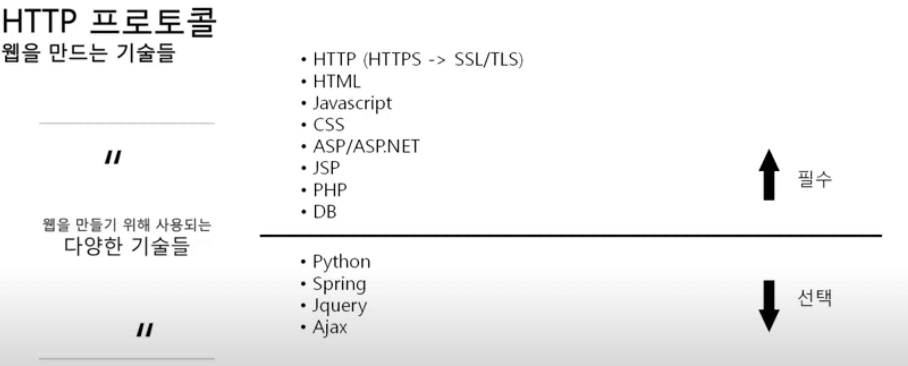

### HTTP 프로토콜 특징
- 하이퍼 텍스트 전송 프로토콜(Hyper Text Transfer Protocol)
- www에서 사용되는 핵심 프로토콜로 문서의 전송을 위해 쓰이며, 오늘날 거의 모든 웹 애플리케이션에서 쓰이고 있다.
  - 음성, 화상 등 여러 종류의 데이터를 MIME으로 정의하여 전송 가능하다.
- Request/Response 동작에 기반하여 서비스를 제공한다.

#### HTTP 1.0 특징
- `연결 수립, 동작, 연결 해제` 의 단순함이 특징이다.
  - 하나의 URL은 하나의 TCP로 연결한다.
- HTML 문서를 전송 받은 뒤, 연결을 끊고 다시 연결하여 데이터를 전송한다.

#### HTTP 1.0의 문제점
- 단순 동작(연결 수립, 동작, 연결 해제)이 반복되어 통신 부하 문제가 발생한다.

## HTTP 요청 프로토콜 

### HTTP 요청 프로토콜 구조
- 요청하는 방식을 정의하고 클라이언트의 정보를 담고 있다.
- 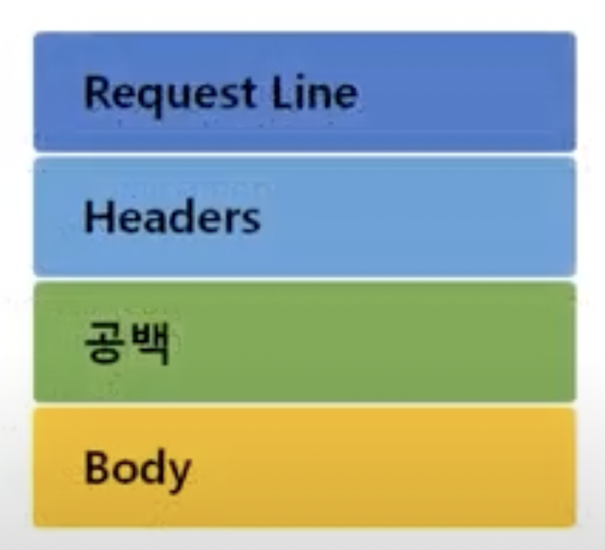

#### Request Line 정보
- 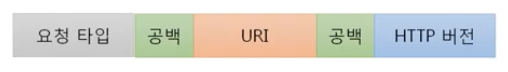

#### HTTP 메소드 종류
- 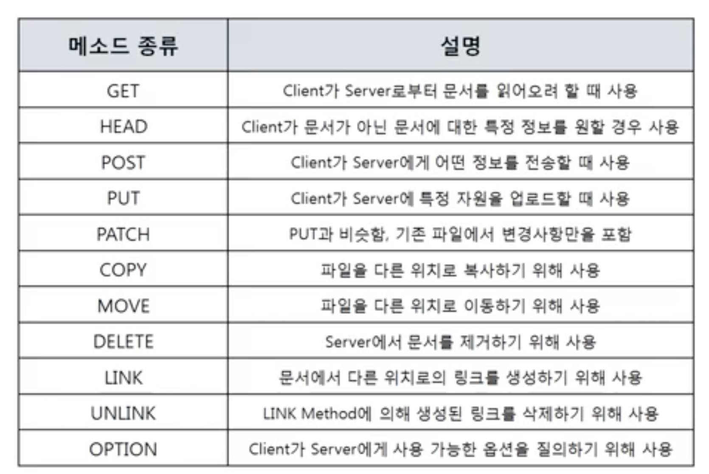

- 예시
  - 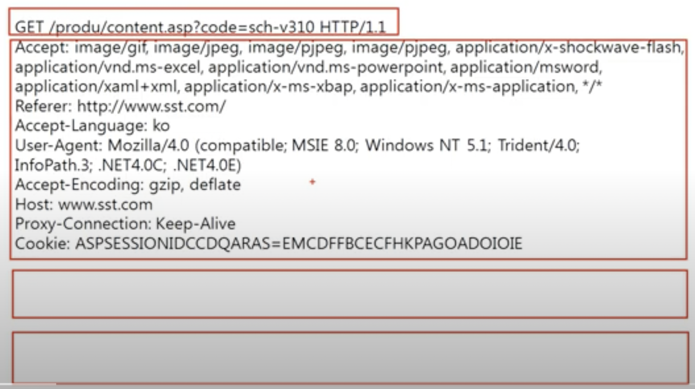

#### [URI(Uniform Resource Identifier) 구조](https://www.youtube.com/watch?v=2ikhZ_fNP5Y&list=PL0d8NnikouEWcF1jJueLdjRIC4HsUlULi&index=30)
- 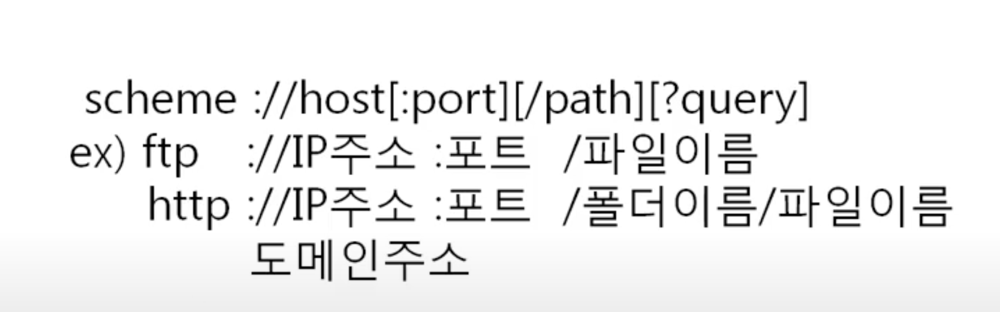

## HTTP 응답 프로토콜
- [동영상 강의](https://www.youtube.com/watch?v=kuucNF4Zvbs&list=PL0d8NnikouEWcF1jJueLdjRIC4HsUlULi&index=33)

### HTTP 응답 프로토코로 구조
- 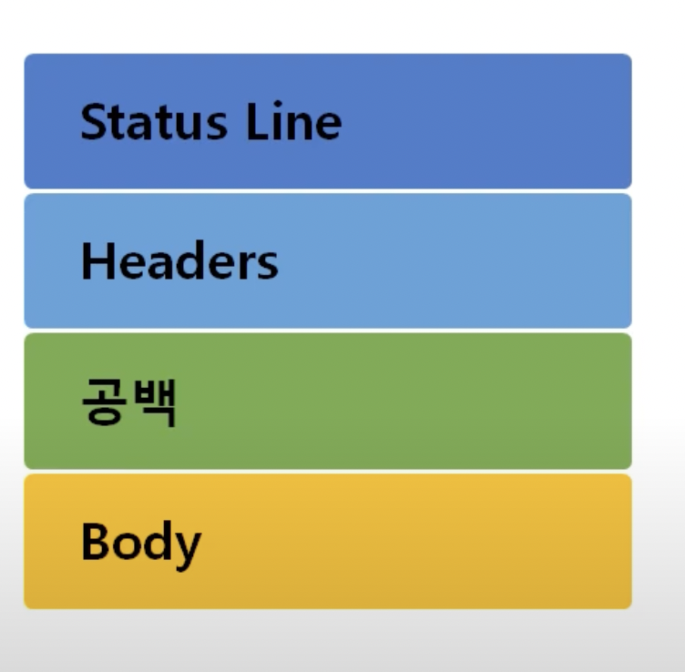

#### Status Line 구조
- 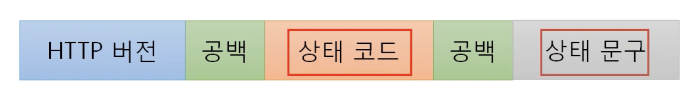

#### 응답 상태 코드
- 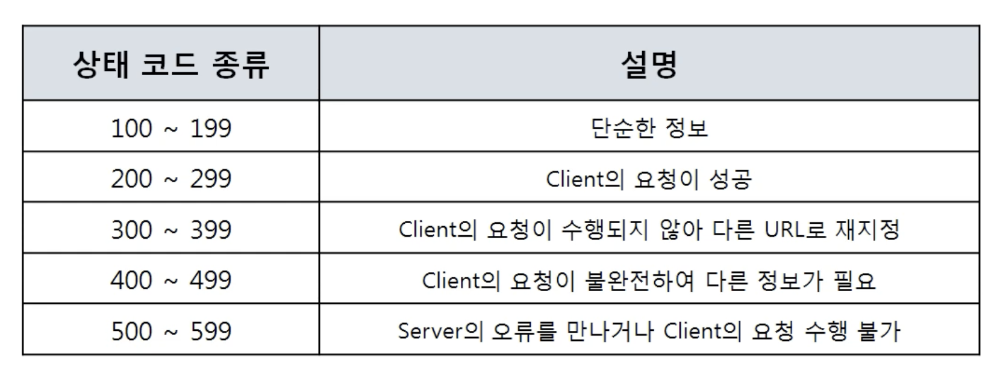

#### 예시
  - 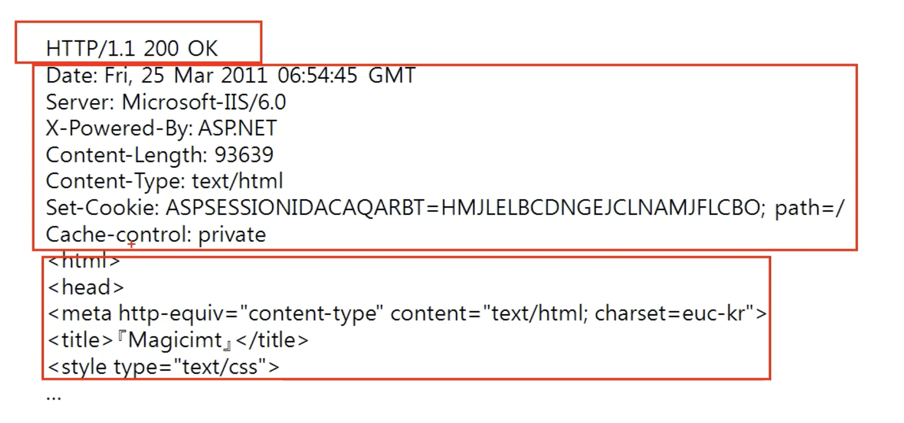

## HTTP 헤더 포맷
- 요청 헤더와 응답 헤더가 있다.

### HTTP 헤더 구조
- ![](resources/images/HTTP_헤더_구조.png

#### 일반 헤더
- 일반적인 정보를 담고 있다.
- 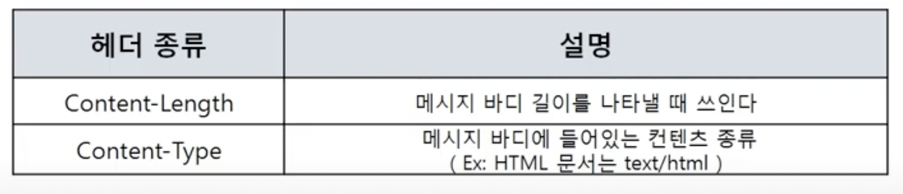

#### 요청 헤더
- 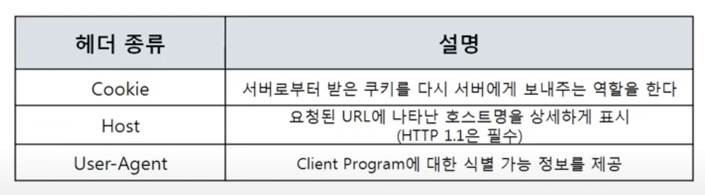

#### 응답 헤더
- 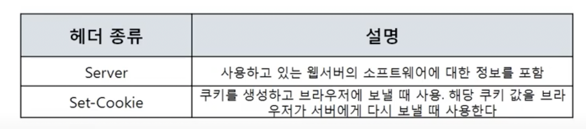
