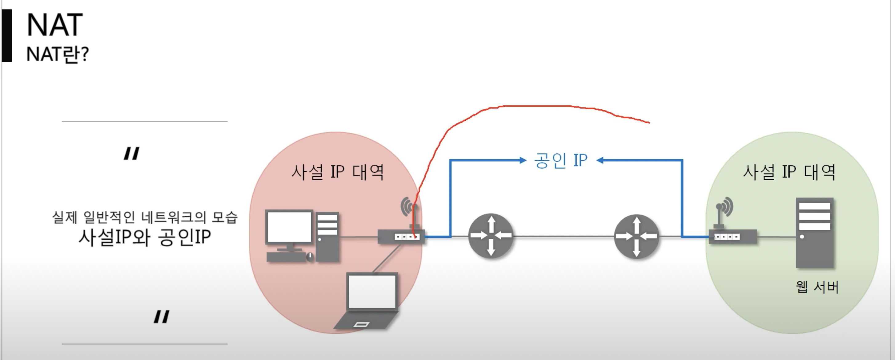
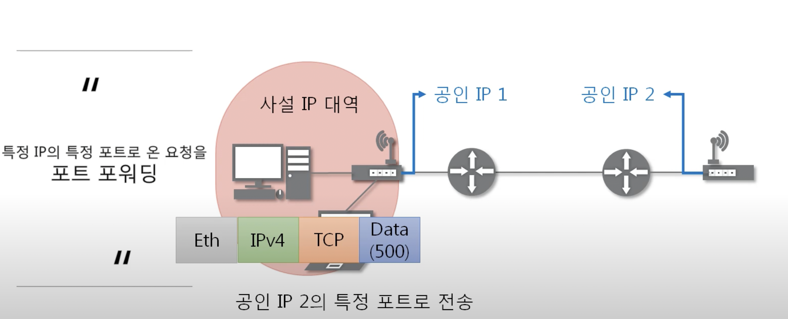
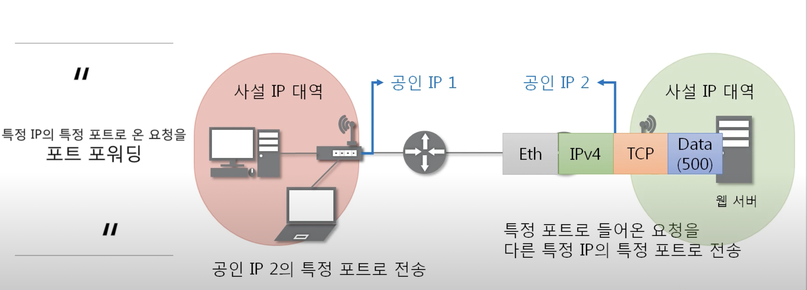

# [NAT와 포트포워딩](https://www.youtube.com/watch?v=Qle5cfCcuEY&list=PL0d8NnikouEWcF1jJueLdjRIC4HsUlULi&index=26)

## NAT
- NAT(Network Address Translation)은 IP 패킷의 TCP/UDP 포트번호와 출발지 및 목적지의 IP 주소 등을 재기록하면서 라우터를 통해 네트워크 트래픽을 주고 받는 기술을 말한다.
- 패킷의 변화가 생기기 때문에 IP나 TCP/UDP의 checksum 도 다시 계산되어 재기록해야 한다.
- NAT를 이용하는 이유는 대개 사설 네트워크에 속한 여러 개의 호스트가 하나의 공인 IP 주소를 사용하여 인터넷에 접속하기 위함이다.
- 하지만 사설 IP주소를 공인 IP주소로 변환하는 데만 사용하는 기술은 아니다.
- NAT
  - 

## 포트 포워딩
- 포트 포워딩 또는 포트 맵핑(port mapping)은 패킷이 라우터나 방화벽과 같은 네트워크 장비를 가로지르는 동안 `특정 IP주소와 포트 번호의 통신 요청을 특정 다른 IP주소와 포트번호로 넘겨주는` 네트워크 주소 변환(NAT)의 응용
  기술이다.
- 이 기법은 게이트웨이(외부망)의 반대쪽에 위치한 사설 네트워크에 상주하는 호스트에 대한 서비스를 생성하기 위해 흔히 사용된다.
- 포트 포워딩 과정
  - 
    - 사설 IP대역에서 공인 IP2로 보내고 싶은데, 공인 IP2의 주소를 모르니까 일단 공인 IP2의 공유기 또는 네트워크 장비의 IP 주소로 보낸다.
  - 
    - 공인 IP2의 공유기 또는 네트워크 장비가 패킷을 받으면 해당 공유기 또는 네트워크 장비가 설정해 놓은 포트 포워딩을 정보를 바탕으로 특정 프로그램의 IP와 PORT로 패킷을 전달한다.
    - 공유기 또는 네트워크 장비는 자기 IP 대역이니까 이 정보를 알 수 있다.