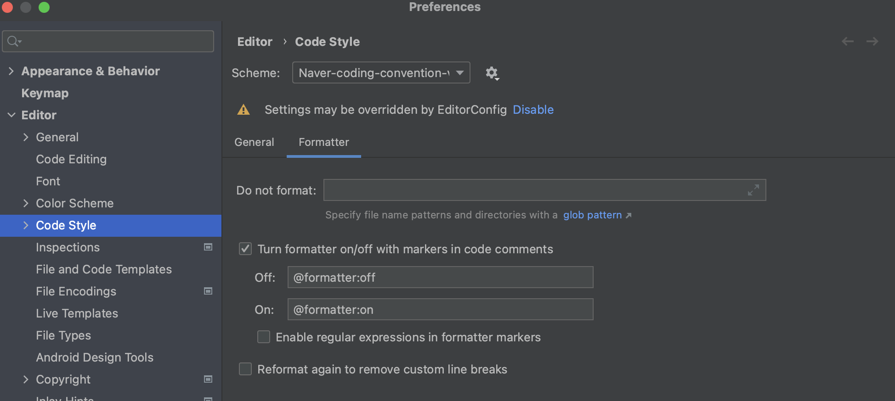

# Java Coding Convention

# Style Guide

## Google

- checkstyle: [https://github.com/checkstyle/checkstyle/blob/master/src/main/resources/google_checks.xml](https://github.com/checkstyle/checkstyle/blob/master/src/main/resources/google_checks.xml)
- style guide(formatter): [https://github.com/google/styleguide/blob/gh-pages/intellij-java-google-style.xml](https://github.com/google/styleguide/blob/gh-pages/intellij-java-google-style.xml)

## NAVER

- [https://naver.github.io/hackday-conventions-java/](https://naver.github.io/hackday-conventions-java/)
- checkstyle: [https://github.com/naver/hackday-conventions-java/blob/master/rule-config/naver-checkstyle-rules.xml](https://github.com/naver/hackday-conventions-java/blob/master/rule-config/naver-checkstyle-rules.xml)
- suppression: [https://github.com/naver/hackday-conventions-java/blob/master/rule-config/naver-checkstyle-suppressions.xml](https://github.com/naver/hackday-conventions-java/blob/master/rule-config/naver-checkstyle-suppressions.xml)
- formatter: [https://github.com/naver/hackday-conventions-java/blob/master/rule-config/naver-intellij-formatter.xml](https://github.com/naver/hackday-conventions-java/blob/master/rule-config/naver-intellij-formatter.xml)

# IntelliJ IDEA 적용

- .gitattributes 에 새줄 적용
- .editorconfig 적용
- checkstyle 적용
- gradle build 파일에 editorconfig, checkstyle 적용하기
- formatter 적용

## .gitattributes LF 적용하기

- 프로젝트 Root에 `.gitattributes` 파일 생성하여 새줄 문자에 LF 적용한다

```
*.c text eol=lf
*.cpp text eol=lf
*.h text eol=lf

# exception for visual studio project configuration
*.sln text eol=crlf
*.vs text eol=crlf
*.csproj eol=crlf
*.props eol=crlf
*.filters eol=crlf
```

## .**editorconfig 규칙 정하기**

- [https://editorconfig.org/](https://editorconfig.org/)

> EditorConfig는 다양한 편집기와 IDE에서 동일한 프로젝트에서 작업하는 여러 개발자를 위해 일관된 코딩 스타일을 유지하는 데 도움이 됩니다. EditorConfig 프로젝트는 코딩 스타일을 정의하기 위한 파일 형식과 편집자가 파일 형식을 읽고 정의된 스타일을 따를 수 있도록 하는 텍스트 편집기 플러그인 모음으로 구성됩니다. EditorConfig 파일은 쉽게 읽을 수 있으며 버전 제어 시스템에서 잘 작동합니다.
> 

**프로젝트 Root에 .editorconfig 파일 생성하기**

```bash
# top-most EditorConfig file
root = true

[*]
# [encoding-utf8]
charset = utf-8

# [newline-lf]
end_of_line = lf

# [newline-eof]
insert_final_newline = true

[*.bat]
end_of_line = crlf

[*.{groovy,java,kt}]
# [indentation-tab]
indent_style = tab
indent_size = 4
continuation_indent_size = 8
tab_width = 4

# [no-trailing-spaces]
trim_trailing_whitespace = true

# [line-length-140]
max_line_length = 140
```

## CheckStyle 규칙 정하기

- [https://docs.gradle.org/current/userguide/checkstyle_plugin.html](https://docs.gradle.org/current/userguide/checkstyle_plugin.html)

**Default Project Layout**


root project 하위에 config, checkstyle 디렉토리를 생성한 후 원하는 checkstyle 규칙 설정파일을 놓는다.

Google걸로 해도 되고 NAVER 걸로 해도 되고 원하는 걸로 놓는다.

```xml
<?xml version="1.0"?>
<!DOCTYPE suppressions PUBLIC
		"-//Puppy Crawl//DTD Suppressions 1.1//EN"
		"http://www.puppycrawl.com/dtds/suppressions_1_1.dtd">

<suppressions>
</suppressions>
```

## IntelliJ에 checkstyle 적용하기

**Plugins에서 Checkstyle-IDEA를 설치한다.**


**Google 또는 NAVER의 Checkstyle 을 적용한다.**

- Tools > Checkstyle 에서 Configuration File에서 [+] 버튼 클릭해서 추가한다.
    
    
    
- Checkstyle version은 최신 걸로 선택하고, Scan Scope은 test 포함한 모든 소스파일로 지정한다. Checkstyle error를 warnings로 설정하고 싶어면 해당 부분을 체크하면 된다.


**Checkstyle Scan**

특정 파일에서 Checkstyle 버튼 클릭해서 수행하면 결과를 확인할 수 있다.


## **build.gradle 파일에 editorconfig와 checkstyle 설정하기**

```bash
plugins {
    id 'org.springframework.boot' version '2.7.3'
    id 'io.spring.dependency-management' version '1.0.13.RELEASE'
    id 'java'
    id "org.ec4j.editorconfig" version "0.0.3" // (1)
    id 'checkstyle' // (2)
}

group = 'com.example'
version = '0.0.1-SNAPSHOT'
sourceCompatibility = '17'

configurations {
    compileOnly {
        extendsFrom annotationProcessor
    }
}

repositories {
    mavenCentral()
}

dependencies {
    implementation 'org.springframework.boot:spring-boot-starter'
    compileOnly 'org.projectlombok:lombok'
    annotationProcessor 'org.projectlombok:lombok'
    testImplementation 'org.springframework.boot:spring-boot-starter-test'
}

tasks.named('test') {
    useJUnitPlatform()
}

editorconfig { // (3)
    excludes = ['build']
}

checkstyle { // (4)
    maxWarnings = 0
    configFile = file("${rootDir}/config/checkstyle/naver-checkstyle-rules.xml")
    configProperties = ["suppressionFile" : "${rootDir}/config/checkstyle/naver-checkstyle-suppressions.xml"]
    toolVersion = "10.3.2"
}

tasks.withType(Checkstyle) { // (5)
    reports {
        xml.required = false
        html.required = true
    }
}

check.dependsOn editorconfigCheck // (6)

compileJava.options.encoding = 'UTF-8'
compileTestJava.options.encoding = 'UTF-8'
```

- (1) [editorconfig 를 적용하기 위해 plugin 설정](https://plugins.gradle.org/plugin/org.ec4j.editorconfig)한다.
- (2) checkstyle 을 적용하기 위해 plugin 설정한다.
- (3) [editor configuration을 설정한다](https://github.com/ec4j/editorconfig-gradle-plugin). build 하위에 있는 디렉토리는 editor configuration 적용대상에서 제외를 한다.
- (4) checkstyle configuration을 설정한다.
- (5) checkstyle task가 수행 후 결과 파일 중 xml파일은 굳이 필요하지 않기 때문에 제외시킨다. 결과 파일은 default로 /build/reports/checkstyle 하위에 main.html 파일로 생성된다.
    
    
    
- (6) checkstyle이 수행될 때, editorconfigCheck도 수행될 수 있도록 한다.

```xml
./gradlew clean build

> Configure project :
> Task :clean
> Task :compileJava
> Task :processResources
> Task :classes
> Task :bootJarMainClassName
> Task :bootJar
> Task :jar
> Task :assemble
> Task :checkstyleMain
> Task :compileTestJava
> Task :processTestResources NO-SOURCE
> Task :testClasses
> Task :editorconfigCheck
> Task :checkstyleTest
> Task :test
> Task :check
> Task :build
```

## IntelliJ에 Formatter 적용하기

Editor > Code Style 에서 scheme을 import 한다.


특정 부분에서 formatter를 무시하고 싶을 경우, `// @foramtter:off` 지정하면 된다.



## Save Action Plugin으로 모든 파일에 대한 convention check하기

Plugins 에서 Save Actions plugin 설치한다. option+command+L 누르면 전체 checkstyle 체크한다.


# PMD
- `build.gradle`
```
plugins {
    id 'pmd'
}

// 생략

pmd {
    consoleOutput = true
    toolVersion = "6.49.0"
    rulesMinimumPriority = 5
    // https://pmd.sourceforge.io/pmd-6.39.0/pmd_userdocs_making_rulesets.html custom ruleset 만들기.
    ruleSetFiles = files("config/pmd/custom-pmd-basic-ruleset.xml")
    pmdTest.enabled = true
}

tasks.withType(Pmd) {
    reports {
        xml.enabled = false
        html.enabled = true
    }
}

compileJava.options.encoding = 'UTF-8'
compileTestJava.options.encoding = 'UTF-8'

```
- custom ruleset 만들기.
```
<?xml version="1.0"?>
<ruleset name="Custom ruleset"
  xmlns="http://pmd.sourceforge.net/ruleset/2.0.0"
  xmlns:xsi="http://www.w3.org/2001/XMLSchema-instance"
  xsi:schemaLocation="http://pmd.sourceforge.net/ruleset/2.0.0
         http://pmd.sourceforge.net/ruleset_2_0_0.xsd">
  <description>
    PMD Basic Configuration
  </description>

  <rule ref="category/java/bestpractices.xml">
    <exclude-pattern>.*src/test/*.*\SpringPracticeApplicationTests.java</exclude-pattern>
  </rule>

  <!--  <rule ref="category/java/codestyle.xml"></rule>-->

  <!--  <rule ref="category/java/design.xml"/>-->

  <!--  <rule ref="category/java/documentation.xml"/>-->

  <!--  <rule ref="category/java/multithreading.xml"/>-->

  <!--  <rule ref="category/java/performance.xml"/>-->

  <!--  <rule ref="category/java/security.xml"/>-->

  <rule ref="category/java/errorprone.xml">
    <exclude-pattern>.*src/test/*.*\SpringPracticeApplicationTests.java</exclude-pattern>
  </rule>

</ruleset>

```

### 참고

- [https://creampuffy.tistory.com/128?category=986887](https://creampuffy.tistory.com/128?category=986887)
- [https://naver.github.io/hackday-conventions-java/](https://naver.github.io/hackday-conventions-java/)
- [https://github.com/checkstyle/checkstyle/blob/master/src/main/resources/google_checks.xml](https://github.com/checkstyle/checkstyle/blob/master/src/main/resources/google_checks.xml)
- https://github.com/ec4j/editorconfig-gradle-plugin
- [https://withhamit.tistory.com/411](https://withhamit.tistory.com/411)
- [https://juneyr.dev/checkstyle](https://juneyr.dev/checkstyle)
- [PMD 공식 문서](https://docs.gradle.org/current/userguide/pmd_plugin.html)
