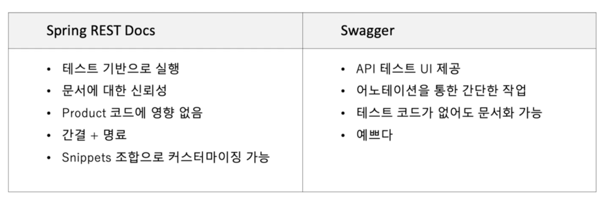
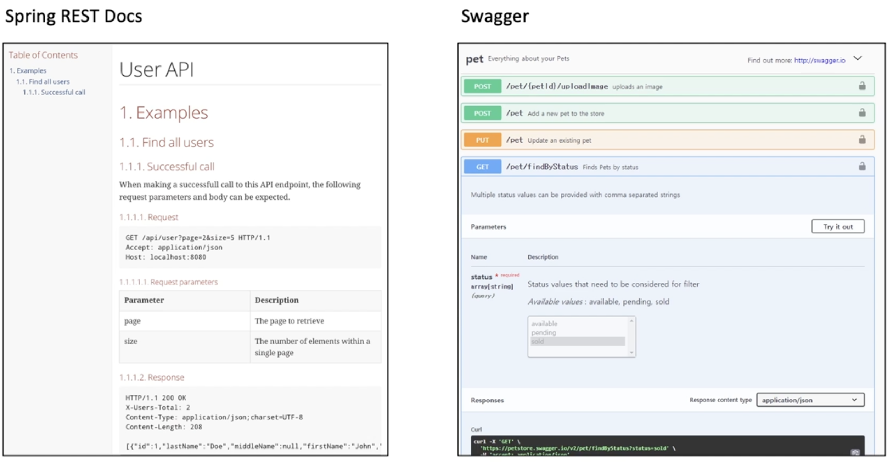
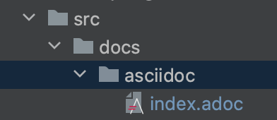
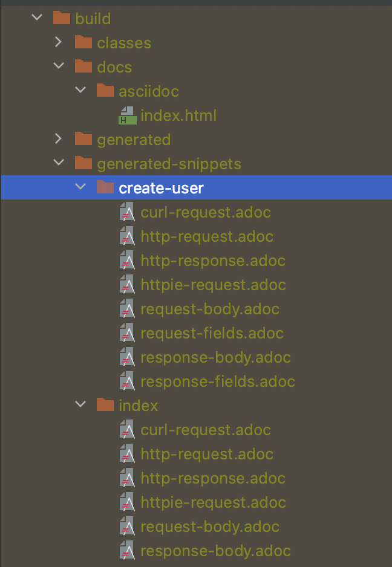
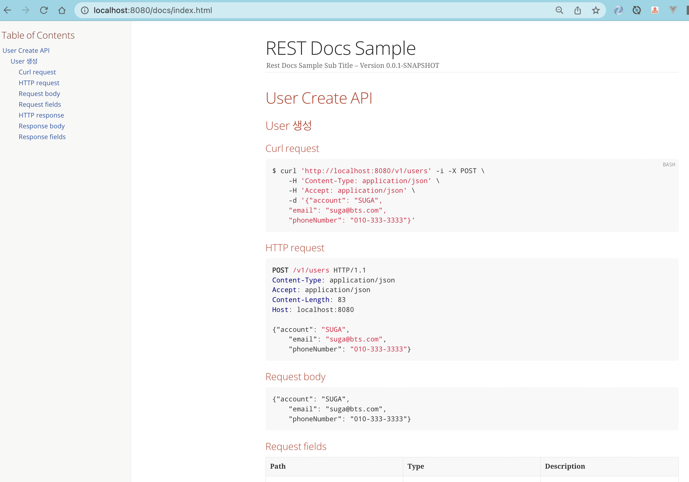
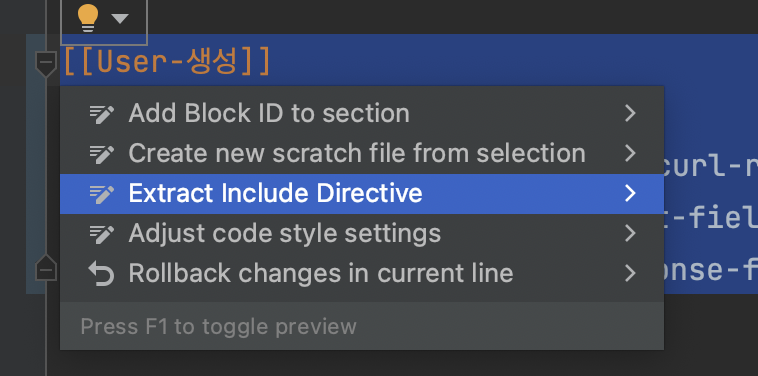
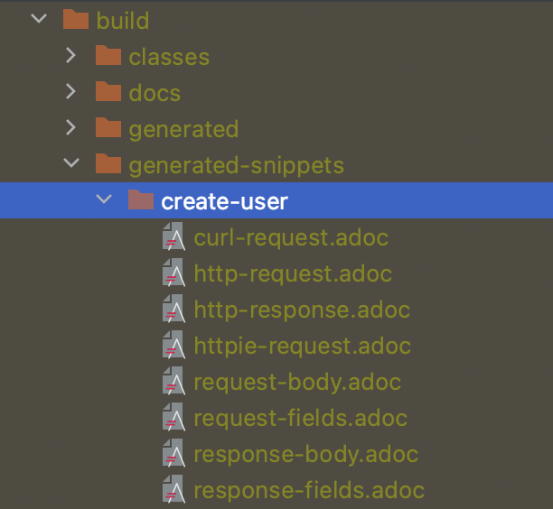
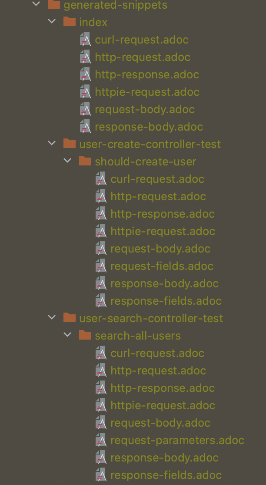
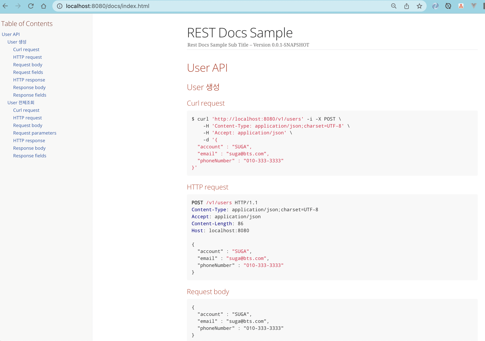

# Spring REST Doc
- RESTful 서비스에 대한 정확하고 읽기 쉬운 문서를 생성하도록 돕는 것이 목적이다.
- 테스트를 통하여 API 문서를 생성한다.
- Snippets의 조합으로 API 문서 커스터마이징을 할 수 있다.
- 간결한 적용, 다양한 생성 방법이 있다.

### 장점
- 별도의 HTML, PDF 파일로 API 문서 자동 생성한다(Hosting 가능하다).
- Request/Response 테스트를 통하여 API 문서의 신뢰도를 높인다.
- API 변경에 따른 API 문서 최신화를 보장한다.

### Spring REST Docs vs Swagger
#### Swagger
- RESTful 문서에 대한 명세보다 API 호출을 쉽게 할 수 있는 것에 초점을 맞췄다.
- 
- 
- 참고: https://techblog.woowahan.com/2597/

### OpenAPI Spec
- REST API에 대한 설명, 생성, 사용 및 시각화하기 위한 인터페이스 파일의 사양
- Swagger 프레임워크의 일부였지만 오픈소스로 전환
- 기본 내용
  - endpoint
  - HTTP Method, parameters
  - Authentication methods
  - Contact information, license, terms of use and other information
- YAML or JSON 으로 작성 가능

### Spring REST Docs + Swagger 조합
- Spring REST Docs의 장점
  - Test가 통과해야 문서가 생성된다.
  - Product 코드에 영향이 없다.
- Swagger의 장점
  - API 테스트 UI를 제공한다.
- MSA 환경 등 여러 API 문서를 한 곳에서 조회가 가능하다.

# 실습
### Development Spec
- Java17
- SpringBoot 2.7.3
- Gradle 7.5

### Build Configuration
- gradle.build 에 의존성 추가하기
```
plugins {
    id 'org.springframework.boot' version '2.7.3'
    id 'io.spring.dependency-management' version '1.0.13.RELEASE'
    id 'java'
    id "org.asciidoctor.jvm.convert" version "3.3.2" // Asciidoctor 플러그인 적용, gradle 7.0 이상부터는 jvm 사용
}

group = 'com.example'
version = '0.0.1-SNAPSHOT'
sourceCompatibility = '17'

configurations {
    asciidoctorExt // dependencies 에서 적용한 것 추가
    compileOnly {
        extendsFrom annotationProcessor
    }
}

repositories {
    mavenCentral()
}

dependencies {
    implementation 'org.springframework.boot:spring-boot-starter-web'
    implementation 'org.springframework.boot:spring-boot-starter-validation'
    implementation 'org.springframework.boot:spring-boot-starter-data-jpa'

    compileOnly 'org.projectlombok:lombok'
    runtimeOnly 'com.h2database:h2'
    annotationProcessor 'org.projectlombok:lombok'

    testImplementation 'org.springframework.boot:spring-boot-starter-test'

    asciidoctorExt 'org.springframework.restdocs:spring-restdocs-asciidoctor'
    testImplementation 'org.springframework.restdocs:spring-restdocs-mockmvc'
}

tasks.named('test') {
    outputs.dir snippetsDir
    useJUnitPlatform()
}

ext {
    snippetsDir = file('build/generated-snippets')
}

asciidoctor {
    inputs.dir snippetsDir
    configurations 'asciidoctorExt'
    dependsOn test

    // source가 없으면 .adoc파일을 전부 html로 만들어버림
    // source 지정시 특정 adoc만 HTML로 만든다.
    sources{
        include("**/index.adoc","**/common/*.adoc")
    }

    // 특정 .adoc에 다른 adoc 파일을 가져와서(include) 사용하고 싶을 경우 경로를 baseDir로 맞춰주는 설정입니다.
    // 개별 adoc으로 운영한다면 필요 없는 옵션입니다.
    baseDirFollowsSourceFile()
}

// static/docs 폴더 비우기
asciidoctor.doFirst {
    delete file('src/main/resources/static/docs')
}

task copyDocument(type: Copy) {
    dependsOn asciidoctor
    from file("build/docs/asciidoc")
    into file("src/main/resources/static/docs")
}

build {
    dependsOn copyDocument
}

bootJar {
    dependsOn asciidoctor
    from ("${asciidoctor.outputDir}/html5") {
        into 'static/docs'
    }
}
```

```
(1): Asciidoctor Plugin을 추가한다. gradle 7.0 이상부터는 jvm 사용한다.
(2): Asciidoctor 3.0 버전 이후에는 asciidoctor가 default로 쓰이지 않아서 임의로 asciidoctorExtensions 지정해야 한다.
(3): spring-restdocs-asciidoctor 의존성을 추가한다. 이렇게 하면 build/generated-snippets를 가리키도록 .adoc 파일에서 사용할 snippets 속성이 자동으로 구성된다. 또한 block macro operation을 사용할 수 있다.?
(4): MockMvc를 이용해서 테스트를 진행할 거라 spring-restdocs-mockmvc 의존성을 추가한다.
(5): snippet 디렉토리를 output에 추가하기 위해서 설정한다.
(6): generated snippet 디렉토리 경로를 설정한다.
(7): asciidoctor task를 설정한다.
(8): Asciidoctor 버전이 3.0 이상일 때 설정한다.
(9): 실행 가능한 jar로 만드는 task에서 snippet 결과물을 resources 내에 복사해서 html 파일을 확인할 수 있도록 한다.
```
- `./gradlew build`하면 아래 순서대로 Task가 수행된다.
```batsh
> Task :compileJava UP-TO-DATE
> Task :processResources UP-TO-DATE
> Task :classes UP-TO-DATE
> Task :jar
> Task :compileTestJava UP-TO-DATE
> Task :processTestResources UP-TO-DATE
> Task :testClasses UP-TO-DATE
> Task :test
> Task :asciidoctor
> Task :bootJarMainClassName
> Task :bootJar
> Task :assemble
> Task :check
> Task :copyDocument
> Task :build
```

### Gradle 환경에서 Snippets를 HTML 포맷 만들기
- `/src/docs/asciidoc`에 `*.adoc` 파일 생성하기
- `index.adoc` 파일
```
// 대제목
= REST Docs Sample
// 소제목
Rest Docs Sample Sub Title

:doctype: book
:icons: font
// 문서에 표기되는 코드들의 하이라이팅을 highlightjs 를 사용
:source-highlighter: highlightjs
// TOC(TableOfContent)를 왼쪽에 위치시킴.
:toc: left
// TOC(TableOfContent) 레벨을 나타냄. Depth.
:toclevels: 6
:sectlinks:

[[User-API]]
== User Create API

[[User-생성]]
=== User 생성
operation::create-user[snippets='curl-request,http-request,request-body,request-fields,http-response,response-body,response-fields']
```
- 
- 


### 샘플 REST Api Application 만들기
- UserCreatController.java
```java
package com.example.springdocswagger.user.adapter.in.web;

@RestController
@RequestMapping("/v1/users")
@RequiredArgsConstructor
public class UserCreateController {

    private final UserCreateUseCase userCreateUsecase;

    @PostMapping
    public ResponseEntity<UserResponse> create(@RequestBody @Valid UserCreateCommand userCreateCommand) {
        UserResponse userResponse = userCreateUsecase.create(userCreateCommand.getAccount(), userCreateCommand.getEmail(), userCreateCommand.getPhoneNumber());
        return ResponseEntity.ok(userResponse);
    }

    @Data
    public static class UserCreateCommand implements Serializable {

        @NotBlank
        private String account;
        @NotBlank
        private String email;
        @NotBlank
        private String phoneNumber;
    }
}

```
- Test 작성하기
```java
package com.example.springdocswagger.user.adapter.in.web;

import com.example.springdocswagger.user.application.port.in.UserCreateUseCase;
import com.example.springdocswagger.user.application.port.in.UserResponse;
import com.example.springdocswagger.user.domain.User;
import org.junit.jupiter.api.BeforeEach;
import org.junit.jupiter.api.Test;
import org.junit.jupiter.api.extension.ExtendWith;
import org.springframework.beans.factory.annotation.Autowired;
import org.springframework.boot.test.autoconfigure.restdocs.AutoConfigureRestDocs;
import org.springframework.boot.test.autoconfigure.web.servlet.WebMvcTest;
import org.springframework.boot.test.mock.mockito.MockBean;
import org.springframework.http.MediaType;
import org.springframework.restdocs.RestDocumentationContextProvider;
import org.springframework.restdocs.RestDocumentationExtension;
import org.springframework.restdocs.payload.JsonFieldType;
import org.springframework.test.context.junit.jupiter.SpringExtension;
import org.springframework.test.web.servlet.MockMvc;
import org.springframework.test.web.servlet.setup.MockMvcBuilders;
import org.springframework.web.context.WebApplicationContext;

import java.time.LocalDateTime;

import static org.hamcrest.Matchers.containsString;
import static org.mockito.Mockito.when;
import static org.springframework.restdocs.mockmvc.MockMvcRestDocumentation.document;
import static org.springframework.restdocs.mockmvc.MockMvcRestDocumentation.documentationConfiguration;
import static org.springframework.restdocs.operation.preprocess.Preprocessors.*;
import static org.springframework.restdocs.payload.PayloadDocumentation.*;
import static org.springframework.restdocs.snippet.Attributes.attributes;
import static org.springframework.restdocs.snippet.Attributes.key;
import static org.springframework.test.web.servlet.request.MockMvcRequestBuilders.post;
import static org.springframework.test.web.servlet.result.MockMvcResultMatchers.content;
import static org.springframework.test.web.servlet.result.MockMvcResultMatchers.status;

/**
 * 참고
 * - https://spring.io/guides/gs/testing-web/
 * - https://docs.spring.io/spring-restdocs/docs/current/reference/html5/#getting-started-build-configuration
 */
@ExtendWith({RestDocumentationExtension.class, SpringExtension.class})
@WebMvcTest(UserCreateController.class)
@AutoConfigureRestDocs
class UserCreateControllerTest {

  @Autowired
  private MockMvc mockMvc;

  @MockBean
  private UserCreateUseCase userCreateUseCase;

  @BeforeEach
  public void setUp(WebApplicationContext webApplicationContext,
                    RestDocumentationContextProvider restDocumentation) {
    this.mockMvc = MockMvcBuilders
            .webAppContextSetup(webApplicationContext)
            .apply(documentationConfiguration(restDocumentation))
            .alwaysDo(document("{method-name}", preprocessRequest(prettyPrint()), preprocessResponse(prettyPrint())))
            .build();
  }

  @Test
  public void shouldReturnDefaultMessage() throws Exception {
    when(userCreateUseCase.create("SUGA", "suga@bts.com", "010-333-3333"))
            .thenReturn(UserResponse.of(new User(1L, "SUGA", "suga@bts.com", "010-333-3333", LocalDateTime.now(), null)));

    this.mockMvc.perform(post("/v1/users")
                    .contentType(MediaType.APPLICATION_JSON)
                    .accept(MediaType.APPLICATION_JSON)
                    .content("{\"account\": \"SUGA\",\n" +
                            "    \"email\": \"suga@bts.com\",\n" +
                            "    \"phoneNumber\": \"010-333-3333\"}"))
            .andExpect(status().isOk())
            .andExpect(content().string(containsString("SUGA")))
            .andDo(document("create-user",
                    requestFields(
                            fieldWithPath("account").description("The user's account"),
                            fieldWithPath("email").description("The user's email"),
                            fieldWithPath("phoneNumber").description("The user's phone number")
                    ),
                    responseFields(
                            fieldWithPath("id").type(JsonFieldType.NUMBER).description("사용자 ID"),
                            fieldWithPath("account").type(JsonFieldType.STRING).description("사용자 계정"),
                            fieldWithPath("email").type(JsonFieldType.STRING).description("이메일"),
                            fieldWithPath("phoneNumber").type(JsonFieldType.STRING).description("전화번호"),
                            fieldWithPath("createdAt").type(JsonFieldType.STRING).description("생성일자")
                    )));
  }
}
```
- `./gradlew clean build`하면 /build 하위에 자동으로 adoc 파일들이 생성된다. html파일들은 /resources/static/docs/에 복사된다.
- 
- 
- http://localhost:8080/docs/index.html로 확인하면 아래 문서 내용을 확인할 수 있다.
- 

#### 문서 분리
- IntelliJ IDEA 에서 Extract Include Directive 하여 문서 분리하기
- 
- src/docs/asciidoc/index.adoc 아래처럼 정리된다.
```
// 대제목
= REST Docs Sample
// 소제목
Rest Docs Sample Sub Title
:doctype: book
:icons: font
// 문서에 표기되는 코드들의 하이라이팅을 highlightjs 를 사용
:source-highlighter: highlightjs
// TOC(TableOfContent)를 왼쪽에 위치시킴.
:toc: left
// TOC(TableOfContent) 레벨을 나타냄. Depth.
:toclevels: 6
:sectlinks:

[[User-API]]
== User Create API

include::create-users.adoc[]
```
- create-users.adoc 파일 내용은 아래처럼 된다.
```
[[User-생성]]
=== User 생성
operation::create-user[snippets='curl-request,http-request,request-body,request-fields,http-response,response-body,response-fields']
```

### Generate Documentation Snippets
- Junit5와 MockMvc 이용해서 Snippets 문서 생성하기 위한 설정을 해야 한다.
```java
@ExtendWith(RestDocumentationExtension.class)
class UserCreateControllerTest {
}
```
- 이렇게 설정하면 Gradle에서는 자동으로 `build/generated-snippets`에 output을 생성한다.
- `@BeforeEach`에 MockMvc 인스턴스 생성할 때 설정을 추가해야 한다.
```java
@Autowired
private MockMvc mockMvc;

@BeforeEach // (2)
public void setUp(WebApplicationContext webApplicationContext,
        RestDocumentationContextProvider restDocumentation) {
        this.mockMvc = MockMvcBuilders
        .webAppContextSetup(webApplicationContext)
        .apply(documentationConfiguration(restDocumentation))
        .alwaysDo(document("{method-name}", preprocessRequest(prettyPrint()), preprocessResponse(prettyPrint())))
        .build();
        }
```
- `MockMvc` 인스턴스는 `MockMvcRestDocumentationConfigurer`를 사용해서 만들어진다. API Configuration을 커스터마이징할 수 있는 API를 제공해준다.

### RestService 호출해서 Documentation 만들기
- `andDo(document("NAME_OF_DOCUMENTATION"))`로 Documentation 만든다.
```java
this.mockMvc.perform(post("/v1/users")
            .contentType(MediaType.APPLICATION_JSON)
            .accept(MediaType.APPLICATION_JSON)
            .content("{\"account\": \"SUGA\",\n" +
                    "    \"email\": \"suga@bts.com\",\n" +
                    "    \"phoneNumber\": \"010-333-3333\"}"))
    .andExpect(status().isOk())
    .andExpect(content().string(containsString("SUGA")))
    .andDo(document("create-user",
            requestFields(
                    attributes(key("title").value("Request Fields for user creation")),
                    fieldWithPath("account").description("The user's account")
                            .attributes(key("constraints")
                                    .value("Must not be null. Must not be empty")),
                    fieldWithPath("email").description("The user's email")
                            .attributes(key("constraints")
                                    .value("Must not be null. Must not be empty")),
                    fieldWithPath("phoneNumber").description("The user's phone number")
                            .attributes(key("constraints")
                                    .value("Must not be null. Must not be empty"))
                    ),
            responseFields(
                    attributes(key("title").value("Response Fields for user creation")),
                    fieldWithPath("id").type(JsonFieldType.NUMBER).description("사용자 ID"),
                    fieldWithPath("account").type(JsonFieldType.STRING).description("사용자 계정"),
                    fieldWithPath("email").type(JsonFieldType.STRING).description("이메일"),
                    fieldWithPath("phoneNumber").type(JsonFieldType.STRING).description("전화번호"),
                    fieldWithPath("createdAt").type(JsonFieldType.STRING).description("생성일자")
            )));
    }
```
- `RestDocumentationResultHandler`에 의해 snippet 문서들이 작성된다. `org.springframework.restdocs.mockmvc.MockMvcRestDocumentation`의 정적 문서 메소드에서 이 클래스의 인스턴스를 얻을 수 있다.
- `/build/generated-snippets` 하위에 파일들이 자동 생성된다.
  - `/<NAME_OF_DOCUMENTATION>/cur-request.adoc`
  - `/<NAME_OF_DOCUMENTATION>/http-request.adoc`
  - `/<NAME_OF_DOCUMENTATION>/http-response.adoc`
  - `/<NAME_OF_DOCUMENTATION>/httpie-request.adoc`
  - `/<NAME_OF_DOCUMENTATION>/request-body.adoc`
  - `/<NAME_OF_DOCUMENTATION>/response-body.adoc`
- 

### Customizing Request, Response Field
- `org.springframework.restdocs:spring-restdocs-core:2.0.6` 하위에 `default-request-parameters.snippet` 파일들이 위치함.
- Request, Response Field 포맷에 대해 Customizing을 하려면 `test/resources/org/springframework.restdocs.templates` 하위에 `request-fields.snippet`, `response-fields.snippet` 를 만든다.
- ex) request-fields.snippet
```
.{{title}}
|===
|Path|Type|Optional|Description|Constrains

{{#fields}}
|{{#tableCellContent}}`+{{path}}+`{{/tableCellContent}}
|{{#tableCellContent}}`+{{type}}+`{{/tableCellContent}}
|{{#tableCellContent}}_{{optional}}_{{/tableCellContent}}
|{{#tableCellContent}}{{description}}{{/tableCellContent}}
|{{#tableCellContent}}{{constraints}}{{/tableCellContent}}

{{/fields}}
|===
```
- 생성 결과물 확인
- 

### html 결과 output 확인
- build 시 copy task를 통해 /resources/static/docs에 html 파일을 복사하도록 했다.


### HTML 결과물
- 

### 참고
- https://docs.spring.io/spring-restdocs/docs/current/reference/html5/#getting-started-build-configuration
- https://backtony.github.io/spring/2021-10-15-spring-test-3/