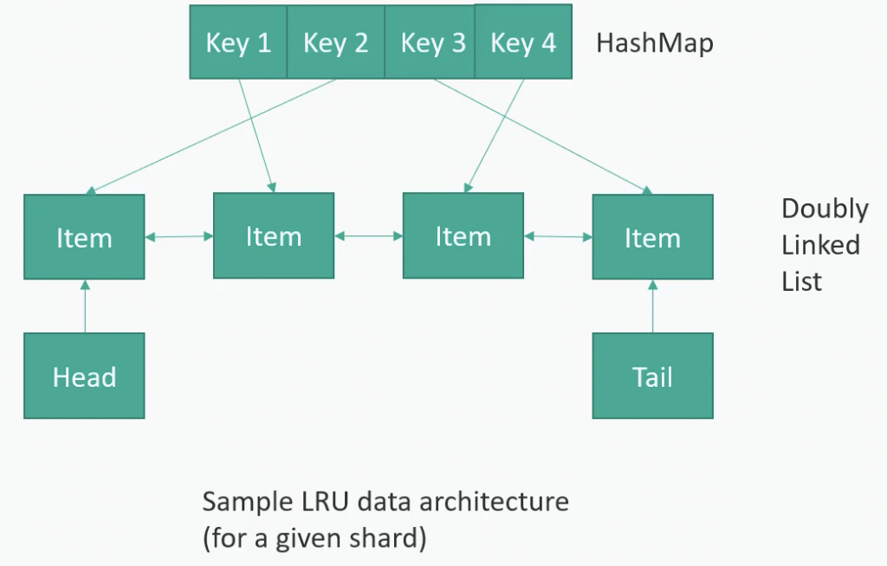

# System Design(Udemy 강의 정리)
- https://www.udemy.com/course/best-system-design-interview/learn/lecture/30189202?start=0#overview

# Failover(장애 극복 전략)
## Database
### Cold Standby
- 주기적으로 standby DB 서버에 백업을 한다.
- 
- 장점
  - 관리할 포인트가 적고 간단하다.
- 단점
  - Downtime 이 길어질 경우 복구하는데 시간이 오래 걸린다.
  - Backup 해야 하는 데이터량이 많을 경우 복구하는데 시간이 오래 걸린다.
  - 마지막으로 Backup한 이후에 쌓인 데이터는 손실된다.

### Warm Standby
- Replication 을 둬서 데이터가 복제되게 한다. StandBy에는 쓰기만 가능하다.(?)
- 
- 장점
  - 관리할 포인트가 적고 간단하다.
- 단점
  - 백업 DB 서버에 부하가 늘어나 실패할 가능성이 있다.
  - 여전히 고정 갯수의 DB 서버로 traffic을 처리하기 때문에 traffic량이 증가에 대해 효율적이지 않다. 

### Hot Standby
- 웹 호스트가 Master와 StandBy 양쪽에 동시에 기록한다.
- 
- 장점
  - 읽기, 쓰기가 동시에 가능하다.

### Sharding(Horizontal Scaling of Database)
- DB 서버를 여러 대 두어서 hash function 을 통해서 어느 DB 서버에 데이터가 저장되고 읽힐 지 결정한다.
- Sharindg은 key, value store 개념을 생각하면 이해하기 쉬움.
- 
- 장점
  - 수평 확장이 가능하다.
- 단점
  - 다른 DB에 있는 데이터와 조인해야 할 경우, 처리가 복잡하다.

#### MongoDB
- Hot StandBy 전략을 취하고 있다.
- Mongos: MongoDB 내의 여러 Replica Set 간에 데이터를 배포하는 프로세스
- Primary: 여러 Replica Set에 대해 Routing하는 역할을 한다. Replica Set 간에 데이터를 저장하는 방법 등을 결정하는 역할을 한다.
- HA(High Availability)를 달성하기 위해 최소 3대의 서버가 필요하다.
- Config Server
  - 트래픽이 최소 3대에 고르게 분배되게 하기 위해서 분배 규칙을 알아야 한다. 이를 위해 별도 Config Server에서 관리한다.
  - Config Server도 3대로 구성하여 Master가 Down되면 Standby 중에서 Master로 승격하여 SPOF가 발생하지 않게 대응한다.
- 
- 장점
  - failover가 쉽게 될 수 있다. Master가 죽으면 StandBy 중에 하나가 Master로 승격되서 처리한다.
- 단점
  - 관리해야 할 서버 댓수가 많다.
  - 늘 가만히 있는 서버가 많다.
  - 유지보수 및 비용이 많이 든다.
  - 순간적으로 SPOF 될 수 있다. 새로운 Node가 Master가 되기 위해서 교체하는데 아~주 짧지만(몇 초) 순간적으로 SPOF는 발생할 수 있다.

#### Casandra
- Consistent Ring(안정해쉬) 사용하여 failover를 한다.
- Sharding을 통해 여러 Node에 데이터 redundancy를 한다.
- 
- 장점
  - 모든 노드가 Master가 될 수 있다.
- 단점
  - 데이터 동기화해야 하는 문제가 발생한다. 이는 Eventual Consistency(최종 일관성) 으로 동기화처리를 한다. 데이터가 Ring을 통해 전파되기까지 시간이 걸리기 때문이다.
- 선택 기준
  - Data Consistency를 약간 포기해도 된다면 Casandra가 MongoDB 보다 적당할 수 있다.

### NoSQL
- Denormalization 을 저장하는 Database.
- 장점
  - 빅데이터의 표준 인터페이스가 된 듯 하다.
- 단점
  - shard간 데이터 join이 가능은 하나 비효율적이다.
  - Resharding 문제: Consistency Ring으로 완화할 순 있다.
  - Hotspot(Celebrity Problem)
    - 현대적인 Routing 시스템에서는 각 샤드로 전송되는 트래픽 양을 모니터링해서 Hotspot에 따라 resharding 또는 재분할 수 있도록 도와준다.
- 종류
  - MongoDB, DynamoDB, Casandra, HBase
- DB 선택을 고려할 때 key-value store로 데이터를 가져올 수 있게 고민하는 것이 좋다.

# DataLake(데이터레이크)
- 데이터를 text file(csv, json)에 쓰고, 이 파일을 Amazon S3와 같은 분산 스토리지 시스템에 저장하는 것을 말한다.
- 거대한 비정형 데이터를 버킷에 하나의 무더기로 쌓는 것을 말한다.
- Amazon Glue: 비정형 데이터를 일종의 스키마를 추출해서 무슨 스키마인지 정의할 수 있게 도와주는 서비스이다.
  - 즉, Amazon S3에 저장된 비정형 데이터를 마치 데이터베이스에 있는 미가공 파일처럼 쿼리할 수 있게 도와주는 서비스이다.
  - 데이터를 모니터링하고, 구조를 심어주고, 스키마처럼 보이게 한다.
- Amazon Athena(Serverless): 데이터를 쿼리할 수 있게 도와준다. S3에 있는 데이터를 쿼리할 수 있는 인터페이스이다.
- Amazon Redshift: 분산 data warehouse, 전통적인 data warehouse와 data lake를 섞은 개념.
- 빅데이터 설계시 정리
  - 데이터를 S3에 저장하고, Glue를 통해 구조를 만들고, Athena로 쿼리를 한다.
- 
- 여전히 성능 향상을 위해 `partitioning`에 대해 고민해야 한다.
  - 고객이 어떻게 이용하는지를 파악해서 partitioning 기준을 선정하는 것이 좋다. 
  - ex) 날짜로 partitioning 할 수 있다.

# ACID Compliance, CAP 정리
## ACID
- Atomicity(원자성): 전체 트랜잭션이 성공하거나 전체 실패하거나. All or Nothing.
- Consistency(일관성): `규칙을 일관적`으로 적용하는 걸 말한다. 예를 들어, 양수만 저장할 수 있을 경우, 음수를 만들려고 할 때 에러 발생하고 롤백처리되어야 한다.
  - `CAP에서 말하는 C와 완전 다르다!`
- Isolation(격리성): 진행중인 트랜잭션은 다른 트랜잭션에 방해를 받지 말아야 한다.
- Duration(지속성): 트랜잭션이 성공하면 그 데이터는 영구 저장된다.

## CAP Theorem
- Consistency(일관성): 언제 요청하든 동일한 데이터를 확인할 수 있다.
- Availability(가용성): 정지없이 언제든지 이용할 수 있다.
- Partition-Tolerance(장애극복): 노드간 통신이 끊기지 않는 걸 의미한다.
- 
- 선택
  - CA: 소형 은행 - Mysql, Oracle
  - AP: - Cassandra
  - CP: - MongoDB, HBase, Amazon DynamoDB

# Cache
- 빠른 성능을 달성하기 위해서 디스크 탐색과 인터넷에서의 장시간 이동은 피해야 한다.
- Database에도 Cache를 두기는 하지만, Applicaition Layer와 더 가까이 별도로 Caching Layer를 두는 것이 성능상 좋다.
- 
- Cache 작동 원리
  - 
  - 캐쉬는 수평 확장이 가능하다.
  - Client는 Hashing을 통해서 어느 Node로 요청할 지 알아야 한다.
  - In-memory라서 빠르다.
  - 쓰기가 많은 것보다 읽기가 많은 애플리케이션에 적합하다. 왜냐면 계속 쓴다면, Cache를 무효화해야 해서 효율적이지 않다.
  - Eviction Policy(만료 정책)
  - Hotspot(Celebrity Problem)
  - Cold-Start Problem: 재시작할 때 데이터가 날라간다. 캐쉬에 재적재될 때까지 Database로 Hit가 발생하여 성능 저하가 발생한다. 또는 너무 많은 요청으로 Database가 죽는 경우도 있다.

## Eviction Policy
- LRU(Least Recently Used): 최근에 사용된 것만 남겨둔다.
  - 
- LFU(Least Frequently Used): 자주 사용되는 것만 남겨둔다. 캐쉬 크기가 충분히 크지 않을 때 사용하는 게 적당하다.
- FIFO(First In First Out): 요청 온 순서대로 지운다.

## 캐쉬 기술
- 

# Design Resiliency
- Single Server가 죽었을 경우
- 전체 Rack이 발생했을 경우
  - Secondary 는 여러 Rack, 여러 Availability Zone, Resion에 분산시켜 놓아야 한다.
  - Rack: PC나 서버, 통신장비, 각종 계측기 등 일정 시스템을 구성하는 장비들을 보관하고 시스템 구성에 필요한 환경을 만들어주는 제품. 랙 내부에는 PC나 서버, 라우터, 스위치 등의 통신장비, 기타 계측 장비 등을 설치한다.
  - 
- 전체 Data Center에 장애가 발생했을 경우
- 전체 Region 에 장애가 발생했을 경우
  - EU 지연 전체가 장애 났을 경우, 가장 가까운 다른 지역에서 응답할 수 있도록 Geo-Routing 구성을 해야 한다. 때문에 다른 지역에서 요청이 올 수 있다는 걸 감안해서 Capacity를 설계해야 한다.
- 
- Provisioning(프로비저닝)
  - 사용자의 요구에 맞게 시스템 자원을 할당, 배치, 배포해 두었다가 필요 시 시스템을 즉시 사용할 수 있는 상태로 미리 준비해 두는 것을 말한다

# Message Queue
- Producer와 Consumer를 De-coupling하는 기술.
- Single-Thread인 경향이 있다. 두 시스템간의 Buffer 역할을 한다.
- Single-Consumer vs Pub/Sub
- Data Streaming하고는 조금 다르다.(from Kafka, Spark Streaming) 이건 두 시스템간의 데이터 토렌트(한번에 여러 시스템에 데이터를 보내는 역할)를 연결하는 매커니즘.

# Example
# Top Seller
## 1단계. 요구사항 분석 및 설계 범위 확정
- Top Seller 기준은 무엇인지?
  - 최근 2주 동안 구매가 많이 발생한 거를 기준으로 가중치를 높인다. 인류때부터 판매량으로 하면 거의 고전적인 제품들이 차지하게 될 거니 이는 최근 트렌딩을 반영하지 못하기 때문이다.
- 만약 2주동안 쌓인 데이터가 적을 경우에는?
  - 최소 구매수량을 정해서 이 이상이 되는 걸 기준으로 하고, 2주치가 모자라면 시간을 더 거슬러 올라가서 계산한다.
- 시간을 거슬러 올라갈 경우, 일주일 전 판매와 3년 전 판매가 같을 순 없지 않나?
  - 시간이 오래 됐을 수록 가중치를 적게 줘서 해결한다.

## 2단계. 개략적 설계안 제시 및 동의 구하기
- 알고리즘: 시간에 따른 가중치를 다르게 둔다.
- 
- 데이터량이 많기 때문에 Data Warehouse나 Date Lake가 갖춰져 있을 거라고 본다.
  - AWS S3, AWS Glue, AWS Athena or Redshift
- Spark Job
  - 모든 구매에 대해 카테고리별로 분류하고, 각 카테고리마다 Item의 구매를 조회한 후, 알고리즘 적용하여 Item 마다 점수를 계산한다. 각 Item의 Score에 따라 분류해서 Top-Seller Database에 저장한다.
- Top-Seller Database
  - 각 카테고리마다 상품이 100개 정도면 충분할 거라 데이터량이 많지 않다. 따라서, MySQL 같은 걸 사용하고 HA를 위해서 StandBy를 구축한다.
  - => 정정한다.
- Cache Layer
  - Top-Seller 데이터에 대한 조회가 많을 거고, 이 정보는 자주 바뀌지 않기 때문에 Cache 를 두어 DB 부하를 줄인다.
  - ex) Memcache, Redis

## 3단계. 상세 설계
- 
- 처음 Top-Seller를 접근할 때, Caching 되어 있지 않기 때문에 Top-Seller Database에 엄청난 부하가 갈 것이다. 더 확장 가능한 기능을 갖추는게 적당할 수 있다.
- 단지 카테고리ID, 카테고리정보, 상품ID, 상품정보의 `Key-Value Store`이기 때문에 `NoSQL`의 DB가 더 적당할 수 있다. Serverless 인 DynamoDB가 유지보수를 신경 쓰지 않아도 되서 이걸 선택하는게 나을 수 있다. 